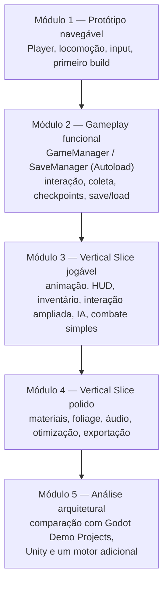
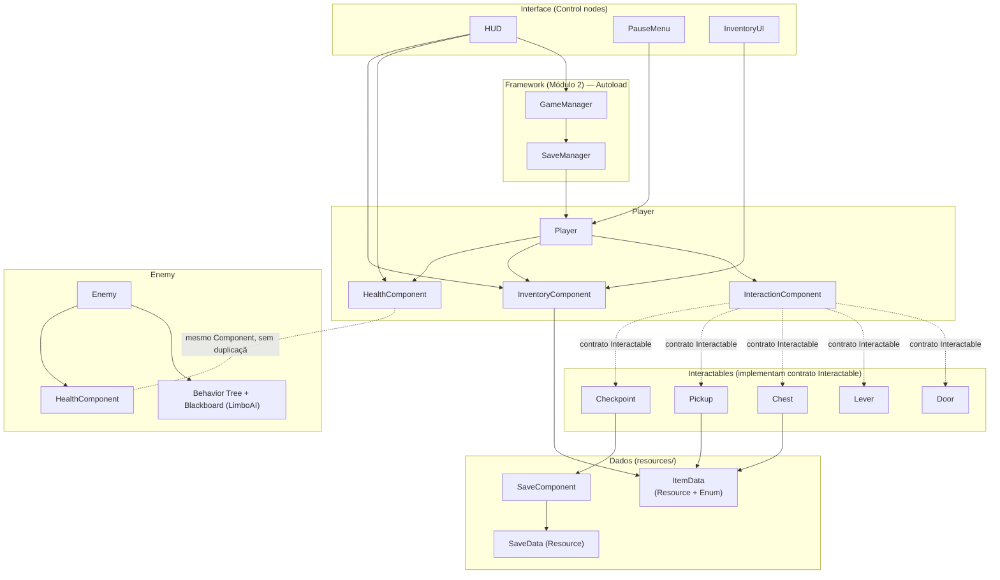

# PROJECT_ARCHITECTURE.md

**Disciplina:** Tendências de Motores de Jogos (IN46A) — Curso Superior de Tecnologia em Jogos Digitais
**Instituição:** Instituto Federal de Mato Grosso do Sul (IFMS) — Campus Dourados
**Motor de referência:** Godot 4.7 + Orchestrator (visual scripting)
**Nome de trabalho do projeto:** *O Templo Esquecido* (título provisório, sem relevância para a avaliação)

Este documento é a referência técnica única do Vertical Slice desenvolvido ao longo do semestre. Ele orienta todos os planos de aula, slides, exercícios e desafios da disciplina e não pode ser contradito por nenhum outro material produzido. Não é um Game Design Document nem um Technical Design Document — é uma referência de consistência entre módulos.

---

## 1. Filosofia do Projeto

O projeto não existe para produzir um jogo comercial. Ele existe exclusivamente para ensinar conceitos universais de motores de jogos usando o Godot 4.7 + Orchestrator como estudo de caso. Cada sistema incluído no escopo existe porque ensina um recurso específico da engine — nenhum sistema é adicionado por valor de jogo isolado.

Quatro princípios orientam toda decisão de escopo:

- **Simplicidade.** Entre duas soluções que ensinam o mesmo conceito, escolhe-se sempre a mais simples de implementar e explicar em um encontro de 2h15.
- **Clareza.** Cada sistema deve poder ser explicado em termos do conceito universal que representa, antes de qualquer detalhe de implementação no Godot.
- **Reutilização.** Nenhum sistema novo substitui um sistema anterior; todo sistema novo se conecta ao que já existe no Vertical Slice.
- **Viabilidade em um semestre.** Todo o escopo deve caber com folga nas 17 semanas do Cronograma, sem depender de retrabalho de arte ou de mecânicas não ensinadas em aula.

---

## 2. Conceito do Jogo

O projeto é um pequeno **Adventure 3D em terceira pessoa**. O jogador explora um ambiente compacto e dividido em poucas áreas (uma zona externa e uma estrutura interna tipo templo/masmorra), interage com objetos do cenário, coleta itens, resolve pequenos desafios de progressão (portas trancadas, alavancas, obstáculos simples), enfrenta um número reduzido de inimigos com combate simples e alcança um objetivo final que encerra a experiência.

Não há sistema de narrativa ramificada, não há multiplayer, não há progressão de personagem via RPG. O jogo existe para que cada sistema do Godot explorado no Cronograma tenha um lugar concreto e testável dentro de uma experiência coesa, e não como minigames isolados.

---

## 3. Direção de Arte

A disciplina não tem foco em produção de arte. Toda a direção de arte é resolvida com pacotes gratuitos da Kenney, usados exclusivamente como apoio didático — a avaliação nunca recai sobre qualidade artística ou quantidade de assets (ver Rubrica 7 do Sistema de Avaliação).

| Pacote | Uso no projeto |
|---|---|
| **Kenney Prototype Kit** | Prototipagem rápida, graybox de níveis, testes de gameplay de novos sistemas antes de qualquer composição de cena definitiva. |
| **Kenney Dungeon Kit** | Ambientes internos: o templo/masmorra, corredores, salas, portas, baús e demais elementos de arquitetura interna. |
| **Kenney Nature Kit** | Ambientes externos: a zona de exploração inicial, vegetação, terreno e transições entre áreas externas e internas. |
| **Kenney Mini Characters** | Modelo de personagem rigged com dezenas de animações (incluindo idle, walk, run) para `Player` e `Enemy` — substitui, a partir da Semana 8, a `CapsuleMesh` de placeholder usada desde a Semana 2. |

Nenhum estudante ou grupo deve depender de produção artística própria para atingir os critérios de avaliação. Assets adicionais da Kenney podem ser incorporados livremente, desde que mantenham a mesma função didática de apoio.

---

## 4. Escopo

### Faz parte do projeto

- Exploração em terceira pessoa de um ambiente compacto (zona externa + estrutura interna).
- Sistema de interação genérico (portas, alavancas, baús, NPCs simples).
- Coleta de itens e inventário básico.
- Checkpoints e persistência de progresso via save/load em Resource.
- HUD com informações essenciais (vida, itens, objetivo).
- Inimigos simples com IA baseada em Navigation, Behavior Tree e Blackboard (addon LimboAI ou Beehave).
- Combate simples (uma forma de ataque do jogador, dano e vida).
- Menu de pausa.
- Um objetivo final único que encerra o Vertical Slice.
- Polimento técnico (materiais parametrizados, áudio integrado a eventos, otimização, exportação).

### Não faz parte do projeto

- Múltiplos finais, ramificações narrativas ou árvores de diálogo.
- Progressão de personagem em estilo RPG (níveis, atributos, árvore de habilidades).
- Múltiplos tipos de inimigo com IA avançada.
- Sistemas de crafting ou economia.
- Qualquer forma de mundo aberto ou geração procedural de nível.

O escopo é fixo desde o Módulo 1. Nenhuma mecânica listada em "Fora do Escopo" (seção 13) deve ser adicionada ao projeto, mesmo que um grupo específico deseje ampliar o jogo — extensões de escopo comprometem a viabilidade do Vertical Slice dentro do semestre e fogem do objetivo pedagógico da disciplina.

---

## 5. Mecânicas e Papel Pedagógico

| Mecânica | Papel pedagógico |
|---|---|
| **Movimentação** | Ensina CharacterBody3D e `move_and_slide` como sistema universal de locomoção. |
| **Câmera** | Ensina configuração de câmera em terceira pessoa (SpringArm3D + Camera3D) e sua relação com o personagem. |
| **Input do jogador** | Ensina Input Map e InputEvent como camada de desacoplamento entre intenção do jogador e ação no mundo. |
| **Interação** | Ensina comunicação desacoplada entre sistemas via contrato de interface (duck typing/`has_method`) e Signals. |
| **Portas e alavancas** | Aplicam o sistema de interação a um caso concreto de progressão espacial. |
| **Baús e coleta de itens** | Ensinam Resource customizado e Enum como estrutura de dados desacoplada da lógica de gameplay. |
| **Inventário** | Ensina padrões de armazenamento, adição/remoção e exibição de dados de gameplay, reutilizando os itens já modelados. |
| **Save/Load** | Ensina serialização e recuperação de estado de jogo entre sessões via Resource + FileAccess. |
| **Checkpoints** | Aplicam o par contrato de interação (Interactable) + persistência (SaveComponent) a um ponto concreto de progressão. |
| **HUD** | Ensina Control nodes como sistema universal de interface em tempo real e o binding de dados de gameplay à UI. |
| **Pausa** | Aplica Control nodes a um caso adicional de interface, reforçando o fluxo de UI sobre o GameManager (Autoload). |
| **Animação (State Machine, Blend Space, animações pontuais)** | Ensinam AnimationTree como sistema de transição e combinação de animações, e faixas do AnimationPlayer como animações pontuais sobrepostas. |
| **Inimigos e IA simples** | Ensinam NavigationRegion3D/NavigationAgent3D, Behavior Trees e Blackboards (via LimboAI) como base de decisão e deslocamento autônomo de agentes. |
| **Combate simples** | Integra o HealthComponent (construído na Semana 8) a uma detecção de acerto simples (Area3D/raycast, Semana 11) entre Player e Enemy, sem propor um sistema de combate avançado. |
| **Objetivo final** | Consolida a integração de todos os sistemas anteriores em um fluxo jogável único, testável de ponta a ponta. |

Nenhuma mecânica é adicionada por valor de entretenimento isolado; toda mecânica listada tem correspondência direta com um recurso do Cronograma.

---

## 6. Roadmap de Implementação

O roadmap segue estritamente a ordem dos módulos definida no Plano de Ensino e no Cronograma. Nenhum sistema é descartado de um módulo para o outro — cada módulo amplia o anterior.

### Módulo 1 — Aprender a Ferramenta (Semanas 1–3)

| Sistema | Objetivo pedagógico | Recursos do Godot | Dependências |
|---|---|---|---|
| Estrutura inicial do projeto | Compreender organização do FileSystem Dock e estrutura de pastas | Editor, FileSystem Dock | — |
| Node base + composição | Compreender composição como unidade universal | Node, Scene Tree, Orchestrator | Estrutura inicial |
| Player (locomoção) | Configurar CharacterBody3D e movimentação | CharacterBody3D, move_and_slide | Node base + composição |
| Input do jogador | Desacoplar intenção do jogador da ação no mundo | Input Map, InputEvent | Player |
| Cena de teste (graybox) | Aplicar Prototype Kit à exploração de terreno e materiais | Materiais, Terrain3D (addon) | Player |
| Renderização moderna e build | Compreender SDFGI/VoxelGI e gerar o primeiro executável | SDFGI/VoxelGI, Exportação de projeto | Cena de teste |

**Produto do módulo:** primeiro build executável, com o jogador explorando um graybox do ambiente externo.

### Módulo 2 — Construir Sistemas (Semanas 4–7)

| Sistema | Objetivo pedagógico | Recursos do Godot | Dependências |
|---|---|---|---|
| GameManager (Autoload) | Separar regras da partida de estado compartilhado | Autoload / Singleton | Módulo 1 |
| Player input de alto nível + SaveManager (Autoload) | Compreender a centralização de input não relacionado a locomoção e persistência entre cenas | Autoload, sinais globais | GameManager |
| Contrato Interactable (interface via duck typing) | Comunicação desacoplada entre Player e objetos do mundo | GDScript (class_name + has_method) ou nós de interface do Orchestrator | Player |
| Signals de interação | Padrão observer para reação a eventos de interação | Signals | Contrato Interactable |
| Door, Lever | Aplicar interação a um caso concreto de progressão | Contrato Interactable, Signals | Signals de interação |
| ItemData (Resource + Enum) | Separar dados de design da lógica de gameplay | Resource customizado, Enum | — |
| Chest, Pickup | Aplicar ItemData a coleta de itens | Resource customizado | ItemData, Interação |
| SaveComponent / SaveData (Resource) | Serializar e recuperar estado de progresso (coleta de itens) — Semana 7 | FileAccess, ResourceSaver/ResourceLoader | ItemData |
| Checkpoint | Aplicar contrato Interactable + persistência a um ponto concreto de progresso — Semana 7 | Contrato Interactable, SaveComponent | Contrato Interactable, SaveComponent |

**Produto do módulo:** gameplay funcional, com portas, baús, alavancas, checkpoints e progresso persistente integrados em um único fluxo.

### Módulo 3 — Resolver Problemas (Semanas 8–11)

| Sistema | Objetivo pedagógico | Recursos do Godot | Dependências |
|---|---|---|---|
| HealthComponent | Suporte mínimo a vida/dano, reutilizável por Player e Enemy — Semana 8 | Node customizado (Component) | Player |
| AnimationTree (State Machine) | Transição de animações do Player — Semana 8 | AnimationTree, AnimationNodeStateMachine | Player |
| BlendSpace1D/2D + AnimationPlayer | Interpolação direcional e animações pontuais — Semana 8 | BlendSpace1D/2D, AnimationPlayer | AnimationTree |
| HUD (Control) | Comunicar estado de jogo em tempo real — Semana 9 | Control nodes, CanvasLayer | GameManager, SaveComponent, HealthComponent |
| PauseMenu (Control) | Aplicar Control nodes a um caso adicional de interface, reforçando o fluxo de UI sobre o GameManager (Autoload) — Semana 9, extensão do desafio de HUD do Encontro 2 | Control nodes, CanvasLayer | GameManager, HUD |
| InventoryComponent + InventoryUI | Estruturar armazenamento e exibição de itens coletados — Semana 10 | Resource customizado, Control nodes | ItemData, HUD |
| Ampliação da Interação | Suportar múltiplos tipos de interação conectados ao inventário — Semana 10 | Contrato Interactable, Signals | InventoryComponent |
| NavigationRegion3D | Base de deslocamento autônomo de agentes — Semana 11 | NavigationRegion3D, NavigationServer | Nível do Módulo 2 |
| Enemy + Behavior Tree + Blackboard (LimboAI) | Decisão e deslocamento autônomo de um agente não-jogador — Semana 11 | LimboAI (BTPlayer, Blackboard), NavigationAgent3D | NavigationRegion3D, HealthComponent |
| Combate simples | Detecção de acerto (Area3D/raycast) do Player chamando apply_damage no HealthComponent do Enemy — Semana 11 | Area3D, RayCast3D | HealthComponent, Enemy |

**Produto do módulo:** Vertical Slice jogável, com animação, interface, inventário, interação ampliada, IA e combate simples integrados.

### Módulo 4 — Produzir como um Pequeno Estúdio (Semanas 12–14)

| Sistema | Objetivo pedagógico | Recursos do Godot | Dependências |
|---|---|---|---|
| Material Overrides / Unique Materials | Padronizar e otimizar materiais do projeto | StandardMaterial3D, Material Overrides | Módulo 1 |
| Foliage (Nature Kit) | Compor a zona externa com performance controlada | MultiMeshInstance3D | Material Overrides |
| Áudio de eventos | Integrar som a interação, passos e ambiente | AudioStreamPlayer | Sistemas de interação |
| Profiling e otimização | Identificar e tratar gargalos técnicos antes da entrega | Profiler/Debugger do Godot, instancing, LOD, occlusion culling | Vertical Slice do Módulo 3 |
| Exportação final | Empacotar build distribuível | Export Templates / Project Export | Profiling |

**Produto do módulo:** Vertical Slice final, otimizado e exportado como build distribuível.

### Módulo 5 — Comparar Arquiteturas (Semanas 15–17)

Nenhum sistema novo é implementado no jogo. O módulo consolida a análise arquitetural do projeto já construído, comparando-o com os Godot Demo Projects (TPS Demo, Platformer 2D Demo), e com a arquitetura equivalente em Unity e em um motor adicional (Unreal Engine, O3DE ou Stride), conforme já definido no Cronograma.

---

## 7. Arquitetura de Alto Nível

Apenas as Scenes (com seus scripts/Orchestrations) e Components principais são definidos. Não há UML nem diagramas de classe — a arquitetura é descrita em termos de responsabilidade, não de implementação.

### Scenes principais

| Scene | Responsabilidade |
|---|---|
| **Player** (CharacterBody3D) | Personagem controlado pelo jogador; concentra locomoção, câmera, input e referências aos Components de gameplay (Interaction, Inventory, Health). |
| **Enemy** (CharacterBody3D) | Agente não-jogador com Behavior Tree/Blackboard próprios (LimboAI) e HealthComponent; não compartilha lógica com Player além do HealthComponent. |
| **Interactable (contrato)** | Contrato implementado por qualquer Node que responda a interação — via `has_method("interact")` (GDScript) ou nó de interface do Orchestrator; não é uma cena instanciável. |
| **Door, Lever, Chest, Pickup** | Cenas concretas que implementam o contrato Interactable, cada uma com sua própria reação ao sinal de interação. |
| **Checkpoint** | Cena que implementa o contrato Interactable e dispara a gravação de progresso (via SaveComponent) ao ser alcançada/interagida pelo jogador — construída na Semana 7. |
| **GameManager** (Autoload) | Define as regras da partida (condições de início, vitória, derrota) e mantém estado de partida compartilhado para o nível atual — reúne o que a Unreal separa em GameMode/GameState. |
| **SaveManager** (Autoload) | Mantém dados persistentes entre cenas e centraliza o slot de save ativo. |
| **HUD** (CanvasLayer + Control) | Interface principal exibida durante o gameplay, consumindo dados de GameManager, HealthComponent e InventoryComponent. |
| **PauseMenu** (Control) | Interface de pausa, acionada via input de alto nível do Player. |
| **SaveData** (Resource) | Objeto de Resource responsável por serializar o progresso do jogador (checkpoints, itens coletados). |

### Components principais

| Component | Responsabilidade |
|---|---|
| **InteractionComponent** | Detecta objetos interativos próximos (via Area3D) e dispara a chamada ao contrato Interactable, mantendo Player desacoplado da lógica específica de cada objeto interativo. |
| **InventoryComponent** | Armazena e gerencia os itens coletados pelo jogador, expondo dados para o HUD sem conhecer detalhes de UI. |
| **HealthComponent** | Gerencia vida, dano e morte, construído na Semana 8 sobre Player e reutilizado por Enemy na Semana 11 sem duplicação de lógica. |
| **SaveComponent** | Centraliza a leitura/escrita do SaveData, evitando que múltiplas cenas implementem lógica de serialização própria. |

Esta separação existe para que cada sistema ensinado no Cronograma tenha um local arquitetural único e óbvio, evitando lógica duplicada entre Scenes — princípio central da Rubrica 4 (Code Review) do Sistema de Avaliação.

---

## 8. Organização do Projeto

Estrutura de pastas recomendada, alinhada às convenções oficiais do Godot:

```
res://
├── scenes/
│   ├── characters/       (Player.tscn, Enemy.tscn)
│   ├── interactables/    (Door.tscn, Lever.tscn, Chest.tscn, Pickup.tscn, Checkpoint.tscn)
│   ├── ui/               (HUD.tscn, PauseMenu.tscn, InventoryUI.tscn)
│   └── levels/
│       ├── exploration/  (zona externa)
│       └── dungeon/      (estrutura interna)
├── scripts/
│   ├── autoload/         (game_manager.gd, save_manager.gd)
│   ├── components/       (interaction_component.gd, inventory_component.gd, health_component.gd, save_component.gd)
│   └── resources/        (classes de Resource customizado, ex.: item_data.gd — Semana 6)
├── orchestrations/       (arquivos .torch do Orchestrator equivalentes aos scripts acima)
├── resources/
│   ├── items/            (ItemData .tres)
│   └── save/             (SaveData .tres)
├── assets/
│   ├── prototype/        (assets do Kenney Prototype Kit)
│   ├── dungeon/          (assets do Kenney Dungeon Kit)
│   ├── nature/           (assets do Kenney Nature Kit)
│   └── characters/       (assets do Kenney Mini Characters — modelo e animações de Player/Enemy)
├── materials/
├── audio/
└── animations/
```

A pasta `resources/` concentra toda a informação de design desacoplada da lógica de gameplay, reforçando o princípio ensinado na Semana 6 do Cronograma.

---

## 9. Convenções de Nomenclatura

Godot não usa prefixos de tipo de asset como a Unreal (`BP_`, `WBP_`); a convenção oficial é PascalCase para nomes de nós/cenas/classes e snake_case para arquivos, variáveis e funções. A tabela abaixo fixa a convenção adotada neste projeto:

| Tipo de asset | Convenção | Exemplo |
|---|---|---|
| Scene (nó raiz) | PascalCase | `Player.tscn` |
| Script GDScript | snake_case, mesmo nome da Scene | `player.gd` |
| Orchestration (Orchestrator) | snake_case, sufixo `.torch` | `player.torch` |
| Class name (GDScript) | PascalCase | `class_name HealthComponent` |
| Autoload / Singleton | PascalCase (nome do node), snake_case (arquivo) | `GameManager` / `game_manager.gd` |
| Resource customizado | PascalCase (classe), snake_case (arquivo `.tres`) | `ItemData` / `item_key.tres` |
| Enum | PascalCase | `enum ItemType { KEY, TOOL, QUEST }` |
| Signal | snake_case, verbo no passado ou substantivo de evento | `interacted`, `item_collected` |
| Cena de nível | snake_case, prefixo de área | `level_exploration.tscn` |
| Textura | snake_case, sufixo de tipo | `ground_albedo.png` |
| Malha 3D importada | snake_case | `crate.glb` |

Regras gerais de organização:

- Todo asset pertence a uma subpasta temática (nunca solto na raiz de `res://`).
- Nenhuma Scene, Control ou Material permanece com o nome padrão gerado pelo editor (`Node2D`, `Control1` etc.).
- Contratos de interface, Resources e Enums usados por mais de um sistema ficam em `resources/` ou em um script dedicado, nunca duplicados dentro de uma Scene específica.
- Nomes descrevem função, não implementação (`Chest.tscn`, não `InteractableBox01.tscn`).

---

## 10. Boas Práticas

Regras válidas para todo o semestre, cobradas em todo Code Review (Rubrica 4):

- Utilizar Components (Nodes filhos) sempre que a responsabilidade puder ser isolada (Interaction, Inventory, Health, Save).
- Evitar Scenes/Orchestrations gigantes: preferir funções nomeadas e grafos organizados a um único grafo de Orchestrator extenso.
- Preferir composição a herança profunda — um novo tipo de interativo deve, sempre que possível, ser resolvido implementando o contrato Interactable em uma nova Scene, não criando uma cadeia de heranças de `Door.tscn`.
- Separar responsabilidades: lógica de dados em Resources/Enums, lógica de UI em Control nodes, lógica de gameplay em Components.
- Evitar lógica duplicada entre `Player` e `Enemy` — o que for comum (ex.: vida) deve estar em um Component compartilhado.
- Utilizar o contrato Interactable (duck typing/`has_method`) para comunicação entre sistemas que não precisam se conhecer diretamente (ex.: qualquer interativo com o jogador).
- Utilizar Signals quando o emissor do evento não deve conhecer quem reage a ele.
- Utilizar Resources customizados para qualquer dado compartilhado por múltiplas instâncias (itens, inimigos, checkpoints).
- Comentar as seções relevantes de todo script/Orchestration, especialmente pontos de integração entre sistemas de módulos diferentes.

---

## 11. Evolução do Vertical Slice

```
Módulo 1 → Protótipo navegável
             (Player, locomoção, input, primeiro build)
                       ↓
Módulo 2 → Gameplay funcional
             (GameManager/SaveManager (Autoload),
              interação, coleta, checkpoints, save/load)
                       ↓
Módulo 3 → Vertical Slice jogável
             (animação, HUD, inventário, interação ampliada, IA, combate simples)
                       ↓
Módulo 4 → Vertical Slice polido
             (materiais, foliage, áudio, otimização, exportação)
                       ↓
Módulo 5 → Análise arquitetural
             (comparação com Godot Demo Projects,
              com Unity e com um motor adicional)
```

Cada seta representa acréscimo, nunca substituição: o produto de um módulo é sempre um subconjunto funcional do produto do módulo seguinte.

---

## 12. Comparações com Unity

| Sistema no Godot | Equivalente na Unity | O que permanece igual | Principal diferença arquitetural |
|---|---|---|---|
| Node + composição de Nodes filhos | GameObject + Component | Composição como unidade de construção do mundo | Godot trata cada Node como parte de uma árvore homogênea (Scene Tree); Unity separa GameObject (contêiner) de Components anexados a ele. |
| CharacterBody3D + move_and_slide | CharacterController / Rigidbody + script de movimento | Uma API dedicada resolve física de locomoção | Godot já entrega `move_and_slide` pronto no CharacterBody; Unity normalmente exige compor a solução a partir de peças mais genéricas. |
| Input Map + InputEvent | Input System (novo) | Ambos desacoplam dispositivo físico de ação lógica via Actions | Godot usa um Input Map único configurado no projeto; Unity usa Action Maps e Player Input, com mais camadas de configuração. |
| GameManager (Autoload) | Ausência de equivalente direto (padrão Manager/Singleton) | Necessidade de um ponto único de regras de partida | Godot formaliza Autoload como mecanismo nativo de singleton global; Unity depende de convenção do próprio time (DontDestroyOnLoad, ScriptableObject singleton etc.). |
| Contrato Interactable (duck typing/has_method) | Interfaces em C# | Comunicação sem acoplamento direto entre classes | Godot resolve isso por tipagem dinâmica (`has_method`) ou nós de interface do Orchestrator; Unity exige uma interface C# formal. |
| Signals | UnityEvent / C# Actions | Padrão observer para eventos de gameplay | Signals são nativos e conectáveis visualmente no editor Godot; Unity depende de UnityEvent (editor) ou Actions (código). |
| Resource customizado + Enum | ScriptableObject | Dados de design desacoplados da lógica | Resource do Godot e ScriptableObject da Unity resolvem o mesmo problema de forma quase idêntica — ambos são objetos de dados serializáveis independentes de uma instância de cena. |
| Save/Load via Resource + FileAccess | PlayerPrefs / serialização própria em JSON | Necessidade de persistir estado entre sessões | Godot serializa Resources nativamente (`ResourceSaver`/`ResourceLoader`) ou via JSON com FileAccess; Unity exige decisão própria de formato de serialização. |
| AnimationTree (State Machine, BlendSpace) | Animator Controller (State Machine, Blend Tree) | Máquina de estados para transições de animação | BlendSpace1D/2D do Godot é configurado por eixos explícitos; Blend Tree da Unity exige configuração equivalente manual. |
| Control nodes | UI Toolkit / uGUI | Sistema de UI em árvore para interface em tempo real | Control nodes do Godot fazem parte da mesma Scene Tree de todo o resto; Unity historicamente dividiu-se entre uGUI (baseado em GameObject) e UI Toolkit (baseado em UXML/USS). |
| Behavior Tree + Blackboard (addon LimboAI) | Behavior Designer / NodeCanvas (assets de terceiros) | Estrutura de decisão + memória compartilhada do agente | Nem Godot nem Unity oferecem Behavior Tree nativo — ambos dependem de addons/packages de terceiros com filosofia semelhante. |

Esta tabela deve ser expandida (não substituída) por cada plano de aula que introduzir um dos sistemas acima, conforme já exigido pela filosofia da disciplina.

---

## 13. Fora do Escopo

Os itens abaixo não devem ser implementados em nenhuma hipótese durante o semestre, independentemente do interesse de um grupo específico, pois extrapolam o objetivo pedagógico da disciplina e comprometem a viabilidade do Vertical Slice em 17 semanas:

- Multiplayer e replicação de rede.
- Dedicated Server.
- GDExtension em C++ avançado (a disciplina permanece em Orchestrator/GDScript).
- Rendering pipeline customizado / shaders avançados além do necessário para materiais.
- Procedural Generation de nível.
- Editor Plugins complexos (além do uso do Orchestrator).
- Sistemas de Quest complexos ou árvores de diálogo ramificadas.
- Crafting e sistemas de economia.
- Mundo aberto ou streaming de nível em larga escala.
- Efeitos de partículas avançados (GPUParticles3D complexo).

Qualquer proposta de desafio, exercício ou slide que envolva um item desta lista deve ser revista antes de ser incorporada à disciplina, pois contradiz diretamente este documento.

---

## 14. Diagrama Visual do Vertical Slice

Infográfico de apoio para os estudantes, com duas visões complementares do mesmo projeto: a evolução do Vertical Slice módulo a módulo (seção 11 em formato visual) e a arquitetura de alto nível entre Scenes e Components (seção 7 em formato visual). Nenhum dos dois diagramas substitui o texto das seções anteriores — servem apenas como referência rápida.

### 14.1 Evolução do Vertical Slice por Módulo



### 14.2 Arquitetura de Alto Nível (Scenes e Components)



**Como ler o segundo diagrama:** setas cheias indicam composição ou posse direta (ex.: Player possui InteractionComponent); a linha tracejada entre InteractionComponent e cada Interactable representa comunicação via contrato (duck typing/`has_method` ou interface do Orchestrator), não uma dependência direta de classe — é exatamente o desacoplamento ensinado na Semana 5. HealthComponent aparece tanto em Player quanto em Enemy porque é o mesmo Component reutilizado, não duas implementações separadas (princípio da Rubrica 4 — Code Review).

---

*Documento de referência arquitetural — Disciplina Tendências de Motores de Jogos, IFMS Campus Dourados. Deve ser consultado antes da produção de qualquer Plano de Aula, slide, exercício ou desafio.*
