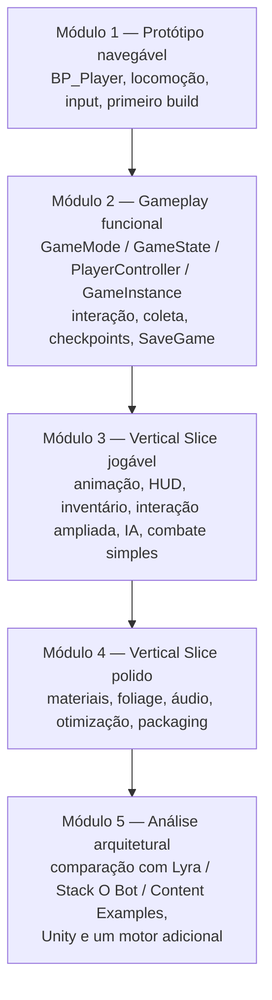
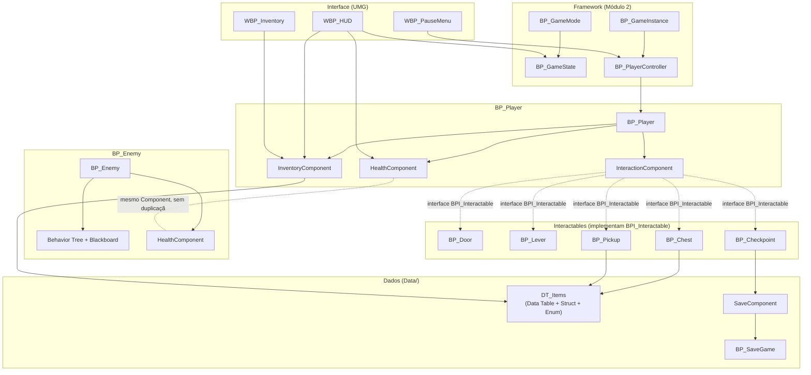

# PROJECT_ARCHITECTURE.md

**Disciplina:** Tendências de Motores de Jogos (IN46A) — Curso Superior de Tecnologia em Jogos Digitais
**Instituição:** Instituto Federal de Mato Grosso do Sul (IFMS) — Campus Dourados
**Motor de referência:** Unreal Engine 5.6
**Nome de trabalho do projeto:** *O Templo Esquecido* (título provisório, sem relevância para a avaliação)

Este documento é a referência técnica única do Vertical Slice desenvolvido ao longo do semestre. Ele orienta todos os planos de aula, slides, exercícios e desafios da disciplina e não pode ser contradito por nenhum outro material produzido. Não é um Game Design Document nem um Technical Design Document — é uma referência de consistência entre módulos.

---

## 1. Filosofia do Projeto

O projeto não existe para produzir um jogo comercial. Ele existe exclusivamente para ensinar conceitos universais de motores de jogos usando a Unreal Engine 5 como estudo de caso. Cada sistema incluído no escopo existe porque ensina um recurso específico da engine — nenhum sistema é adicionado por valor de jogo isolado.

Quatro princípios orientam toda decisão de escopo:

- **Simplicidade.** Entre duas soluções que ensinam o mesmo conceito, escolhe-se sempre a mais simples de implementar e explicar em um encontro de 2h15.
- **Clareza.** Cada sistema deve poder ser explicado em termos do conceito universal que representa, antes de qualquer detalhe de implementação na Unreal.
- **Reutilização.** Nenhum sistema novo substitui um sistema anterior; todo sistema novo se conecta ao que já existe no Vertical Slice.
- **Viabilidade em um semestre.** Todo o escopo deve caber com folga nas 17 semanas do Cronograma, sem depender de retrabalho de arte ou de mecânicas não ensinadas em aula.

---

## 2. Conceito do Jogo

O projeto é um pequeno **Adventure 3D em terceira pessoa**. O jogador explora um ambiente compacto e dividido em poucas áreas (uma zona externa e uma estrutura interna tipo templo/masmorra), interage com objetos do cenário, coleta itens, resolve pequenos desafios de progressão (portas trancadas, alavancas, obstáculos simples), enfrenta um número reduzido de inimigos com combate simples e alcança um objetivo final que encerra a experiência.

Não há sistema de narrativa ramificada, não há multiplayer, não há progressão de personagem via RPG. O jogo existe para que cada sistema da Unreal explorado no Cronograma tenha um lugar concreto e testável dentro de uma experiência coesa, e não como minigames isolados.

---

## 3. Direção de Arte

A disciplina não tem foco em produção de arte. Toda a direção de arte é resolvida com pacotes gratuitos da Kenney, usados exclusivamente como apoio didático — a avaliação nunca recai sobre qualidade artística ou quantidade de assets (ver Rubrica 7 do Sistema de Avaliação).

| Pacote | Uso no projeto |
|---|---|
| **Kenney Prototype Kit** | Prototipagem rápida, graybox de níveis, testes de gameplay de novos sistemas antes de qualquer composição de cena definitiva. |
| **Kenney Dungeon Kit** | Ambientes internos: o templo/masmorra, corredores, salas, portas, baús e demais elementos de arquitetura interna. |
| **Kenney Nature Kit** | Ambientes externos: a zona de exploração inicial, vegetação, terreno e transições entre áreas externas e internas. |

Nenhum estudante ou grupo deve depender de produção artística própria para atingir os critérios de avaliação. Assets adicionais da Kenney podem ser incorporados livremente, desde que mantenham a mesma função didática de apoio.

---

## 4. Escopo

### Faz parte do projeto

- Exploração em terceira pessoa de um ambiente compacto (zona externa + estrutura interna).
- Sistema de interação genérico (portas, alavancas, baús, NPCs simples).
- Coleta de itens e inventário básico.
- Checkpoints e persistência de progresso via SaveGame.
- HUD com informações essenciais (vida, itens, objetivo).
- Inimigos simples com IA baseada em Navigation, Behavior Tree e Blackboard.
- Combate simples (uma forma de ataque do jogador, dano e vida).
- Menu de pausa.
- Um objetivo final único que encerra o Vertical Slice.
- Polimento técnico (materiais parametrizados, áudio integrado a eventos, otimização, empacotamento).

### Não faz parte do projeto

- Múltiplos finais, ramificações narrativas ou árvores de diálogo.
- Progressão de personagem em estilo RPG (níveis, atributos, árvore de habilidades).
- Múltiplos tipos de inimigo com IA avançada.
- Sistemas de crafting ou economia.
- Qualquer forma de mundo aberto ou geração procedural de nível.

O escopo é fixo desde o Módulo 1. Nenhuma mecânica listada em "Fora do Escopo" (seção 10) deve ser adicionada ao projeto, mesmo que um grupo específico deseje ampliar o jogo — extensões de escopo comprometem a viabilidade do Vertical Slice dentro do semestre e fogem do objetivo pedagógico da disciplina.

---

## 5. Mecânicas e Papel Pedagógico

| Mecânica | Papel pedagógico |
|---|---|
| **Movimentação** | Ensina Character e Character Movement Component como sistema universal de locomoção. |
| **Câmera** | Ensina configuração de câmera em terceira pessoa (Spring Arm/Camera Component) e sua relação com o Character. |
| **Input do jogador** | Ensina Enhanced Input (Input Actions, Mapping Contexts, Triggers, Modifiers) como camada de desacoplamento entre intenção do jogador e ação no mundo. |
| **Interação** | Ensina comunicação desacoplada entre sistemas via Blueprint Interfaces e Event Dispatchers. |
| **Portas e alavancas** | Aplicam o sistema de interação a um caso concreto de progressão espacial. |
| **Baús e coleta de itens** | Ensinam Data Tables, Structs e Enums como estrutura de dados desacoplada da lógica de gameplay. |
| **Inventário** | Ensina padrões de armazenamento, adição/remoção e exibição de dados de gameplay, reutilizando os itens já modelados. |
| **SaveGame** | Ensina serialização e recuperação de estado de jogo entre sessões. |
| **Checkpoints** | Aplicam o par Interface (BPI_Interactable) + persistência (SaveComponent) a um ponto concreto de progressão. |
| **HUD** | Ensina UMG como sistema universal de interface em tempo real e o binding de dados de gameplay à UI. |
| **Pausa** | Aplica UMG a um caso adicional de interface, reforçando o fluxo de Widgets sobre o GameState/PlayerController. |
| **Animação (State Machine, Blend Space, Montage)** | Ensinam Animation Blueprint como sistema de transição e combinação de animações, e Montages como animações pontuais sobrepostas. |
| **Inimigos e IA simples** | Ensinam Navigation/NavMesh, Behavior Trees e Blackboards como base de decisão e deslocamento autônomo de agentes. |
| **Combate simples** | Integra o HealthComponent (construído na Semana 8) a uma detecção de acerto simples (Trace/Overlap, Semana 11) entre BP_Player e BP_Enemy, sem propor um sistema de combate avançado. |
| **Objetivo final** | Consolida a integração de todos os sistemas anteriores em um fluxo jogável único, testável de ponta a ponta. |

Nenhuma mecânica é adicionada por valor de entretenimento isolado; toda mecânica listada tem correspondência direta com um recurso do Cronograma.

---

## 6. Roadmap de Implementação

O roadmap segue estritamente a ordem dos módulos definida no Plano de Ensino e no Cronograma. Nenhum sistema é descartado de um módulo para o outro — cada módulo amplia o anterior.

### Módulo 1 — Aprender a Ferramenta (Semanas 1–3)

| Sistema | Objetivo pedagógico | Recursos da Unreal | Dependências |
|---|---|---|---|
| Estrutura inicial do projeto | Compreender organização de Content Browser e estrutura de pastas | Editor, Content Browser | — |
| Actor + Component base | Compreender composição como unidade universal | Actors, Components, Blueprint | Estrutura inicial |
| BP_Player (locomoção) | Configurar Character e Character Movement | Character, Character Movement Component | Actor + Component base |
| Input do jogador | Desacoplar intenção do jogador da ação no mundo | Enhanced Input | BP_Player |
| Cena de teste (graybox) | Aplicar Prototype Kit à exploração de terreno e materiais | Materiais, Landscape | BP_Player |
| Renderização moderna e build | Compreender Nanite/Lumen e gerar o primeiro executável | Nanite, Lumen, Packaging | Cena de teste |

**Produto do módulo:** primeiro build executável, com o jogador explorando um graybox do ambiente externo.

### Módulo 2 — Construir Sistemas (Semanas 4–7)

| Sistema | Objetivo pedagógico | Recursos da Unreal | Dependências |
|---|---|---|---|
| BP_GameMode / BP_GameState | Separar regras da partida de estado compartilhado | GameMode, GameState | Módulo 1 |
| BP_PlayerController / BP_GameInstance | Compreender a ponte jogador–Pawn e persistência entre níveis | PlayerController, GameInstance | GameMode/GameState |
| BPI_Interactable (Interface) | Comunicação desacoplada entre Player e objetos do mundo | Blueprint Interfaces | BP_Player |
| Event Dispatchers de interação | Padrão observer para reação a eventos de interação | Event Dispatchers | BPI_Interactable |
| BP_Door, BP_Lever | Aplicar interação a um caso concreto de progressão | Interfaces, Event Dispatchers | Event Dispatchers de interação |
| DT_Items (Data Table + Struct + Enum) | Separar dados de design da lógica de gameplay | Data Tables, Structs, Enums | — |
| BP_Chest, BP_Pickup | Aplicar Data Table a coleta de itens | Data Assets, Data Tables | DT_Items, Interação |
| SaveComponent / BP_SaveGame | Serializar e recuperar estado de progresso (coleta de itens) — Semana 7 | SaveGame Object | DT_Items |
| BP_Checkpoint | Aplicar Interface + persistência a um ponto concreto de progresso — Semana 7 | Interfaces, SaveGame Object | BPI_Interactable, SaveComponent |

**Produto do módulo:** gameplay funcional, com portas, baús, alavancas, checkpoints e progresso persistente integrados em um único fluxo.

### Módulo 3 — Resolver Problemas (Semanas 8–11)

| Sistema | Objetivo pedagógico | Recursos da Unreal | Dependências |
|---|---|---|---|
| HealthComponent | Suporte mínimo a vida/dano, reutilizável por BP_Player e BP_Enemy — Semana 8 | Actor Components | BP_Player |
| Animation Blueprint (State Machine) | Transição de animações do BP_Player — Semana 8 | Animation Blueprint | BP_Player |
| Blend Space / Montage | Interpolação direcional e animações pontuais — Semana 8 | Blend Spaces, Montages | Animation Blueprint |
| WBP_HUD | Comunicar estado de jogo em tempo real — Semana 9 | UMG, HUD | GameState, SaveComponent, HealthComponent |
| InventoryComponent + WBP_Inventory | Estruturar armazenamento e exibição de itens coletados — Semana 10 | Data Assets, UMG | DT_Items, WBP_HUD |
| Ampliação da Interação | Suportar múltiplos tipos de interação conectados ao inventário — Semana 10 | Interfaces, Event Dispatchers | InventoryComponent |
| NavMesh | Base de deslocamento autônomo de agentes — Semana 11 | Navigation | Nível do Módulo 2 |
| BP_Enemy + Behavior Tree + Blackboard | Decisão e deslocamento autônomo de um agente não-jogador — Semana 11 | Behavior Trees, Blackboards | NavMesh, HealthComponent |
| Combate simples | Detecção de acerto (Trace/Overlap) do BP_Player chamando ApplyDamage no HealthComponent de BP_Enemy — Semana 11 | Line Trace/Overlap | HealthComponent, BP_Enemy |

**Produto do módulo:** Vertical Slice jogável, com animação, interface, inventário, interação ampliada, IA e combate simples integrados.

### Módulo 4 — Produzir como um Pequeno Estúdio (Semanas 12–14)

| Sistema | Objetivo pedagógico | Recursos da Unreal | Dependências |
|---|---|---|---|
| Material Instances | Padronizar e otimizar materiais do projeto | Materials, Material Instances | Módulo 1 |
| Foliage (Nature Kit) | Compor a zona externa com performance controlada | Foliage | Material Instances |
| Áudio de eventos | Integrar som a interação, passos e ambiente | Áudio | Sistemas de interação |
| Profiling e otimização | Identificar e tratar gargalos técnicos antes da entrega | Optimization, Profiling | Vertical Slice do Módulo 3 |
| Packaging final | Empacotar build distribuível | Packaging | Profiling |

**Produto do módulo:** Vertical Slice final, otimizado e empacotado como build distribuível.

### Módulo 5 — Comparar Arquiteturas (Semanas 15–17)

Nenhum sistema novo é implementado no jogo. O módulo consolida a análise arquitetural do projeto já construído, comparando-o com Lyra, Stack O Bot e Content Examples, e com a arquitetura equivalente em Unity e em um motor adicional (Godot, O3DE, Stride ou CryEngine), conforme já definido no Cronograma.

---

## 7. Arquitetura de Alto Nível

Apenas os Blueprints e Components principais são definidos. Não há UML nem diagramas de classe — a arquitetura é descrita em termos de responsabilidade, não de implementação.

### Blueprints principais

| Blueprint | Responsabilidade |
|---|---|
| **BP_Player** | Character controlado pelo jogador; concentra locomoção, câmera, input e referências aos Components de gameplay (Interaction, Inventory, Health). |
| **BP_Enemy** | Agente não-jogador com Behavior Tree/Blackboard próprios e HealthComponent; não compartilha lógica com BP_Player além do HealthComponent. |
| **BPI_Interactable** | Interface implementada por qualquer Actor que responda a interação (não é um Blueprint instanciável). |
| **BP_Door, BP_Lever, BP_Chest, BP_Pickup** | Actors concretos que implementam BPI_Interactable, cada um com sua própria reação ao evento de interação. |
| **BP_Checkpoint** | Actor que implementa BPI_Interactable e dispara a gravação de progresso (via SaveComponent) ao ser alcançado/interagido pelo jogador — construído na Semana 7. |
| **BP_GameMode** | Define as regras da partida (condições de início, vitória, derrota) para o nível atual. |
| **BP_GameState** | Mantém estado de partida compartilhado, replicável entre sistemas de UI e gameplay. |
| **BP_PlayerController** | Ponte entre o jogador e o BP_Player; concentra input de alto nível não relacionado a locomoção (ex.: abrir inventário, pausar). |
| **BP_GameInstance** | Mantém dados persistentes entre níveis, quando aplicável (ex.: referência ao slot de save ativo). |
| **WBP_HUD** | Widget principal exibido durante o gameplay, consumindo dados de GameState, HealthComponent e InventoryComponent. |
| **WBP_PauseMenu** | Widget de pausa, acionado via PlayerController. |
| **BP_SaveGame** | Objeto de SaveGame responsável por serializar o progresso do jogador (checkpoints, itens coletados). |

### Components principais

| Component | Responsabilidade |
|---|---|
| **InteractionComponent** | Detecta objetos interativos próximos e dispara a chamada à interface BPI_Interactable, mantendo BP_Player desacoplado da lógica específica de cada Actor interativo. |
| **InventoryComponent** | Armazena e gerencia os itens coletados pelo jogador, expondo dados para o WBP_HUD sem conhecer detalhes de UI. |
| **HealthComponent** | Gerencia vida, dano e morte, construído na Semana 8 sobre BP_Player e reutilizado por BP_Enemy na Semana 11 sem duplicação de lógica. |
| **SaveComponent** | Centraliza a leitura/escrita do BP_SaveGame, evitando que múltiplos Actors implementem lógica de serialização própria. |

Esta separação existe para que cada sistema ensinado no Cronograma tenha um local arquitetural único e óbvio, evitando lógica duplicada entre Blueprints — princípio central da Rubrica 4 (Code Review) do Sistema de Avaliação.

---

## 8. Organização do Projeto

Estrutura de pastas recomendada, alinhada às convenções oficiais da Unreal Engine:

```
Content/
├── Blueprints/
│   ├── Characters/       (BP_Player, BP_Enemy)
│   ├── Interactables/    (BP_Door, BP_Lever, BP_Chest, BP_Pickup, BP_Checkpoint)
│   ├── Framework/        (BP_GameMode, BP_GameState, BP_PlayerController, BP_GameInstance)
│   └── Components/       (InteractionComponent, InventoryComponent, HealthComponent, SaveComponent)
├── Characters/
│   └── Player/           (Skeletal Mesh, Animation Blueprint, Blend Spaces, Montages)
├── Environment/
│   ├── Dungeon/          (assets do Kenney Dungeon Kit)
│   └── Nature/           (assets do Kenney Nature Kit)
├── UI/
│   └── Widgets/          (WBP_HUD, WBP_PauseMenu, WBP_Inventory)
├── Materials/
│   ├── Base/              (Materials base)
│   └── Instances/         (Material Instances)
├── Audio/
├── Maps/
│   ├── Exploration/       (zona externa)
│   └── Dungeon/           (estrutura interna)
├── Data/
│   ├── DataTables/        (DT_Items)
│   ├── DataAssets/
│   └── Structs_Enums/
├── Textures/
└── Meshes/
```

A pasta `Data/` concentra toda a informação de design desacoplada da lógica de gameplay, reforçando o princípio ensinado na Semana 6 do Cronograma.

---

## 9. Convenções de Nomenclatura

| Tipo de asset | Prefixo | Exemplo |
|---|---|---|
| Blueprint (Actor/Character/GameMode etc.) | `BP_` | `BP_Player` |
| Blueprint Interface | `BPI_` | `BPI_Interactable` |
| Widget Blueprint (UMG) | `WBP_` | `WBP_HUD` |
| Material | `M_` | `M_StoneWall` |
| Material Instance | `MI_` | `MI_StoneWall_Mossy` |
| Data Asset | `DA_` | `DA_Item_Key` |
| Data Table | `DT_` | `DT_Items` |
| Struct | `S_` (ou `F` seguido de nome, conforme convenção C++) | `S_ItemData` |
| Enum | `E_` | `E_ItemType` |
| Mapa/Nível | `Map_` | `Map_Exploration` |
| Textura | `T_` | `T_Ground_Diffuse` |
| Static Mesh | `SM_` | `SM_Crate` |

Regras gerais de organização:

- Todo asset pertence a uma subpasta temática (nunca solto na raiz de `Content/`).
- Nenhum Blueprint, Widget ou Material permanece com o nome padrão gerado pelo editor (`NewBlueprint`, `WidgetBlueprint1` etc.).
- Interfaces, Structs e Enums usados por mais de um sistema ficam em `Data/Structs_Enums/`, nunca duplicados dentro de um Blueprint específico.
- Nomes descrevem função, não implementação (`BP_Chest`, não `BP_InteractableBox01`).

---

## 10. Boas Práticas

Regras válidas para todo o semestre, cobradas em todo Code Review (Rubrica 4):

- Utilizar Components sempre que a responsabilidade puder ser isolada (Interaction, Inventory, Health, Save).
- Evitar Blueprints gigantes: preferir funções nomeadas e Collapsed Graphs a Event Graphs extensos.
- Preferir composição a herança profunda — um novo tipo de interativo deve, sempre que possível, ser resolvido implementando `BPI_Interactable` em um novo Actor, não criando uma cadeia de heranças de `BP_Door`.
- Separar responsabilidades: lógica de dados em Data Tables/Structs, lógica de UI em Widgets, lógica de gameplay em Components.
- Evitar lógica duplicada entre `BP_Player` e `BP_Enemy` — o que for comum (ex.: vida) deve estar em um Component compartilhado.
- Utilizar Interfaces para comunicação entre sistemas que não precisam se conhecer diretamente (ex.: qualquer interativo com o jogador).
- Utilizar Event Dispatchers quando o emissor do evento não deve conhecer quem reage a ele.
- Utilizar Data Assets/Data Tables para qualquer dado compartilhado por múltiplas instâncias (itens, inimigos, checkpoints).
- Comentar (Comment Boxes) as seções relevantes de todo Blueprint, especialmente pontos de integração entre sistemas de módulos diferentes.

---

## 11. Evolução do Vertical Slice

```
Módulo 1 → Protótipo navegável
             (BP_Player, locomoção, input, primeiro build)
                       ↓
Módulo 2 → Gameplay funcional
             (GameMode/GameState/PlayerController/GameInstance,
              interação, coleta, checkpoints, SaveGame)
                       ↓
Módulo 3 → Vertical Slice jogável
             (animação, HUD, inventário, interação ampliada, IA, combate simples)
                       ↓
Módulo 4 → Vertical Slice polido
             (materiais, foliage, áudio, otimização, packaging)
                       ↓
Módulo 5 → Análise arquitetural
             (comparação com Lyra/Stack O Bot/Content Examples,
              com Unity e com um motor adicional)
```

Cada seta representa acréscimo, nunca substituição: o produto de um módulo é sempre um subconjunto funcional do produto do módulo seguinte.

---

## 12. Comparações com Unity

| Sistema na Unreal | Equivalente na Unity | O que permanece igual | Principal diferença arquitetural |
|---|---|---|---|
| Actor + Component | GameObject + Component | Composição como unidade de construção do mundo | Unreal separa Actor (contêiner) de Component de forma mais rígida; Unity trata GameObject como contêiner genérico de Components desde a raiz. |
| Character + Character Movement Component | CharacterController / Rigidbody + script de movimento | Um componente dedicado resolve física de locomoção | Unreal já entrega um Movement Component completo por padrão; Unity normalmente exige compor a solução a partir de peças mais genéricas. |
| Enhanced Input | Input System (novo) | Ambos desacoplam dispositivo físico de ação lógica via Actions | Unreal usa Input Mapping Contexts combináveis em runtime; Unity usa Action Maps e Player Input. |
| GameMode / GameState | Ausência de equivalente direto (padrão Manager/Singleton) | Necessidade de um ponto único de regras de partida | Unreal formaliza esse papel como classe nativa da engine; Unity depende de convenção do próprio time. |
| Blueprint Interfaces | Interfaces em C# | Comunicação sem acoplamento direto entre classes | Blueprint Interfaces funcionam nativamente em visual scripting; Unity exige C# para o mesmo resultado. |
| Event Dispatchers | UnityEvent / C# Actions | Padrão observer para eventos de gameplay | Sintaxe visual (Unreal) versus código (Unity), mesmo princípio. |
| Data Table / Data Asset | ScriptableObject | Dados de design desacoplados da lógica | Data Table é orientada a linhas (planilha); ScriptableObject é orientado a instância de objeto. |
| SaveGame Object | PlayerPrefs / serialização própria em JSON | Necessidade de persistir estado entre sessões | Unreal oferece uma classe dedicada e serializável nativamente; Unity exige decisão própria de formato de serialização. |
| Animation Blueprint (State Machine, Blend Space) | Animator Controller (State Machine, Blend Tree) | Máquina de estados para transições de animação | Blend Space é multidimensional por padrão na Unreal; Blend Tree exige configuração equivalente manual na Unity. |
| UMG | UI Toolkit / uGUI | Sistema de Widgets para interface em tempo real | UMG é fortemente integrado a Blueprints; Unity historicamente dividiu-se entre uGUI e UI Toolkit. |
| Behavior Tree + Blackboard | Behavior Designer / NodeCanvas (assets de terceiros) | Estrutura de decisão + memória compartilhada do agente | Unreal oferece Behavior Tree nativamente; Unity não possui equivalente nativo de mesmo nível, dependendo de packages externos. |

Esta tabela deve ser expandida (não substituída) por cada plano de aula que introduzir um dos sistemas acima, conforme já exigido pela filosofia da disciplina.

---

## 13. Fora do Escopo

Os itens abaixo não devem ser implementados em nenhuma hipótese durante o semestre, independentemente do interesse de um grupo específico, pois extrapolam o objetivo pedagógico da disciplina e comprometem a viabilidade do Vertical Slice em 17 semanas:

- Multiplayer e Replicação de rede.
- Dedicated Server.
- Gameplay Ability System (GAS).
- Mass AI / Mass Framework.
- Procedural Generation / PCG Framework.
- C++ avançado (a disciplina permanece em Blueprint Visual Scripting).
- Editor Utility Widgets e plugins complexos.
- Sistemas de Quest complexos ou árvores de diálogo ramificadas.
- Crafting e sistemas de economia.
- Mundo aberto ou streaming de nível em larga escala.
- Niagara avançado (efeitos visuais complexos).

Qualquer proposta de desafio, exercício ou slide que envolva um item desta lista deve ser revista antes de ser incorporada à disciplina, pois contradiz diretamente este documento.

---

## 14. Diagrama Visual do Vertical Slice

Infográfico de apoio para os estudantes, com duas visões complementares do mesmo projeto: a evolução do Vertical Slice módulo a módulo (seção 11 em formato visual) e a arquitetura de alto nível entre Blueprints e Components (seção 7 em formato visual). Nenhum dos dois diagramas substitui o texto das seções anteriores — servem apenas como referência rápida.

### 14.1 Evolução do Vertical Slice por Módulo



### 14.2 Arquitetura de Alto Nível (Blueprints e Components)



**Como ler o segundo diagrama:** setas cheias indicam composição ou posse direta (ex.: BP_Player possui InteractionComponent); a linha tracejada entre InteractionComponent e cada Interactable representa comunicação via Interface (BPI_Interactable), não uma dependência direta de classe — é exatamente o desacoplamento ensinado na Semana 5. HealthComponent aparece tanto em BP_Player quanto em BP_Enemy porque é o mesmo Component reutilizado, não duas implementações separadas (princípio da Rubrica 4 — Code Review).

---

*Documento de referência arquitetural — Disciplina Tendências de Motores de Jogos, IFMS Campus Dourados. Deve ser consultado antes da produção de qualquer Plano de Aula, slide, exercício ou desafio.*
