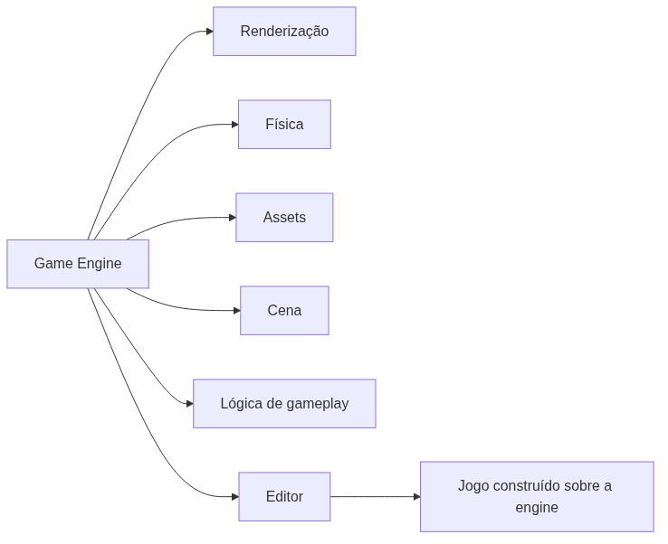

<!-- _class: cover -->

# Semana 1

## O que é uma Game Engine? Actor e Component

**Disciplina:** Tendências de Motores de Jogos (IN46A)
**Instituição:** IFMS — Campus Dourados
**Curso:** Tecnologia em Jogos Digitais
**Módulo 1 — Aprender a Ferramenta**

<!--
### Notas do apresentador
Primeira semana da disciplina. Reforçar que este é o último semestre do curso e que os estudantes já sabem programar, fazer game design e usar Unity — não é preciso ensinar conceitos básicos de desenvolvimento de jogos.
Deixar claro desde já: a disciplina NÃO ensina Unreal Engine como produto final, ela usa a Unreal como estudo de caso para ensinar conceitos universais de motores de jogos.
-->

---

## Objetivos da Semana

- Compreender o que é uma game engine, antes de qualquer botão
- Reconhecer a organização do Unreal Editor como instância de conceitos universais
- Compreender Actor e Component como unidade de composição
- Iniciar a estrutura do projeto único do semestre: o Vertical Slice

<!--
### Notas do apresentador
Resultado esperado ao final da semana: projeto criado e organizado, mais um Actor customizado com Components e uma variação própria. Nenhum sistema de gameplay ainda é esperado — é um resultado puramente estrutural e conceitual.
Perguntar à turma: "quem já usou Unity ou outra engine antes?" para calibrar o ritmo da comparação.
-->

---

<!-- _class: timeline -->

## Como a semana está organizada

- **Encontro 1** O que é uma game engine + tour pelo Unreal Editor + estrutura de pastas do Vertical Slice
- **Encontro 2** Actor e Component como composição + criação guiada + desafio de variação

<!--
### Notas do apresentador
Metodologia da semana: Scaffolded Learning, autonomia muito baixa — o professor demonstra e o estudante replica. É a primeira semana de contato com a Unreal 5.6, então o ritmo é 100% guiado.
-->

---

<!-- _class: chapter -->

## Encontro 1

# O que é uma Game Engine?

01

<!--
### Notas do apresentador
Abrir a aula sem tocar no editor. Primeiro a discussão conceitual, só depois o tour pela interface — essa ordem é intencional e não deve ser invertida.
-->

---

<!-- _class: question -->

# Aprender Unreal é a mesma coisa que aprender a fazer jogos?

Pense na diferença entre a ferramenta e o que se constrói com ela.

<!--
### Notas do apresentador
Deixar a turma discutir por 1-2 minutos antes de responder. A resposta esperada é "não" — e essa distinção é a espinha dorsal de toda a disciplina.
-->

---

## Engine, Editor e Jogo

- **Engine** — software que resolve renderização, física, assets, cena e lógica de forma reutilizável
- **Editor** — interface que expõe essas ferramentas ao desenvolvedor
- **Jogo** — o conteúdo e a lógica específicos construídos sobre a engine

Unreal, Unity, Godot e O3DE resolvem o mesmo conjunto de problemas, cada uma à sua maneira.

<!--
### Notas do apresentador
Conceito universal da aula. Reforçar que confundir "aprender Unreal" com "aprender a fazer jogos" é o erro mais comum de quem começa numa engine nova.
Pergunta para a turma: cite um problema que toda engine precisa resolver, independente de qual seja.
Erro comum: achar que dominar os botões do editor é o objetivo final da disciplina.
Referência: Unreal Engine 5 Documentation — visão geral do Editor (dev.epicgames.com/documentation).
-->

---

<!-- _class: diagram -->

## Onde a Unreal se encaixa

<!--
### Notas do apresentador
Diagrama conceitual, não literal — o objetivo é mostrar que o Editor é só a porta de entrada, não a engine em si.
-->

---

<!-- _class: comparison -->

## Unreal × Unity — primeira aproximação

### Unreal Editor

Viewport, Content Browser, Outliner, Details

### Unity Editor

Scene View, Project Window, Hierarchy, Inspector

<!--
### Notas do apresentador
Correspondência direta, mas não aprofundar ainda. A diferença arquitetural mais relevante (Unreal já nasce com Gameplay Framework robusto; Unity é mais minimalista) será retomada na Semana 4 — não antecipar agora.
-->

---

## Demonstração: tour pelo Unreal Editor

O professor vai mostrar, ao vivo, as quatro áreas principais do editor e a função de cada uma — antes de qualquer ação prática dos estudantes.

O objetivo não é decorar botões, é reconhecer o papel de cada área.

<!--
### Notas do apresentador
Não detalhar passo a passo aqui — o tutorial da semana faz isso. Este slide só estrutura a demonstração: mostrar, na ordem, Viewport → Content Browser → Outliner → Details, clicando em um objeto para mostrar a atualização simultânea do Outliner e do Details.
-->

---

> **Imagem sugerida**
>
> Objetivo: mostrar a disposição geral do Unreal Editor com as quatro áreas principais destacadas.
> Enquadramento: captura de tela cheia do editor logo após a criação do projeto Third Person, Viewport ao centro.
> Elementos presentes: Viewport, Content Browser, Outliner, Details, cada um com contorno colorido e rótulo.
> Destaque visual: contornos coloridos ao redor de cada área.
> Legenda sugerida: "As quatro áreas principais do Unreal Editor: Viewport, Content Browser, Outliner e Details."

<!--
### Notas do apresentador
Esta imagem pode ser um print real do próprio projeto de demonstração do professor, capturado durante a preparação da aula.
-->

---

## Arquitetura: a estrutura de pastas do Vertical Slice

- `Blueprints/` — Characters, Interactables, Framework, Components
- `Maps/` — Exploration, Dungeon
- `Environment/`, `Characters/`, `UI/`, `Materials/`, `Audio/`, `Data/`, `Textures/`, `Meshes/`

A mesma lógica de organizar por função, não por tipo de arquivo, é padrão em qualquer estúdio profissional.

<!--
### Notas do apresentador
Muitas dessas pastas ficarão vazias por semanas — isso é esperado. A estrutura é definida agora para não exigir retrabalho depois. Mencionar que esta estrutura está descrita em detalhe no PROJECT_ARCHITECTURE.md.
-->

---

## Boas práticas de organização

- Agrupar por função, nunca por tipo de arquivo solto
- Usar prefixos desde o início (`BP_`, `Map_`)
- Nunca renomear ou mover arquivos pelo explorador do sistema operacional

<!--
### Notas do apresentador
Reforçar: mover ou renomear assets fora do Content Browser quebra referências internas da Unreal. Esse é um erro comum e caro de corrigir mais adiante no semestre.
-->

---

<!-- _class: exercise -->

# Laboratório do Encontro 1

Criar o projeto Third Person em Blueprint e organizar a estrutura de pastas completa do Vertical Slice, replicando o modelo demonstrado.

Critério de sucesso: projeto criado, pastas organizadas, nenhum asset solto na raiz de `Content/`.

<!--
### Notas do apresentador
Não há desafio de autonomia neste encontro — é demonstração e replicação guiada, coerente com a autonomia muito baixa do início do Módulo 1. Circular pela sala conferindo a estrutura de pastas de cada grupo.
Dificuldade esperada: estudantes vindos de Unity podem procurar uma "Assets folder" idêntica. Reforçar que a equivalência é funcional, não literal.
-->

---

<!-- _class: summary-slide -->

## Fechando o Encontro 1

- Engine ≠ Editor ≠ Jogo
- Projeto do Vertical Slice criado e organizado
- Próximo encontro: Actor e Component

<!--
### Notas do apresentador
Encerrar retomando a pergunta do início: "aprender Unreal é a mesma coisa que aprender a fazer jogos?" — a turma já deve conseguir responder que não.
-->

---

<!-- _class: chapter -->

## Encontro 2

# Actor e Component

02

<!--
### Notas do apresentador
Retomar rapidamente o projeto e a estrutura de pastas do Encontro 1 antes de avançar.
-->

---

<!-- _class: question -->

# Como dar forma e comportamento a um objeto sem uma árvore rígida de heranças?

Pense em quantas classes seriam necessárias se cada combinação de "tem luz", "tem colisão", "tem malha" exigisse uma subclasse nova.

<!--
### Notas do apresentador
Deixar a turma tentar responder antes de introduzir o termo "composição sobre herança".
-->

---

## Composição sobre Herança

- Comportamento montado anexando peças reutilizáveis, não por herança de classes
- Cada peça resolve **uma** responsabilidade isolada
- O mesmo Component pode ser reaproveitado em Actors completamente diferentes

É o mesmo problema que toda engine moderna precisa resolver.

<!--
### Notas do apresentador
Conceito universal do encontro. Erro comum: estudantes tentam resolver variações criando uma nova subclasse, replicando o padrão de herança da programação tradicional — redirecionar sempre para "adicione um Component".
Referência: Actors in Unreal Engine / Components in Unreal Engine (dev.epicgames.com/documentation).
-->

---

## Actor: o contêiner universal

- Unidade básica de qualquer objeto que existe em um nível
- Sem Components, é apenas um ponto no espaço
- Ganha forma, colisão e comportamento anexando Components

<!--
### Notas do apresentador
Um Actor puro (não Character, não Pawn) é o ponto de partida do exercício — subclasses especializadas já escondem Components padrão que dificultariam ver o processo de composição.
-->

---

## Component: responsabilidade isolada

- **Static Mesh Component** — forma visual
- **Collision** — interação física com o mundo
- **Light Component** — emissão de luz

Nenhum Component sabe da existência dos outros.

<!--
### Notas do apresentador
Essa independência entre Components é o que permite reaproveitar cada peça em Actors totalmente diferentes.
-->

---

<!-- _class: comparison -->

## Actor/Component × GameObject/Component

### Unreal

Actor + Components (Static Mesh, Collision, Light)

### Unity

GameObject + Components (MeshRenderer, Collider, Light)

<!--
### Notas do apresentador
Mesmo princípio de composição nas duas engines. Diferença relevante, sem aprofundar: o Actor da Unreal já nasce com ciclo de vida e replicação embutidos; o GameObject da Unity é um contêiner mais genérico, com o comportamento definido quase inteiramente pelos Components anexados.
-->

---

## Demonstração: o que será construído

Um Actor Blueprint (`BP_TesteComposicao`) com Static Mesh, Point Light e colisão, testado em modo Play contra o personagem do template.

**Resultado esperado:** malha visível, luz emitida, colisão bloqueando o jogador.

<!--
### Notas do apresentador
Não detalhar o passo a passo aqui — isso é papel do tutorial. Demonstrar a ordem: Add Component → Static Mesh → Point Light → verificar colisão → compilar → arrastar para o nível → testar em Play.
-->

---

> **Imagem sugerida**
>
> Objetivo: mostrar o painel de Components do Blueprint com três Components anexados.
> Enquadramento: editor de Blueprint com o painel de Components à esquerda expandido.
> Elementos presentes: DefaultSceneRoot como pai de Static Mesh, Point Light e colisão.
> Destaque visual: estrutura em árvore do painel, cada item rotulado por função.
> Legenda sugerida: "Um Actor composto por três Components independentes: malha, colisão e luz."

<!--
### Notas do apresentador
Print pode ser tirado do próprio Actor de referência preparado antes da aula, sem mostrá-lo à turma antecipadamente.
-->

---

## Boas práticas

- Nomear cada Component de forma descritiva (`MalhaPrincipal`, não `StaticMesh1`)
- Compilar antes de testar em modo Play
- Comentar decisões de composição direto no Blueprint

<!--
### Notas do apresentador
O hábito de comentar decisões será cobrado formalmente a partir do Módulo 2, no Code Review — vale já mencionar isso à turma.
-->

---

<!-- _class: exercise -->

# Laboratório do Encontro 2

Replicar o `BP_TesteComposicao` demonstrado: Actor puro com Static Mesh, Point Light e colisão funcional.

Critério de sucesso: Actor bloqueia o personagem em modo Play e emite luz visível.

<!--
### Notas do apresentador
Erro comum a corrigir: selecionar "Character" em vez de "Actor" como classe-pai — Character já vem com Components de movimentação que escondem o processo de composição manual.
-->

---

<!-- _class: exercise -->

# Desafio: variação própria

Adicionar um Component adicional que produza um comportamento visual diferente do demonstrado — sem gabarito único.

Resolva por composição (novo Component), nunca criando uma nova classe de Actor.

<!--
### Notas do apresentador
Primeiro pequeno exercício de autonomia da disciplina, ainda em escopo estreito e seguro. Fazer um showcase rápido das variações de cada grupo ao final — reforça que múltiplas soluções são válidas.
-->

---

<!-- _class: summary-slide -->

## Resumo da Semana 1

- Engine, Editor e Jogo são camadas diferentes
- Projeto do Vertical Slice criado e organizado
- Actor e Component como composição sobre herança
- Cada grupo produziu uma variação própria de Component

<!--
### Notas do apresentador
Retomar o checklist do tutorial com a turma antes de encerrar.
-->

---

## Próximos passos

Na Semana 2, o `BP_Player` nasce de um **Character** — subclasse de Actor com Components de movimentação já embutidos.

**Leitura recomendada:** Actors in Unreal Engine · Components in Unreal Engine (Epic Games Documentation).

<!--
### Notas do apresentador
Antecipar que Character não é uma classe isolada, é uma especialização de Actor com Components adicionais — retomar a distinção composição/herança quando isso for explicado na Semana 2.
-->
