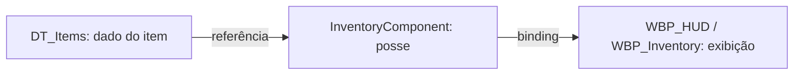
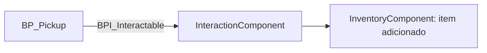

<!-- _class: cover -->

# Semana 10

## Inventário e Ampliação do Interaction System

**Disciplina:** Tendências de Motores de Jogos (IN46A)
**Instituição:** IFMS — Campus Dourados
**Curso:** Tecnologia em Jogos Digitais
**Módulo 3 — Resolver Problemas**

<!--
### Notas do apresentador
A Semana 10 continua a Unidade III com Challenge Based Learning. O eixo conceitual é a estruturação de dados coletados em um Inventário e a retomada do Interaction System da Semana 5 para suportar múltiplos tipos de interação conectados a esse inventário. Nenhum sistema dos Módulos 1 e 2 é descartado: `DT_Items` (Semana 6), `BPI_Interactable`/`InteractionComponent` (Semana 5) e `WBP_HUD` (Semana 9) são reutilizados e ampliados. A semana encerra com Code Review formal (Rubrica 4), terceira aplicação no semestre, após a Semana 7.
-->

---

## Objetivos da Semana

- Compreender padrões universais de Inventory System (armazenamento, adição/remoção, exibição)
- Estruturar um `InventoryComponent` funcional, reutilizando os itens já modelados em `DT_Items` (Semana 6)
- Retomar e ampliar o `InteractionComponent`/`BPI_Interactable` (Semana 5) para múltiplos tipos de interação
- Conectar o Interaction System ao Inventário (coletar, usar, descartar), com um novo tipo proposto por cada grupo

<!--
### Notas do apresentador
Resultado esperado ao final da semana: cada grupo com um `InventoryComponent` funcional, conectado a um `InteractionComponent` ampliado capaz de responder a múltiplos tipos de interação, sem substituir nenhum sistema anterior. Entrega da semana: Code Review dos sistemas de inventário e interação.
-->

---

<!-- _class: timeline -->

## Como a semana está organizada

- **Encontro 1** Inventory System — `InventoryComponent`, reutilizando `DT_Items` da Semana 6
- **Encontro 2** Ampliação do Interaction System — múltiplos tipos de interação conectados ao inventário + Code Review

<!--
### Notas do apresentador
Metodologia: Challenge Based Learning, autonomia média. Encontro 1 é fundamentação e adaptação guiada, não compressível — alimenta diretamente o desafio do Encontro 2. Encontro 2 concentra o desafio de ampliação e o Code Review de encerramento.
-->

---

<!-- _class: chapter -->

## Encontro 1

# Inventory System e `InventoryComponent`

01

<!--
### Notas do apresentador
Partir da constatação de que os itens já estão modelados em `DT_Items` desde a Semana 6, mas nenhum sistema registra quais itens o jogador possui. Hoje inicia a linha "Inventário" do roadmap (PROJECT_ARCHITECTURE.md, Módulo 3).
-->

---

<!-- _class: question -->

# Os itens do seu jogo já existem. Mas alguém sabe quais o jogador possui?

Pense na diferença entre o dado de um item existir e o estado de posse desse item ser controlado por algum sistema.

<!--
### Notas do apresentador
Deixar a turma responder antes de introduzir o InventoryComponent. Resposta esperada: `DT_Items` define o que cada item é desde a Semana 6, mas nada registra quais itens, e em que quantidade, um jogador possui em determinado momento.
-->

---

## Separar o dado do item da posse do item

- `DT_Items` já define o que um item é — nome, tipo, atributos (Semana 6)
- Falta um sistema que controle quais itens, e quantos, o jogador possui agora
- Um Inventory System não redefine o item — apenas gerencia uma coleção de referências a itens já definidos
- O mesmo padrão de Component isolado já usado por `HealthComponent` e `InteractionComponent`

Se o dano de um item mudar em `DT_Items`, nenhum outro sistema deveria precisar ser atualizado manualmente.

<!--
### Notas do apresentador
Este é o conceito universal do encontro. Reforçar que o InventoryComponent é o terceiro Component construído pela turma seguindo o mesmo princípio de encapsulamento — o padrão já deve ser reconhecível pelos grupos.
Referência: Gameplay Framework in Unreal Engine — Data Assets aplicados a inventário (dev.epicgames.com/documentation).
-->

---

## `InventoryComponent`: armazenamento, adição/remoção, exibição

- Component dedicado, anexado ao `BP_Player`, seguindo o padrão de `HealthComponent`/`InteractionComponent`
- Mantém uma coleção interna (Array ou Map) de referências a linhas de `DT_Items`
- Expõe funções de adicionar, remover e consultar itens
- O restante do projeto nunca precisa conhecer a estrutura interna dessa coleção

<!--
### Notas do apresentador
Erro comum a antecipar: duplicar atributos do item dentro do InventoryComponent em vez de armazenar apenas referências a DT_Items. Pergunta de verificação: "quantos lugares do projeto precisariam mudar se um item mudasse de nome?"
-->

---

<!-- _class: comparison -->

## Inventário: Unreal × Unity

### Unreal

`InventoryComponent` (Component) mantendo Array/Map de referências a linhas de `DT_Items` (Data Table + Struct)

### Unity

`MonoBehaviour` de inventário mantendo `List<T>`/`Dictionary` de referências a `ScriptableObjects` de item

<!--
### Notas do apresentador
O princípio é idêntico: o Component/script de inventário nunca redefine o item, apenas gerencia posse e quantidade. A diferença é a estrutura de dados de origem (Data Table vs. ScriptableObject por item). Não aprofundar mais — retomado na Unidade V.
-->

---

<!-- _class: diagram -->

## Item, posse e exibição

<!--
### Notas do apresentador
Diagrama conceitual. Reforçar a separação de responsabilidades: DT_Items nunca sabe quem possui o item; InventoryComponent nunca redefine o item; WBP_HUD apenas exibe o estado do InventoryComponent, reutilizando o binding aprendido na Semana 9.
-->

---

## Demonstração: `InventoryComponent` com adicionar item

O professor cria um `InventoryComponent`, com Array interno de itens possuídos e uma função de adicionar item por referência a uma linha de `DT_Items`.

**Resultado esperado:** ao chamar a função, o item passa a constar na coleção interna do Component, consultável por outros sistemas.

<!--
### Notas do apresentador
Não detalhar o passo a passo aqui — não há tutorial para este módulo, conforme PEDAGOGICAL_RULES.md; a implementação é adaptação guiada em aula. Referência: Gameplay Framework in Unreal Engine.
-->

---

> **Imagem sugerida**
>
> Objetivo: mostrar o Event Graph de um `InventoryComponent` com a função de adicionar item.
> Enquadramento: captura de tela do editor de Blueprint da Unreal, Event Graph em primeiro plano.
> Elementos presentes: nó de função "Add Item", referência a uma linha de `DT_Items`, Array de itens possuídos exposto no painel de variáveis.
> Destaque visual: circular o nó que adiciona a referência ao Array interno.
> Legenda sugerida: "InventoryComponent adicionando uma referência de DT_Items ao Array de itens possuídos."

<!--
### Notas do apresentador
Usar esta imagem para orientar visualmente a estrutura do Component antes da demonstração ao vivo.
-->

---

## Boas práticas

- Nomear o Component com o prefixo `BP_` seguido de `Component` (`InventoryComponent`), conforme PROJECT_ARCHITECTURE.md
- Armazenar apenas referências às linhas de `DT_Items`, nunca duplicar seus atributos
- Manter o `InventoryComponent` desacoplado de qualquer lógica de UI

<!--
### Notas do apresentador
Grupos com dificuldade para referenciar uma linha de Data Table a partir do Component devem ser direcionados à documentação oficial antes de receber a resposta direta.
-->

---

<!-- _class: exercise -->

# Laboratório do Encontro 1

Cada grupo estrutura seu próprio `InventoryComponent`, reutilizando os itens já modelados em `DT_Items` na Semana 6, e implementa adição e remoção básica.

Critério de sucesso: o `InventoryComponent` armazena e consulta itens referenciados em `DT_Items`, sem alterar a lógica de nenhum sistema anterior.

<!--
### Notas do apresentador
Sem desafio de liberdade de solução neste encontro — estruturação é demonstração e adaptação guiada, preparando o desafio de maior autonomia do Encontro 2. Nota de contingência: se faltar tempo, priorizar a função de adicionar sobre a de remover/descartar, retomável no início do Encontro 2.
-->

---

<!-- _class: summary-slide -->

## Fechando o Encontro 1

- Inventory System separa o dado do item (`DT_Items`) da posse do item (`InventoryComponent`)
- Cada grupo com um `InventoryComponent` funcional, armazenando e consultando itens
- Próximo encontro: conectar esse inventário ao Interaction System da Semana 5

<!--
### Notas do apresentador
Reforçar que o InventoryComponent construído hoje é a base sobre a qual a interação ampliada do Encontro 2 será conectada — nada será substituído.
-->

---

<!-- _class: chapter -->

## Encontro 2

# Ampliando o Interaction System

02

<!--
### Notas do apresentador
Terceira aplicação da Rubrica 4 — Code Review no semestre (após a Semana 7), aplicada aos sistemas de inventário e interação. Enunciado do desafio deliberadamente aberto, sem indicar qual novo tipo de interação implementar.
-->

---

<!-- _class: question -->

# Uma única reação de interação resolve coletar, usar e descartar itens?

Pense no que muda quando um sistema de interação precisa distinguir tipos diferentes de resposta, não apenas disparar uma reação genérica.

<!--
### Notas do apresentador
Deixar a turma responder antes de introduzir a ampliação. Resposta esperada: não — a Semana 5 disparava uma única chamada via BPI_Interactable; agora é preciso distinguir coletar, usar e descartar, sem que o InteractionComponent conheça os detalhes internos de cada caso.
-->

---

## De uma reação genérica a múltiplas respostas

- Semana 5: `InteractionComponent` detectava e disparava uma única chamada via `BPI_Interactable`
- Agora: a interação precisa distinguir coletar, usar e descartar, conectados ao `InventoryComponent`
- O princípio de desacoplamento não muda — muda a granularidade da resposta
- `BPI_Interactable` continua sendo o único ponto de comunicação entre `InteractionComponent` e o mundo

O `InteractionComponent` nunca deveria precisar conhecer se o objeto interativo é um item, uma porta ou uma alavanca.

<!--
### Notas do apresentador
Conceito universal do encontro. Reforçar que o mesmo padrão arquitetural da Semana 5 é reaproveitado, não recriado. Referência: Gameplay Framework in Unreal Engine.
-->

---

## Recursos retomados e novos

- `InteractionComponent`, `BPI_Interactable`, Event Dispatchers — retomados da Semana 5
- `InventoryComponent` — construído no Encontro 1
- Conexão: coletar (adicionar ao inventário), usar (aplicar efeito), descartar (remover e devolver ao mundo)

<!--
### Notas do apresentador
Nenhum destes sistemas é recriado — todos são reaproveitados e ampliados, conforme PEDAGOGICAL_RULES.md ("cada novo conteúdo deve reutilizar sistemas desenvolvidos anteriormente").
-->

---

<!-- _class: comparison -->

## Múltiplos tipos de interação: Unreal × Unity

### Unreal

`BPI_Interactable` com parâmetro de tipo, ou interfaces adicionais especializadas por tipo de interação

### Unity

Interface C# equivalente, distinguindo tipos por parâmetro (enum) do método ou por múltiplas interfaces especializadas

<!--
### Notas do apresentador
O princípio de comunicação desacoplada é idêntico nas duas engines; a decisão entre método genérico parametrizado e múltiplas interfaces é a mesma decisão de design em qualquer engine. Não aprofundar mais — retomado na Unidade V.
-->

---

<!-- _class: diagram -->

## Fluxo de uma interação de coleta

<!--
### Notas do apresentador
Diagrama conceitual. Reforçar que o InteractionComponent nunca acessa o InventoryComponent diretamente do Actor interativo — a comunicação passa pela interface, exatamente como ensinado na Semana 5.
-->

---

## Demonstração: `BP_Pickup` conectado ao inventário

O professor conecta um Actor interativo (`BP_Pickup`) que implementa `BPI_Interactable` e, ao ser interagido, adiciona seu item ao `InventoryComponent` do jogador.

**Resultado esperado:** ao interagir com o `BP_Pickup`, o item correspondente passa a constar no inventário do jogador.

<!--
### Notas do apresentador
Não detalhar o passo a passo — não há tutorial para este módulo. Após a demonstração, apresentar o desafio sem indicar qual novo tipo de interação implementar.
-->

---

> **Imagem sugerida**
>
> Objetivo: mostrar a interface `BPI_Interactable` implementada por um `BP_Pickup` que se comunica com o `InventoryComponent`.
> Enquadramento: captura de tela do editor de Blueprint, com dois grafos lado a lado.
> Elementos presentes: grafo do `BP_Pickup` chamando a interface; grafo do `InteractionComponent` recebendo o evento e acionando o `InventoryComponent`.
> Destaque visual: seta tracejada conectando os dois grafos através da interface, sem linha direta entre as classes.
> Legenda sugerida: "BP_Pickup e InteractionComponent comunicando-se por BPI_Interactable, sem referência direta."

<!--
### Notas do apresentador
Usar esta imagem para reforçar visualmente que a comunicação passa pela interface, não por Cast to direto.
-->

---

<!-- _class: exercise -->

# Desafio: ampliando o Interaction System

Cada grupo expande seu sistema de interação para suportar um novo tipo além de coletar — empilhar itens, combinar itens, ou interação com cooldown — conectado ao `InventoryComponent`, com solução própria.

Não há indicação prévia de qual novo tipo implementar. A escolha técnica faz parte do desafio.

<!--
### Notas do apresentador
Ao final, cada grupo apresenta sua solução para o Code Review formal (Rubrica 4). Grupos que travarem na lógica de empilhar ou combinar itens devem ser direcionados à documentação oficial antes de apoio direto, preservando a autonomia média do Módulo 3.
-->

---

## Boas práticas

- Nunca contornar `BPI_Interactable` com `Cast to` direto entre o Actor interativo e o `InventoryComponent`
- Modularizar a lógica comum entre coletar, usar e descartar, evitando duplicação
- Manter a nomenclatura consistente com `InteractionComponent`/`InventoryComponent` já estabelecidos

<!--
### Notas do apresentador
Erro comum a antecipar: duplicação de lógica entre os diferentes tipos de interação. Durante o Code Review, priorizar feedback sobre modularização dessas funções.
-->

---

<!-- _class: exercise -->

# Code Review — Inventário e Interação

Ao final do encontro, cada grupo apresenta os sistemas de inventário e interação ampliada para Code Review formal, terceira aplicação da Rubrica 4 no semestre.

Critérios avaliados: Organização dos Blueprints, Nomenclatura, Modularidade, Reutilização, Comunicação entre sistemas, Boas práticas gerais.

<!--
### Notas do apresentador
Rubrica 4 — Code Review, aplicada anteriormente na Semana 7. Reforçar aos grupos que a reutilização de DT_Items, InteractionComponent e WBP_HUD sem recriação é critério explícito de avaliação (Reutilização).
-->

---

<!-- _class: summary-slide -->

## Resumo da Semana 10

- Inventory System separa o dado do item (`DT_Items`) da posse do item (`InventoryComponent`)
- Interaction System evolui de uma reação genérica para múltiplas respostas (coletar, usar, descartar), via `BPI_Interactable`
- Terceiro desafio de liberdade real de solução da disciplina, avaliado por Code Review formal
- Nenhum sistema dos Módulos 1 e 2 substituído ou quebrado

<!--
### Notas do apresentador
Reforçar a distinção entre dado de item, posse de item e comunicação de interação como núcleo conceitual da semana.
-->

---

## Checklist da Semana

- `InventoryComponent` funcional, armazenando e consultando itens de `DT_Items` (Encontro 1)
- `InteractionComponent` ampliado, suportando coletar e ao menos um segundo tipo de interação (Encontro 2)
- Conexão entre inventário e interação via `BPI_Interactable`, sem `Cast to` direto
- Code Review formal (Rubrica 4) realizado

<!--
### Notas do apresentador
Este checklist alimenta o Code Review formal da semana, conforme Sistema de Avaliação.
-->

---

## Próximos passos

A Semana 11 introduz Navigation, Behavior Trees e Blackboards, encerrando a Unidade III com a entrega do Vertical Slice jogável do Módulo 3 — animação, interface, inventário, interação ampliada e IA integrados —, seguida de Playtest coletivo e Showcase.

**Leitura recomendada:** Gameplay Framework in Unreal Engine — Data Assets aplicados a inventário (Epic Games Documentation).

<!--
### Notas do apresentador
Reforçar que o InventoryComponent e a interação ampliada construídos nesta semana servirão de contexto para o comportamento autônomo de NPCs na Semana 11, e que o padrão de comunicação via BPI_Interactable/Event Dispatchers será reaproveitado na integração com a IA.
-->
