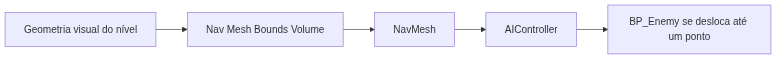
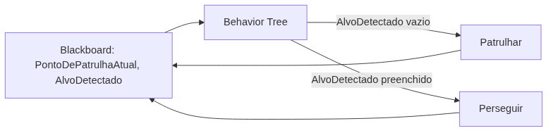
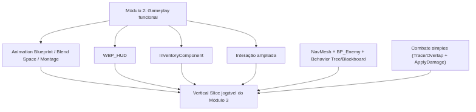

<!-- _class: cover -->

# Semana 11

## Navigation, Behavior Tree, Blackboard e Combate Simples — Encerramento do Módulo 3

**Disciplina:** Tendências de Motores de Jogos (IN46A)
**Instituição:** IFMS — Campus Dourados
**Curso:** Tecnologia em Jogos Digitais
**Módulo 3 — Resolver Problemas**

<!--
### Notas do apresentador
A Semana 11 encerra a Unidade III, mantendo Challenge Based Learning com autonomia média. O eixo conceitual é a autonomia de deslocamento e decisão de agentes não-jogadores, resolvida por três recursos que sempre aparecem juntos: NavMesh (onde o agente pode andar), Behavior Tree (o que decide fazer) e Blackboard (o que sabe/lembra). O Encontro 2 também fecha o combate simples do Vertical Slice, conectando `BP_Player` e `BP_Enemy` via Trace/Overlap + `ApplyDamage` no `HealthComponent` (Semana 8). Encerra com Playtest coletivo (Rubrica 5) e Showcase (Rubrica 6) do Vertical Slice do Módulo 3. Não há tutorial para esta semana — Módulo 3 não produz tutoriais passo a passo, conforme PEDAGOGICAL_RULES.md.
-->

---

## Objetivos da Semana

- Compreender Navigation/NavMesh como base universal de deslocamento autônomo de agentes
- Compreender Behavior Tree como estrutura de decisão e Blackboard como memória compartilhada do agente
- Implementar `BP_Enemy` com patrulha e perseguição, reutilizando o `HealthComponent` já existente
- Implementar um combate simples: `BP_Player` ataca `BP_Enemy` via Trace/Overlap chamando `ApplyDamage`
- Propor, com autonomia própria, um comportamento autônomo adicional e apresentar o Vertical Slice do Módulo 3 em Showcase

<!--
### Notas do apresentador
Resultado esperado: NavMesh gerado, `BP_Enemy` funcional com patrulha/perseguição via Behavior Tree/Blackboard, um comportamento adicional proposto pelo grupo, e o Vertical Slice do Módulo 3 (animação, HUD, inventário, interação ampliada, IA) avaliado em Playtest e Showcase.
-->

---

<!-- _class: timeline -->

## Como a semana está organizada

- **Encontro 1** Navigation e NavMesh — `BP_Enemy` se desloca até um ponto
- **Encontro 2** Behavior Tree e Blackboard, combate simples (Trace/Overlap + `ApplyDamage`) — desafio de comportamento autônomo, Playtest e Showcase de encerramento do Módulo 3

<!--
### Notas do apresentador
Metodologia: Challenge Based Learning, autonomia média. Encontro 1 é fundamentação não compressível — alimenta diretamente a Behavior Tree do Encontro 2. Encontro 2 concentra o desafio de maior liberdade da semana, além do Playtest e do Showcase de encerramento do módulo — não comprimir nenhum dos três.
-->

---

<!-- _class: chapter -->

## Encontro 1

# Navigation e NavMesh

01

<!--
### Notas do apresentador
Partir da constatação de que, até aqui, apenas o `BP_Player` se move pelo nível, sempre por comando direto do jogador. Hoje inicia a linha "NavMesh / BP_Enemy" do roadmap (PROJECT_ARCHITECTURE.md, Módulo 3).
-->

---

<!-- _class: question -->

# Como um NPC sabe onde pode andar sem atravessar uma parede?

Pense na diferença entre a geometria que o jogador vê e colide, e a geometria que um agente autônomo consulta para planejar um caminho.

<!--
### Notas do apresentador
Deixar a turma responder antes de introduzir NavMesh. Resposta esperada: o NPC não "enxerga" o nível como o jogador — ele precisa de uma representação simplificada e navegável do espaço, calculada previamente.
-->

---

## Geometria visual × geometria de navegação

- A geometria que o jogador vê e colide não é a mesma que um agente autônomo consulta para planejar caminho
- Um NPC precisa de uma malha navegável, calculada previamente a partir do nível
- Toda engine madura separa essas duas camadas: visual/colisão e navegação
- Este é o primeiro sistema do semestre dedicado exclusivamente a um agente não-jogador

Até aqui, todo deslocamento ensinado pertencia ao `BP_Player` — hoje o deslocamento passa a ser também autônomo, decidido por um agente.

<!--
### Notas do apresentador
Conceito universal do encontro. Reforçar que a separação entre camada visual e camada de navegação é o motivo de existir de qualquer sistema de Navigation, não uma particularidade da Unreal.
Referência: Navigation System in Unreal Engine (dev.epicgames.com/documentation).
-->

---

## NavMesh e AIController

- `Nav Mesh Bounds Volume` delimita a área onde a malha de navegação é gerada
- `NavMesh` é gerado automaticamente a partir da geometria marcada como estática dentro do volume
- `AIController` solicita deslocamento até qualquer ponto navegável da malha
- `BP_Enemy` (novo) é o primeiro Actor do projeto controlado por um `AIController`, não pelo jogador

<!--
### Notas do apresentador
Reforçar que o NavMesh precisa ser regenerado sempre que a geometria estática do nível mudar. Pergunta de verificação: se o professor mover uma parede do Dungeon Kit agora, o NavMesh atual continua válido?
-->

---

<!-- _class: comparison -->

## Navigation: Unreal × Unity

### Unreal

NavMesh gerado em tempo real dentro do `Nav Mesh Bounds Volume`; `AIController` solicita deslocamento sobre a malha

### Unity

NavMesh gerado via bake explícito sobre a geometria estática; `NavMeshAgent` solicita deslocamento com `SetDestination`

<!--
### Notas do apresentador
O princípio é idêntico nas duas engines: geometria navegável pré-calculada, separada da camada visual, consultada por um agente para planejar caminho. A diferença está no fluxo de configuração — geração em tempo real (Unreal) versus bake explícito (Unity). Não aprofundar mais — retomado na Unidade V.
-->

---

<!-- _class: diagram -->

## Da geometria do nível ao deslocamento autônomo

<!--
### Notas do apresentador
Diagrama conceitual. Reforçar que cada seta representa uma camada adicional entre a geometria bruta do nível e o deslocamento efetivo de um agente autônomo.
-->

---

## Demonstração: NavMesh e primeiro deslocamento

O professor configura um `Nav Mesh Bounds Volume` cobrindo a área jogável, gera o NavMesh resultante, e cria um `BP_Enemy` com `AIController` capaz de se deslocar até um ponto fixo usando `Move To`/`Simple Move to Location`.

**Resultado esperado:** o `BP_Enemy` se move de um ponto a outro sem atravessar paredes ou obstáculos do nível.

<!--
### Notas do apresentador
Não detalhar o passo a passo — não há tutorial para este módulo, conforme PEDAGOGICAL_RULES.md. Dificuldade esperada: NavMesh incompleto por geometria não marcada como estática, ou volume delimitado menor que a área jogável.
-->

---

> **Imagem sugerida**
>
> Objetivo: mostrar a malha de navegação gerada sobre o nível, reforçando a separação entre geometria visual e geometria navegável.
> Enquadramento: captura de tela do editor da Unreal Engine com a visualização de NavMesh ativada sobre um trecho do Dungeon Kit.
> Elementos presentes: área navegável destacada em verde translúcido sobre o piso do nível; contorno das paredes sem cobertura de NavMesh.
> Destaque visual: o limite entre a área verde (navegável) e a geometria sem cobertura (paredes, obstáculos).
> Legenda sugerida: "A malha de navegação existe apenas onde um agente pode efetivamente andar."

<!--
### Notas do apresentador
Print pode ser montado a partir do nível de exemplo preparado antes da aula, com a visualização de NavMesh ativada (tecla de debug), fora da visão da turma.
-->

---

## Boas práticas

- Marcar corretamente a geometria estática do nível antes de gerar o NavMesh
- Delimitar o `Nav Mesh Bounds Volume` cobrindo toda a área jogável, sem sobras
- Nomear e organizar `BP_Enemy` na subpasta `Blueprints/Characters/`, conforme PROJECT_ARCHITECTURE.md

<!--
### Notas do apresentador
Grupos com dificuldade para associar o AIController ao BP_Enemy devem ser direcionados à documentação oficial antes de receber a resposta direta.
-->

---

<!-- _class: exercise -->

# Laboratório do Encontro 1

Configurar o NavMesh do próprio nível e criar `BP_Enemy` com `AIController`, validando o deslocamento até um ponto definido, sem alterar a lógica de nenhum sistema anterior.

Critério de sucesso: NavMesh gerado corretamente sobre o nível e `BP_Enemy` deslocando-se até o ponto definido, sem atravessar paredes ou obstáculos.

<!--
### Notas do apresentador
Sem desafio de liberdade de solução neste encontro — construção guiada, preparando o desafio de maior autonomia do Encontro 2. Nota de contingência: se faltar tempo, priorizar a geração do NavMesh e o deslocamento a um único ponto fixo sobre variações de destino.
-->

---

<!-- _class: summary-slide -->

## Fechando o Encontro 1

- NavMesh separa geometria visual de geometria navegável; `AIController` consulta a malha para planejar deslocamento
- `BP_Enemy` de cada grupo deslocando-se corretamente até um ponto do nível
- Próximo encontro: dar a esse deslocamento uma estrutura de decisão — patrulhar ou perseguir

<!--
### Notas do apresentador
Reforçar que o NavMesh e o AIController construídos hoje são a base sobre a qual a Behavior Tree do Encontro 2 será conectada — nada será substituído.
-->

---

<!-- _class: chapter -->

## Encontro 2

# Behavior Tree e Blackboard

02

<!--
### Notas do apresentador
Encerramento da Unidade III. Após a demonstração guiada de patrulha/perseguição, os grupos recebem o desafio de propor um comportamento autônomo adicional, seguido de Playtest coletivo (Rubrica 5) e Showcase (Rubrica 6) do Vertical Slice do Módulo 3.
-->

---

<!-- _class: question -->

# Quem deve guardar "para onde o inimigo está indo": a árvore de decisão, ou outra coisa?

Pense no que acontece se a estrutura de decisão também tiver que guardar cada dado que usa.

<!--
### Notas do apresentador
Deixar a turma responder antes de introduzir Blackboard. Resposta esperada: se a estrutura de decisão guardasse ela mesma cada dado que consulta, o mesmo problema resolvido pelo Event Dispatcher da Semana 5 reapareceria — decisão e dado deveriam ser coisas separadas.
-->

---

## Decisão e memória: dois papéis separados

- Uma Behavior Tree é uma estrutura hierárquica avaliada continuamente durante o jogo
- Nós de seleção escolhem entre ramos alternativos (patrulhar ou perseguir); nós de sequência executam passos em ordem
- Nenhum nó guarda por si só o estado do agente — essa responsabilidade é de outro artefato
- Um Blackboard é uma memória de chave-valor compartilhada, lida e escrita pela Behavior Tree a cada avaliação

O mesmo princípio de `BPI_Interactable`/Event Dispatchers (Semana 5): uma estrutura de controle não deve guardar o dado que outra parte do sistema também precisa consultar.

<!--
### Notas do apresentador
Conceito universal do encontro. Reforçar a ligação explícita com a Semana 5 e a Semana 10 — o mesmo princípio de desacoplamento reaparece aqui entre decisão (Behavior Tree) e memória (Blackboard).
Referência: Behavior Trees in Unreal Engine (dev.epicgames.com/documentation).
-->

---

## Patrulha e perseguição em `BP_Enemy`

- A Behavior Tree alterna entre dois ramos: patrulhar entre pontos e perseguir o jogador
- O Blackboard guarda chaves como `PontoDePatrulhaAtual` e `AlvoDetectado`
- A transição para perseguição ocorre quando `AlvoDetectado` é preenchido por uma verificação de distância ou visão
- `BP_Enemy` reutiliza o `HealthComponent` já construído na Semana 8, sem duplicar lógica de vida/dano

<!--
### Notas do apresentador
Erro comum a antecipar: resolver o comportamento adicional do desafio com lógica direta no Event Graph do BP_Enemy, fora da Behavior Tree, quebrando a decisão centralizada. Pergunta de verificação: se esse NPC precisar de um terceiro comportamento no futuro, essa lógica solta no Event Graph cresceria de forma organizada?
-->

---

<!-- _class: comparison -->

## Behavior Tree e Blackboard: Unreal × Unity

### Unreal

Behavior Tree e Blackboard nativos, integrados ao editor desde o início

### Unity

Sem equivalente nativo de mesmo nível; depende de packages de terceiros (Behavior Designer, NodeCanvas) para estrutura de decisão hierárquica, com memória compartilhada resolvida por variáveis do próprio asset ou um Dictionary

<!--
### Notas do apresentador
O princípio — separar estrutura de decisão de memória do agente — é o mesmo nas duas engines; a diferença está na disponibilidade nativa. Não aprofundar mais — retomado na Unidade V.
-->

---

<!-- _class: diagram -->

## Behavior Tree e Blackboard em conjunto

<!--
### Notas do apresentador
Diagrama conceitual. Reforçar que a Behavior Tree lê e escreve continuamente no Blackboard — a seta de volta para A representa essa atualização constante, não um evento único.
-->

---

## Demonstração: patrulha e perseguição

O professor constrói uma Behavior Tree com um nó seletor entre dois ramos — patrulhar entre pontos definidos no Blackboard e perseguir o jogador quando a chave `AlvoDetectado` é preenchida por uma verificação de distância ou visão.

**Resultado esperado:** a turma vê o `BP_Enemy` alternando corretamente entre patrulha e perseguição, antes de propor o próprio comportamento adicional.

<!--
### Notas do apresentador
Não detalhar o passo a passo — não há tutorial para este módulo. Após a demonstração, apresentar o desafio sem indicar qual comportamento adicional implementar.
-->

---

> **Imagem sugerida**
>
> Objetivo: mostrar a estrutura visual de uma Behavior Tree simples, reforçando a separação entre nós de decisão e o Blackboard que eles consultam.
> Enquadramento: captura de tela do editor de Behavior Tree da Unreal Engine, com a janela de Blackboard visível ao lado.
> Elementos presentes: um nó Selector ligando os ramos "Patrulhar" e "Perseguir"; painel de Blackboard com as chaves `PontoDePatrulhaAtual` e `AlvoDetectado` visíveis.
> Destaque visual: a chave `AlvoDetectado` do Blackboard, com uma seta indicando que ela é lida pelo nó Selector para escolher o ramo.
> Legenda sugerida: "A árvore decide; o Blackboard lembra."

<!--
### Notas do apresentador
Print pode ser montado a partir da Behavior Tree e do Blackboard de exemplo preparados antes da aula, fora da visão da turma.
-->

---

<!-- _class: question -->

# O jogador ataca. Quem decide se o inimigo foi atingido, e quem decide o que fazer com isso?

Pense na diferença entre "detectar que um ataque acertou" e "saber o que fazer quando a vida chega a zero".

<!--
### Notas do apresentador
Deixar a turma responder antes de introduzir o combate simples. Resposta esperada: detectar o acerto é um problema novo (Trace/Overlap); o que fazer com o dano já está resolvido desde a Semana 8 pelo `HealthComponent` — não é preciso reinventar essa parte.
-->

---

## Combate simples: detecção de acerto + `ApplyDamage`

- Um combate simples não precisa de um sistema próprio de dano — só precisa identificar o alvo atingido
- `BP_Player` dispara um Trace (ou ativa um Overlap por um instante) durante uma ação de ataque
- Ao identificar um `BP_Enemy` atingido, chama `ApplyDamage` no `HealthComponent` do alvo — função já construída na Semana 8
- O `BP_Player` nunca precisa saber como o `HealthComponent` do inimigo guarda ou processa vida

Detectar o acerto (Trace/Overlap) e decidir o que fazer com o dano (`HealthComponent`) são dois problemas separados — o combate desta semana só resolve o primeiro, reaproveitando o segundo.

<!--
### Notas do apresentador
Conceito universal do bloco: hit detection como problema independente de gerenciamento de vida. Reforçar que o escopo do combate é deliberadamente mínimo (PROJECT_ARCHITECTURE.md, seção 4) — uma forma de ataque, sem combos nem múltiplas armas.
Referência: Traces and Overlaps in Unreal Engine (dev.epicgames.com/documentation).
-->

---

<!-- _class: comparison -->

## Combate simples: Unreal × Unity

### Unreal

Line Trace/Overlap identifica o alvo; chama `ApplyDamage` no `HealthComponent` do alvo atingido

### Unity

`Physics.Raycast`/`Physics.OverlapSphere` identifica o alvo; chama um método público de dano em um script de vida equivalente

<!--
### Notas do apresentador
O princípio é idêntico nas duas engines: detectar o alvo, depois chamar uma função de contrato conhecida que já gerencia vida. A diferença é apenas de API e sintaxe. Não aprofundar mais — retomado na Unidade V.
-->

---

## Demonstração: combate simples

O professor dispara um Trace a partir de uma ação de ataque do `BP_Player`, identifica um `BP_Enemy` atingido e chama `ApplyDamage` no `HealthComponent` do inimigo.

**Resultado esperado:** a turma vê a vida do `BP_Enemy` sendo reduzida a cada acerto, sem nenhuma lógica de dano nova dentro do `HealthComponent`.

<!--
### Notas do apresentador
Não detalhar o passo a passo — não há tutorial para este módulo. Esta é construção guiada (não o desafio de liberdade de solução do encontro), mas é pré-requisito funcional para a opção de "fuga ao ficar com pouca vida" do desafio seguinte.
-->

---

<!-- _class: exercise -->

# Desafio: comportamento autônomo adicional

Cada grupo propõe e implementa um comportamento autônomo adicional para seu `BP_Enemy` — alerta antes de perseguir, fuga ao ficar com pouca vida (reutilizando o `HealthComponent`), ou reação a uma interação do jogador — integrado ao NavMesh, à Behavior Tree e ao Blackboard já construídos.

Não há indicação prévia de qual comportamento implementar. A escolha e a integração à Behavior Tree existente fazem parte do desafio.

<!--
### Notas do apresentador
Avaliação: Rubrica 2 — Desafios Técnicos, critérios Solução proposta, Uso correto da Unreal e Criatividade. Grupos que travarem na detecção de proximidade do jogador devem ser direcionados à documentação oficial antes de receber apoio direto, preservando a autonomia média do Módulo 3.
-->

---

## Boas práticas

- Toda decisão do agente deve passar pela Behavior Tree, nunca por lógica solta no Event Graph do `BP_Enemy`
- Usar o Blackboard como único ponto de memória compartilhada do agente
- Reutilizar o `HealthComponent` já existente — nunca duplicar lógica de vida entre `BP_Player` e `BP_Enemy`

<!--
### Notas do apresentador
Durante o Playtest, é comum um NPC ficar preso em geometria do nível por NavMesh mal configurado — registrar o bug para correção antes do Módulo 4, sem penalizar o Showcase isoladamente se a IA funcionar na maior parte da sessão.
-->

---

<!-- _class: exercise -->

# Playtest coletivo e Showcase — Encerramento do Módulo 3

Cada grupo apresenta o Vertical Slice completo do Módulo 3 — animação, HUD, inventário, interação ampliada e IA integrados — em Showcase, seguido de Playtest coletivo conduzido pelos colegas.

Critério de sucesso: Vertical Slice jogável do início ao fim, com `BP_Enemy` funcional, sem interromper nenhum sistema construído nos Módulos 1 e 2.

<!--
### Notas do apresentador
Avaliação: Playtest (Rubrica 5 — Funcionamento, Usabilidade, Bugs, Feedback visual, Clareza da interface, Experiência do jogador) e Showcase (Rubrica 6 — Apresentações: Comunicação, Demonstração, Justificativas técnicas, Domínio do projeto, Capacidade de responder perguntas). Reforçar que a própria equipe jogar o Playtest invalida o instrumento — é necessário um jogador externo ao grupo.
-->

---

<!-- _class: diagram -->

## Vertical Slice do Módulo 3

<!--
### Notas do apresentador
Diagrama conceitual, retomando a seção 11 do PROJECT_ARCHITECTURE.md. Reforçar que todos os sistemas das Semanas 8 a 11 convergem para o mesmo Vertical Slice, sem substituir nada dos Módulos 1 e 2.
-->

---

<!-- _class: summary-slide -->

## Resumo da Semana 11

- NavMesh resolve deslocamento autônomo; Behavior Tree decide, Blackboard lembra
- `BP_Enemy` funcional, com patrulha, perseguição e um comportamento adicional proposto pelo grupo
- Combate simples funcional: Trace/Overlap do `BP_Player` chamando `ApplyDamage` no `HealthComponent` de `BP_Enemy`
- Vertical Slice do Módulo 3 apresentado em Showcase e avaliado em Playtest coletivo
- Unidade III — Resolver Problemas — encerrada

<!--
### Notas do apresentador
Reforçar a distinção entre geometria de navegação (NavMesh), estrutura de decisão (Behavior Tree) e memória do agente (Blackboard) como três problemas complementares, não hierárquicos.
-->

---

## Checklist Final do Módulo 3

- `HealthComponent`, Animation Blueprint com State Machine, Blend Space e Montage funcionais (Semana 8)
- `WBP_HUD` exibindo dados de jogo em tempo real (Semana 9)
- `InventoryComponent` e interação ampliada integrados (Semana 10)
- NavMesh gerado e `BP_Enemy` com patrulha, perseguição e comportamento adicional (Semana 11)
- Combate simples funcional entre `BP_Player` e `BP_Enemy` (Semana 11)
- Playtest coletivo e Showcase concluídos, com pendências registradas quando houver

<!--
### Notas do apresentador
Este checklist encerra formalmente a Unidade III. Pendências registradas (ex.: NavMesh incompleto, bug de colisão) devem ser acompanhadas no Módulo 4, sem impedir o registro do progresso já alcançado.
-->

---

## Próximos passos

A Semana 12 abre a Unidade IV — Produzir como um Pequeno Estúdio, mudando a metodologia para Studio Based Learning com o professor como diretor técnico e autonomia alta. O foco passa a ser polimento técnico — materiais parametrizados (Material Instances) e Foliage — sobre o Vertical Slice já consolidado, sem substituir nenhum sistema construído até aqui.

**Leitura recomendada:** Behavior Trees in Unreal Engine (Epic Games Documentation).

<!--
### Notas do apresentador
Reforçar que `HealthComponent`, `InteractionComponent`, `InventoryComponent`, `BP_Enemy` com Behavior Tree/Blackboard e o combate simples permanecem intactos — o Módulo 4 refina e otimiza o que já existe, a partir dos bugs e pontos de confusão registrados no Playtest desta semana.
-->
