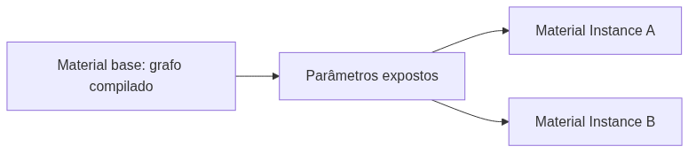
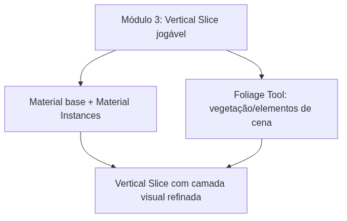

<!-- _class: cover -->

# Semana 12

## Material Instances e Foliage — Abertura do Módulo 4

**Disciplina:** Tendências de Motores de Jogos (IN46A)
**Instituição:** IFMS — Campus Dourados
**Curso:** Tecnologia em Jogos Digitais
**Módulo 4 — Produzir como um Pequeno Estúdio**

<!--
### Notas do apresentador
A Semana 12 abre a Unidade IV — Produzir como um Pequeno Estúdio, encerrando o eixo de resolução de problemas da Unidade III (Semanas 8–11) e iniciando Studio Based Learning com autonomia alta: o professor passa a atuar como diretor técnico, não mais propondo desafios fechados. O eixo conceitual é a padronização e otimização da produção visual em escala de estúdio, resolvida por Material Instance (parametrização sem recompilar shader) e Foliage Tool (composição de cena em massa). Não há tutorial para esta semana — Módulo 4 não produz tutoriais passo a passo, conforme PEDAGOGICAL_RULES.md. Nenhum sistema de gameplay do Módulo 1 ao 3 é alterado.
-->

---

## Objetivos da Semana

- Compreender Material Instance como estratégia universal de parametrização e otimização de materiais
- Compreender a Foliage Tool como ferramenta de composição de cena em massa, com controle de densidade e performance
- Refatorar os materiais existentes do projeto em Material Instances parametrizadas
- Compor vegetação/elementos de cena no nível do Vertical Slice, sem alterar nenhum sistema de gameplay

<!--
### Notas do apresentador
Resultado esperado: materiais principais refatorados em Material base + Material Instances organizadas conforme PROJECT_ARCHITECTURE.md (`Materials/Base/`, `Materials/Instances/`, prefixos `M_`/`MI_`), e um nível com vegetação/elementos de cena via Foliage Tool. Encerra com Code Review formal (Rubrica 4), com ênfase em nomenclatura e organização de pastas.
-->

---

<!-- _class: timeline -->

## Como a semana está organizada

- **Encontro 1** Material base × Material Instance — refatoração dos materiais existentes
- **Encontro 2** Foliage Tool — composição de cena e Code Review de encerramento

<!--
### Notas do apresentador
Metodologia: Studio Based Learning, autonomia alta — o professor atua como diretor técnico. Encontro 1 tem folga relativa (pode ser comprimido reduzindo a quantidade de materiais refatorados, sem prejuízo conceitual, conforme Cronograma). Encontro 2 concentra o Code Review de encerramento (Rubrica 4) — não deve ser comprimido.
-->

---

<!-- _class: chapter -->

## Encontro 1

# Material Base e Material Instance

01

<!--
### Notas do apresentador
Primeiro momento do semestre em que o foco recai sobre a camada de produção visual em si. Até aqui os materiais existiam apenas como parte do graybox exploratório do Módulo 1 (Semana 1) — hoje inicia a linha "Materials → Material Instances" do roadmap (PROJECT_ARCHITECTURE.md, Módulo 4).
-->

---

<!-- _class: question -->

# Por que não criar um Material novo para cada variação de superfície?

Pense no custo de compilar um shader e no que acontece quando esse custo se multiplica por dezenas de variações visuais.

<!--
### Notas do apresentador
Deixar a turma responder antes de introduzir Material Instance. Resposta esperada: compilar shader é uma operação custosa; multiplicar Materials completos para cada variação (pedra limpa, pedra com musgo, pedra molhada) multiplica esse custo e a dificuldade de manutenção sem necessidade.
-->

---

## Estrutura compilada × valores de instância

- Um Material base é o grafo de nós que define como a superfície reage à luz — estrutura compilada
- Uma Material Instance herda esse grafo e expõe apenas parâmetros editáveis (cor, textura, rugosidade)
- Dezenas de variações visuais podem nascer de uma única estrutura compilada uma única vez
- Este é o primeiro sistema do semestre dedicado exclusivamente à camada de produção visual

Até aqui os materiais existiam apenas como parte do graybox do Módulo 1 — hoje eles se tornam uma decisão de produção, não apenas um placeholder.

<!--
### Notas do apresentador
Conceito universal do encontro. Reforçar que a separação entre estrutura e parametrização é o motivo de existir de qualquer sistema de Material Instance, não uma particularidade da Unreal.
Referência: Unreal Engine Materials (dev.epicgames.com/documentation).
-->

---

## Parâmetros expostos e Material Editor

- `Scalar Parameter`, `Vector Parameter` e `Texture Parameter` são os tipos de valor que uma instância pode sobrescrever
- O Material base define quais parâmetros existem; a instância apenas atribui valores a eles
- Cada Material Instance aponta para o mesmo grafo compilado do Material base — nenhuma recompilação ocorre ao trocar seus valores
- Toda superfície recorrente do nível (paredes, piso) é candidata a essa refatoração

<!--
### Notas do apresentador
Pergunta de verificação: se o professor alterar um parâmetro exposto no Material base agora, o que acontece com as Material Instances já criadas a partir dele?
-->

---

<!-- _class: comparison -->

## Material Instance: Unreal × Unity

### Unreal

Material base (grafo compilado) → parâmetros expostos → Material Instance, visível como filha direta no Content Browser

### Unity

Shader (estrutura compilada) → Material, com variações em runtime via Material Property Block, tipicamente resolvidas em código

<!--
### Notas do apresentador
O princípio é o mesmo nas duas engines — separar estrutura compilada da parametrização de instância. A diferença está no fluxo: a Unreal tributa a hierarquia explicitamente no editor; a Unity resolve a variação mais frequentemente em código. Não aprofundar mais — retomado na Unidade V.
-->

---

<!-- _class: diagram -->

## Do grafo compilado às variações visuais

<!--
### Notas do apresentador
Diagrama conceitual. Reforçar que A é compilado uma única vez; C e D reaproveitam essa compilação, mudando apenas valores.
-->

---

## Demonstração: refatorando um material existente

O professor cria um Material base parametrizado (cor, rugosidade, textura) e deriva duas Material Instances a partir dele, mostrando a mesma estrutura compilada gerando duas variações visuais distintas.

**Resultado esperado:** duas superfícies com aparência diferente, produzidas a partir de um único Material base, sem recompilação de shader.

<!--
### Notas do apresentador
Não detalhar o passo a passo — não há tutorial para este módulo, conforme PEDAGOGICAL_RULES.md. Dificuldade esperada: expor parâmetros em excesso, sem propósito visual claro.
-->

---

> **Imagem sugerida**
>
> Objetivo: mostrar a relação hierárquica entre Material base e Material Instances no Content Browser.
> Enquadramento: captura de tela do Content Browser da Unreal Engine com um Material pai e duas Material Instances listadas como filhas diretas.
> Elementos presentes: ícone de Material base destacado; dois ícones de Material Instance com seta indicando herança do pai; painel de detalhes mostrando parâmetros expostos.
> Destaque visual: a seta de herança entre o Material base e cada Material Instance.
> Legenda sugerida: "A estrutura é compilada uma vez; os valores variam por instância."

<!--
### Notas do apresentador
Print pode ser montado a partir do Material de exemplo preparado antes da aula, fora da visão da turma.
-->

---

## Boas práticas

- Expor apenas parâmetros que realmente precisam variar entre instâncias
- Organizar em `Materials/Base/` e `Materials/Instances/`, conforme PROJECT_ARCHITECTURE.md
- Nomear com os prefixos `M_` (Material base) e `MI_` (Material Instance)

<!--
### Notas do apresentador
Grupos com dificuldade para visualizar o ganho de performance da instância sobre a duplicação de Materials devem ser direcionados à documentação oficial antes de receber a resposta direta.
-->

---

<!-- _class: exercise -->

# Laboratório do Encontro 1

Refatorar os materiais existentes do projeto (paredes, piso do Dungeon Kit) em Material base parametrizado + Material Instances derivadas, organizando as pastas conforme o PROJECT_ARCHITECTURE.md.

Critério de sucesso: ao menos um Material base parametrizado e duas Material Instances derivadas aplicadas ao nível, organizadas em `Materials/Base/` e `Materials/Instances/`, sem alterar nenhum sistema de gameplay.

<!--
### Notas do apresentador
Sem desafio de liberdade de solução neste encontro — refatoração guiada, preparando a autonomia maior da Foliage Tool no Encontro 2. Nota de contingência: se faltar tempo, priorizar um material com resultado visível sobre a cobertura de todos os materiais do nível.
-->

---

<!-- _class: summary-slide -->

## Fechando o Encontro 1

- Material base é a estrutura compilada; Material Instance expõe apenas os valores que variam
- Materiais principais de cada grupo refatorados e organizados conforme PROJECT_ARCHITECTURE.md
- Próximo encontro: o mesmo princípio de parametrização aplicado à composição de cena em massa

<!--
### Notas do apresentador
Reforçar que as Material Instances criadas hoje serão reutilizadas diretamente na composição de Foliage do Encontro 2 — nada será substituído.
-->

---

<!-- _class: chapter -->

## Encontro 2

# Foliage Tool

02

<!--
### Notas do apresentador
Encerramento da semana com Code Review formal (Rubrica 4), com ênfase renovada em boas práticas de nomenclatura e organização, consistente com a virada de ênfase avaliativa dos Módulos 4 e 5.
-->

---

<!-- _class: question -->

# Por que não colocar um Actor para cada moita de grama do cenário?

Pense no que acontece com a performance de um nível quando milhares de elementos repetidos existem como Actors independentes.

<!--
### Notas do apresentador
Deixar a turma responder antes de introduzir Foliage Tool. Resposta esperada: um Actor por elemento repetido inviabiliza a performance; é preciso agrupar instâncias repetidas em uma estrutura otimizada única.
-->

---

## Instanciação em massa como resposta de performance

- A Foliage Tool "pinta" instâncias de uma mesma malha estática sobre a superfície do nível
- Todas as instâncias pintadas são agrupadas em um único `Instanced Static Mesh Component`, não um Actor por elemento
- O mesmo princípio de parametrização e reuso de estrutura do Encontro 1, agora aplicado à geometria
- Densidade de pintura é uma decisão de produção, não apenas estética

Mais instâncias aumentam o custo de renderização — este encontro antecipa diretamente o tema de Optimization e Profiling da Semana 13.

<!--
### Notas do apresentador
Conceito universal do encontro. Reforçar a ligação explícita com o Encontro 1 — Material Instance parametriza superfície, Foliage Tool "parametriza" quantidade e distribuição de geometria repetida.
Referência: Unreal Engine Materials — seção de Foliage (dev.epicgames.com/documentation).
-->

---

## Densidade, escala e distribuição

- Parâmetros de pintura controlam densidade, escala e variação aleatória das instâncias
- Toda vegetação/elemento de cena pintado reutiliza as Material Instances criadas no Encontro 1
- `HealthComponent`, `InteractionComponent`, `InventoryComponent`, `BPI_Interactable`, `WBP_HUD` e `BP_Enemy` permanecem intactos — esta é uma camada estritamente visual
- Nenhum sistema de gameplay é tocado nesta semana

<!--
### Notas do apresentador
Pergunta de verificação: essa densidade pintada agora seria sustentável se o nível fosse dez vezes maior?
-->

---

<!-- _class: comparison -->

## Foliage: Unreal × Unity

### Unreal

Foliage Tool pinta instâncias sobre qualquer superfície estática do nível, agrupadas em `Instanced Static Mesh Component`

### Unity

Tree/Detail Painting do Terrain (associado a Terrain) ou `Graphics.DrawMeshInstanced`/GPU Instancing fora desse contexto

<!--
### Notas do apresentador
O princípio de evitar um GameObject por elemento repetido é o mesmo nas duas engines; a diferença está no acoplamento da ferramenta — a Unreal não exige um sistema de Terrain para pintar Foliage. Não aprofundar mais — retomado na Unidade V.
-->

---

<!-- _class: diagram -->

## Da geometria repetida à cena composta

<!--
### Notas do apresentador
Diagrama conceitual. Reforçar que uma única malha compilada gera qualquer quantidade de instâncias sem custo de um Actor por elemento.
-->

---

## Demonstração: pintando vegetação/elementos de cena

O professor pinta vegetação/elementos de cena com a Foliage Tool sobre uma área de teste, ajustando densidade e escala, comparando visualmente uma composição equilibrada e uma composição excessivamente densa.

**Resultado esperado:** ganho visual perceptível sobre o graybox original, sem comprometer a fluidez do nível.

<!--
### Notas do apresentador
Não detalhar o passo a passo — não há tutorial para este módulo. Dificuldade esperada: densidade excessiva por priorizar impacto visual imediato sobre custo de performance.
-->

---

> **Imagem sugerida**
>
> Objetivo: evidenciar o contraste entre densidade equilibrada e densidade excessiva de Foliage sobre a mesma área.
> Enquadramento: duas capturas de tela lado a lado do editor da Unreal Engine, mesma área do nível, densidades diferentes.
> Elementos presentes: vegetação/elementos de cena do Nature Kit pintados sobre o terreno; contagem de instâncias visível no painel de estatísticas, quando disponível.
> Destaque visual: a diferença de cobertura visual entre as duas capturas.
> Legenda sugerida: "Densidade é uma decisão de produção, não apenas de estética."

<!--
### Notas do apresentador
Print pode ser montado a partir da composição de exemplo preparada antes da aula, fora da visão da turma.
-->

---

## Boas práticas

- Reutilizar as Material Instances do Encontro 1 em vez de criar Materials duplicados
- Ajustar densidade pensando no custo de renderização, não apenas no impacto visual imediato
- Compor apenas as áreas que reforçam a identidade visual do projeto, sem cobrir o nível inteiro por padrão

<!--
### Notas do apresentador
Grupos que criarem Materials duplicados em vez de derivar Material Instances do Encontro 1 devem ser direcionados de volta à estrutura Material base + Instance durante o próprio Code Review.
-->

---

<!-- _class: exercise -->

# Laboratório: composição de cena

Cada grupo compõe vegetação/elementos de cena em seu próprio nível do Vertical Slice, usando a Foliage Tool e reutilizando as Material Instances do Encontro 1.

Critério de sucesso: vegetação/elementos de cena compostos com densidade visualmente equilibrada, reutilizando as Material Instances do Encontro 1, sem alterar nenhum sistema de gameplay.

<!--
### Notas do apresentador
A autonomia alta do Módulo 4 se expressa na escolha de quais áreas e elementos compor, sem restrição de solução técnica única. Nota de contingência: o Code Review de encerramento não deve ser comprimido; se necessário, reduzir a área coberta por foliage por grupo.
-->

---

<!-- _class: exercise -->

# Code Review de Encerramento — Materiais e Composição de Cena

Avaliação formal (Rubrica 4) dos materiais refatorados e da composição de cena de cada grupo, com ênfase em nomenclatura, organização de pastas e ausência de duplicação de materiais equivalentes.

Materiais duplicados em vez de Material Instances derivadas, e nomes padrão da engine não alterados, são os principais pontos de atenção deste Code Review.

<!--
### Notas do apresentador
Avaliação: Rubrica 4 — Code Review, critérios Organização dos Blueprints, Nomenclatura, Modularidade, Reutilização, Comunicação entre sistemas e Boas práticas gerais. Esta semana concentra a atenção em nomenclatura (`M_`, `MI_`) e organização de pastas (`Materials/Base/`, `Materials/Instances/`), conforme a progressão avaliativa dos Módulos 4 e 5.
-->

---

<!-- _class: diagram -->

## Onde a Semana 12 se encaixa no Vertical Slice

<!--
### Notas do apresentador
Diagrama conceitual, retomando a seção 11 do PROJECT_ARCHITECTURE.md. Reforçar que a Semana 12 não adiciona gameplay novo — refina exclusivamente a camada visual do mesmo Vertical Slice construído até a Semana 11.
-->

---

<!-- _class: summary-slide -->

## Resumo da Semana 12

- Material Instance separa estrutura compilada de valores de parametrização, evitando recompilação de shader
- Foliage Tool aplica o mesmo princípio à geometria, agrupando instâncias repetidas em um componente único
- Materiais principais refatorados e vegetação/elementos de cena compostos, sem alterar nenhum sistema de gameplay
- Code Review formal de encerramento (Rubrica 4) concluído

<!--
### Notas do apresentador
Reforçar que Material Instance e Foliage Tool resolvem o mesmo problema conceitual — parametrização e reuso de estrutura compilada — em duas camadas diferentes: superfície e geometria.
-->

---

## Checklist Final do Encontro

- Material base parametrizado e Material Instances organizadas em `Materials/Base/` e `Materials/Instances/`
- Nomenclatura `M_`/`MI_` aplicada de forma consistente
- Vegetação/elementos de cena compostos via Foliage Tool, com densidade equilibrada
- `HealthComponent`, `InteractionComponent`, `InventoryComponent`, `BPI_Interactable`, `WBP_HUD` e `BP_Enemy` intactos
- Code Review formal (Rubrica 4) concluído

<!--
### Notas do apresentador
Este checklist confirma que a semana refinou exclusivamente a camada visual do Vertical Slice, sem retrabalho estrutural nos sistemas de gameplay já avaliados nos módulos anteriores.
-->

---

## Próximos passos

A Semana 13 mantém Studio Based Learning, avançando para áudio integrado a eventos de gameplay já existentes (interação, passos, ambiente) e para Optimization e Profiling como etapa obrigatória de produção — retomando diretamente a discussão de custo de densidade de Foliage iniciada nesta semana, agora com ferramentas de profiling concretas.

**Leitura recomendada:** Unreal Engine Materials (Epic Games Documentation).

<!--
### Notas do apresentador
Reforçar que a densidade de Foliage decidida hoje será revisitada com dados concretos de profiling na Semana 13, e que o desafio de otimização daquela semana terá solução própria por grupo.
-->
