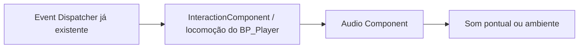
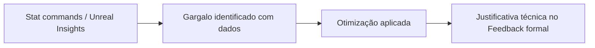
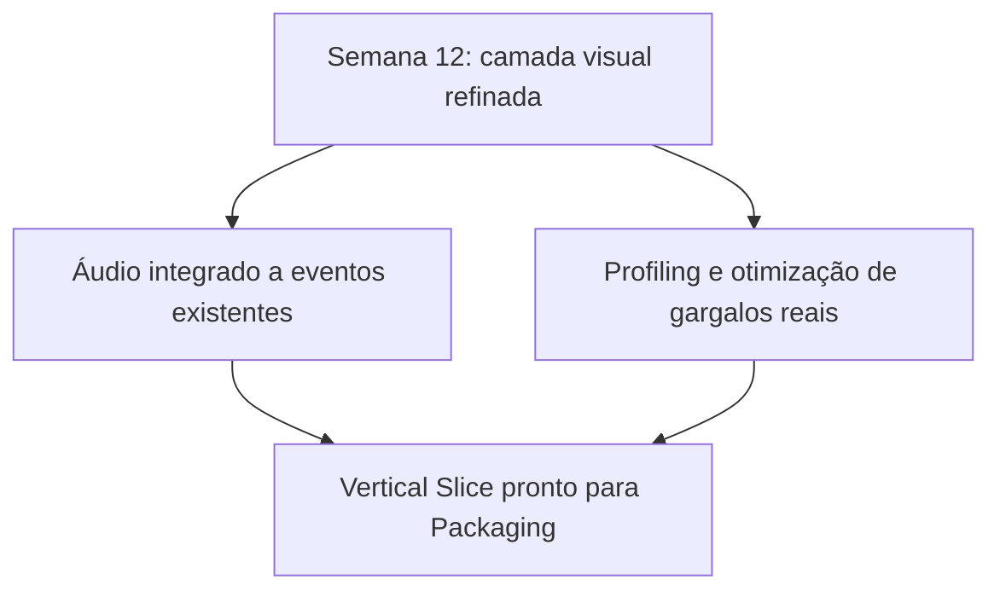

<!-- _class: cover -->

# Semana 13

## Áudio de Eventos e Profiling — Produção Técnica

**Disciplina:** Tendências de Motores de Jogos (IN46A)
**Instituição:** IFMS — Campus Dourados
**Curso:** Tecnologia em Jogos Digitais
**Módulo 4 — Produzir como um Pequeno Estúdio**

<!--
### Notas do apresentador
A Semana 13 dá continuidade à Unidade IV — Produzir como um Pequeno Estúdio, mantendo Studio Based Learning com autonomia alta e o professor como diretor técnico. Depois de a Semana 12 ter refinado a camada visual (Material Instances e Foliage), esta semana trata de dois eixos complementares: integrar áudio a eventos de gameplay já existentes e tratar Optimization/Profiling como etapa obrigatória de produção, retomando diretamente a discussão de custo de densidade de Foliage iniciada na Semana 12. Não há tutorial para esta semana — Módulo 4 não produz tutoriais passo a passo, conforme PEDAGOGICAL_RULES.md. Nenhum sistema de gameplay dos Módulos 1 a 3 é alterado.
-->

---

## Objetivos da Semana

- Compreender áudio como resposta a eventos de gameplay já existentes, não como camada decorativa de final de produção
- Compreender Optimization e Profiling como etapa obrigatória de produção, capaz de identificar gargalos antes de qualquer entrega
- Integrar sons a ações já existentes no projeto (interação, passos, ambiente), sem alterar nenhum sistema de gameplay
- Executar profiling do próprio Vertical Slice, identificar ao menos um gargalo real e tratá-lo, justificando a escolha técnica

<!--
### Notas do apresentador
Resultado esperado: áudio integrado às ações de interação, locomoção e ambiente já existentes, organizado em `Audio/` conforme o PROJECT_ARCHITECTURE.md, e ao menos um gargalo real identificado e tratado via profiling. Encerra com Feedback formal, insumo direto do critério "Qualidade técnica" do Sistema de Avaliação.
-->

---

<!-- _class: timeline -->

## Como a semana está organizada

- **Encontro 1** Áudio de eventos — som como resposta a ações já existentes no projeto
- **Encontro 2** Optimization e Profiling — medir antes de otimizar, com Feedback formal de encerramento

<!--
### Notas do apresentador
Metodologia: Studio Based Learning, autonomia alta. Encontro 1 tem folga relativa (pode ser comprimido priorizando o som de interação sobre a cobertura completa de passos e ambiente, conforme nota de contingência do Plano de Aula). Encontro 2 concentra o Feedback formal de encerramento — não deve ser comprimido.
-->

---

<!-- _class: chapter -->

## Encontro 1

# Áudio de Eventos

01

<!--
### Notas do apresentador
Primeiro momento do semestre dedicado exclusivamente à camada sonora. O eixo conceitual conecta diretamente com o que já existe: os mesmos Event Dispatchers que disparam a interação (Semana 5) ou atualizam o WBP_HUD (Semana 9) também podem disparar um som, sem nenhum sistema novo.
-->

---

<!-- _class: question -->

# Um som precisa de um sistema próprio para existir no jogo?

Pense em tudo que já dispara uma reação no projeto sempre que o jogador interage, anda ou entra em uma nova área.

<!--
### Notas do apresentador
Deixar a turma responder antes de introduzir áudio de eventos. Resposta esperada: não — o mesmo evento que já dispara a interação ou a atualização do HUD também pode disparar um som, sem exigir um "sistema de áudio" separado.
-->

---

## Áudio como resposta a um evento, não um sistema à parte

- Um som, em uma engine, não é um arquivo tocado isoladamente — é a resposta a um evento que já existe no fluxo de gameplay
- O mesmo Event Dispatcher que já dispara a interação via `BPI_Interactable` pode disparar um som, sem sistema novo
- Som pontual (disparado por um evento) é diferente de som contínuo/ambiente (associado a um espaço ou estado)
- Esta integração é deliberadamente tardia — ocorre depois que o gameplay já está estável desde os Módulos 2 e 3

Áudio comunica estado e reforça feedback: uma porta que range ao abrir confirma a interação tanto quanto a animação.

<!--
### Notas do apresentador
Conceito universal do encontro. Reforçar que a aula não introduz um "sistema de áudio" separado — ela conecta pontos de disparo sonoro aos eventos que o InteractionComponent, a locomoção do BP_Player e a ambientação dos níveis já produzem.
Referência: Unreal Engine — Audio Overview (dev.epicgames.com/documentation).
-->

---

## Onde o som se conecta ao que já existe

- Interação: o Event Dispatcher já existente no `InteractionComponent` dispara o som de portas, alavancas e baús
- Locomoção: a movimentação do `BP_Player` dispara o som de passos
- Ambiente: cada nível (Exploração, Dungeon) recebe som contínuo associado ao próprio espaço
- Sons mal gerenciados (excesso de sons simultâneos, sem prioridade ou distância de corte) também custam performance — antecipa o Encontro 2

<!--
### Notas do apresentador
Pergunta de verificação: se um som não está reagindo a nenhum evento que já existe no projeto, de onde ele deveria vir?
-->

---

<!-- _class: comparison -->

## Áudio de eventos: Unreal × Unity

### Unreal

Sound Cue/Sound Base e Audio Component, disparados a partir de Event Dispatchers já existentes (`InteractionComponent`)

### Unity

`AudioSource` e `AudioClip`, disparados a partir de eventos de script (`OnTriggerEnter`, chamadas diretas de método)

<!--
### Notas do apresentador
O princípio é idêntico nas duas engines — som como resposta a um evento de gameplay já existente, não como sistema autônomo. A Unreal tende a centralizar composição sonora mais complexa (mixagem, randomização, atenuação) em assets dedicados editáveis visualmente; a Unity historicamente resolve variações semelhantes com mais lógica em código sobre o próprio AudioSource. Não aprofundar mais — retomado na Unidade V.
-->

---

<!-- _class: diagram -->

## Do evento existente ao som disparado

<!--
### Notas do apresentador
Diagrama conceitual. Reforçar que nenhuma seta desta cadeia é nova — apenas o Audio Component se conecta a um fluxo que já existia desde os Módulos 2 e 3.
-->

---

## Demonstração: som de interação e som de passos

O professor associa um som ao evento já disparado pelo Event Dispatcher do `InteractionComponent` e um som de passos à locomoção do `BP_Player`, sem alterar a lógica de gameplay existente.

**Resultado esperado:** interação e locomoção já existentes passam a soar, sem nenhuma mudança na lógica que as dispara.

<!--
### Notas do apresentador
Não detalhar o passo a passo — não há tutorial para este módulo, conforme PEDAGOGICAL_RULES.md. Dificuldade esperada: tratar áudio como adição isolada, criando um gatilho novo em vez de reutilizar o Event Dispatcher existente.
-->

---

> **Imagem sugerida**
>
> Objetivo: mostrar a conexão entre um Event Dispatcher já existente e o disparo de um Audio Component.
> Enquadramento: captura de tela do grafo de Blueprint do `InteractionComponent` na Unreal Engine, com o nó de Event Dispatcher e o nó de Play Sound conectados na mesma sequência de execução.
> Elementos presentes: nó de Event Dispatcher já existente; nó de Audio Component/Play Sound anexado à mesma linha de execução; comentário indicando "nenhuma lógica nova".
> Destaque visual: a linha de execução única que liga o evento de interação ao som.
> Legenda sugerida: "O som reage ao mesmo evento que já dispara a interação."

<!--
### Notas do apresentador
Print pode ser montado a partir do exemplo pré-configurado antes da aula, fora da visão da turma.
-->

---

## Boas práticas

- Conectar o som ao Event Dispatcher já existente, nunca criar um gatilho novo só para o áudio
- Organizar os assets sonoros em `Audio/`, conforme PROJECT_ARCHITECTURE.md
- Definir prioridade e distância de corte para sons de ambiente, evitando excesso de sons simultâneos

<!--
### Notas do apresentador
Grupos que sonorizarem excessivamente o ambiente sem critério de distância ou prioridade devem ser alertados de que isso antecipa um problema de performance a ser evidenciado no profiling do Encontro 2.
-->

---

<!-- _class: exercise -->

# Laboratório do Encontro 1

Cada grupo integra som às suas próprias ações de interação (portas, alavancas, baús), à locomoção do próprio `BP_Player` e à ambientação de seus níveis de Exploração e Dungeon, organizando os assets em `Audio/`.

Critério de sucesso: som integrado a pelo menos uma ação de interação, à locomoção do `BP_Player` e a um elemento de ambiente do nível, organizados em `Audio/`, sem alterar nenhum sistema de gameplay existente.

<!--
### Notas do apresentador
Sem desafio de liberdade de solução neste encontro — integração guiada, preparando a autonomia maior do desafio de otimização do Encontro 2. Nota de contingência: se faltar tempo, priorizar a integração de som à interação (evento mais evidente para o Feedback) sobre a cobertura completa de passos e ambiente.
-->

---

<!-- _class: summary-slide -->

## Fechando o Encontro 1

- Áudio é resposta a um evento de gameplay já existente, não um sistema autônomo
- Interação, locomoção e ambiente de cada grupo já soam, sem alteração de nenhuma lógica de gameplay
- Próximo encontro: a mesma disciplina de medir antes de agir, agora aplicada à performance do projeto

<!--
### Notas do apresentador
Reforçar que sons mal gerenciados também custam performance — ponte direta para o tema de Profiling do Encontro 2.
-->

---

<!-- _class: chapter -->

## Encontro 2

# Optimization e Profiling

02

<!--
### Notas do apresentador
Encerramento da semana com Feedback formal, insumo direto do critério "Qualidade técnica" do Sistema de Avaliação (Rubrica de progressão dos Módulos 4 e 5), que passa a considerar explicitamente os gargalos identificados no profiling desta semana.
-->

---

<!-- _class: question -->

# Como saber qual parte do projeto está custando performance?

Pense no que aconteceria se você tentasse otimizar sem antes medir onde o tempo de frame está sendo gasto.

<!--
### Notas do apresentador
Deixar a turma responder antes de introduzir Profiling. Resposta esperada: sem medição, a otimização vira suposição — pode-se gastar esforço em uma parte do projeto que não é, de fato, o gargalo.
-->

---

## Medir antes de otimizar

- Nenhuma decisão de otimização é válida sem medição prévia — otimizar por intuição tende a gastar esforço na parte errada
- A Unreal expõe essa medição por ferramentas de profiling: Stat commands e Unreal Insights/Session Frontend, conforme disponibilidade da versão 5.6
- Essas ferramentas revelam onde o tempo de frame é consumido: geometria, materiais, iluminação ou lógica de Blueprint
- A densidade de Foliage da Semana 12 é o primeiro candidato a gargalo mensurável, mas a discussão se amplia às demais camadas do semestre

Este encontro retoma diretamente a densidade de Foliage discutida na Semana 12 — agora com dados concretos de profiling, não apenas impressão visual.

<!--
### Notas do apresentador
Conceito universal do encontro. Reforçar que o desafio pede que cada grupo escolha, com base em dados reais do próprio projeto, o que otimizar — não há solução única, coerente com a autonomia alta do Módulo 4.
Referência: Unreal Engine — Optimization Guide (dev.epicgames.com/documentation).
-->

---

## Onde procurar o gargalo

- Fontes comuns de gargalo em um Vertical Slice deste porte: densidade de Foliage, draw calls, complexidade de Materials, iluminação dinâmica, lógica de Blueprint em Tick
- `stat fps`, `stat unit` e `stat scenerendering` expõem o custo de cada camada em tempo real
- Isolar variáveis uma de cada vez (ex.: ocultar temporariamente a Foliage) ajuda a confirmar a origem real do gargalo
- O gargalo real depende do que cada grupo construiu — não existe uma resposta única para toda a turma

<!--
### Notas do apresentador
Pergunta de verificação: como você confirmaria, com dados, se a Foliage da Semana 12 é realmente o gargalo do seu projeto, e não outra camada?
-->

---

<!-- _class: comparison -->

## Profiling: Unreal × Unity

### Unreal

Stat commands e Unreal Insights/Session Frontend, expondo dados por sistema (renderização, materiais, Blueprint) em ferramentas complementares

### Unity

Profiler integrado ao Editor, concentrando CPU, GPU, memória e renderização por frame em um único painel unificado

<!--
### Notas do apresentador
O princípio é o mesmo nas duas engines — medir antes de otimizar, tratando profiling como etapa obrigatória de produção, não como correção pontual. A diferença está na granularidade: a Unreal expõe os dados por múltiplas ferramentas complementares; a Unity concentra essas visões em um painel único. Não aprofundar mais — retomado na Unidade V.
-->

---

<!-- _class: diagram -->

## Da medição à otimização justificada

<!--
### Notas do apresentador
Diagrama conceitual. Reforçar que nenhuma seta desta cadeia pode ser invertida — a justificativa técnica depende do dado de profiling coletado antes da otimização.
-->

---

## Demonstração: profiling guiado com gargalo proposital

O professor usa stat commands (e Unreal Insights, se disponível) sobre uma cena de teste com um gargalo proposital de densidade de Foliage, mostrando como o dado de profiling aponta a causa antes de qualquer correção.

**Resultado esperado:** identificação clara de qual camada (geometria, materiais, iluminação ou Blueprint) está consumindo o tempo de frame, antes de qualquer mudança na cena.

<!--
### Notas do apresentador
Não detalhar o passo a passo — não há tutorial para este módulo. Dificuldade esperada: tentar otimizar por suposição, sem antes medir com stat commands.
-->

---

> **Imagem sugerida**
>
> Objetivo: evidenciar a leitura de um dado de profiling antes e depois de uma otimização aplicada.
> Enquadramento: duas capturas de tela lado a lado do editor da Unreal Engine, mesma cena de teste, com `stat fps`/`stat unit` visível no canto superior.
> Elementos presentes: overlay de stat commands com valores de frame time; indicação visual da camada testada (ex.: Foliage oculta versus visível).
> Destaque visual: a diferença numérica do frame time entre as duas capturas.
> Legenda sugerida: "Nenhuma otimização é válida sem o dado que a justifica."

<!--
### Notas do apresentador
Print pode ser montado a partir da cena de teste preparada antes da aula, fora da visão da turma.
-->

---

## Boas práticas

- Medir com stat commands antes de propor qualquer otimização
- Isolar uma variável por vez ao investigar um gargalo, em vez de alterar várias camadas simultaneamente
- Registrar o dado de profiling que motivou cada otimização, para sustentar a justificativa técnica no Feedback

<!--
### Notas do apresentador
Grupos que tentarem otimizar por suposição, sem o dado de profiling correspondente, não devem ter a otimização validada até apresentarem a medição que a justifica.
-->

---

<!-- _class: exercise -->

# Laboratório/Desafio: profiling do próprio projeto

Cada grupo executa profiling do próprio Vertical Slice, identifica um gargalo real (geometria, materiais, iluminação ou lógica de Blueprint) e o trata, justificando tecnicamente a escolha com base nos dados coletados.

Critério de sucesso: profiling executado, ao menos um gargalo real identificado com dados concretos, gargalo tratado e justificativa técnica coerente apresentada no Feedback formal, sem regressão em nenhum sistema já construído.

<!--
### Notas do apresentador
Não há solução única — diferentes grupos podem legitimamente identificar e tratar gargalos distintos, coerente com a autonomia alta do Módulo 4. Nota de contingência: o Feedback formal de encerramento não deve ser comprimido; se necessário, reduzir o escopo do gargalo tratado por grupo a um único aspecto.
-->

---

<!-- _class: exercise -->

# Feedback Formal de Encerramento — Áudio e Otimização

Avaliação formal das otimizações realizadas por cada grupo, com ênfase na qualidade da medição (profiling real, não suposição), na pertinência da escolha de otimização e na clareza da justificativa técnica apresentada.

Otimizações propostas sem o dado de profiling correspondente, e justificativas baseadas em suposição em vez de medição, são os principais pontos de atenção deste Feedback.

<!--
### Notas do apresentador
Avaliação: insumo direto para o critério "Qualidade técnica" do Sistema de Avaliação, que passa a considerar explicitamente os gargalos identificados no profiling da Semana 13. Recusar validar qualquer otimização proposta sem o dado de profiling correspondente.
-->

---

<!-- _class: diagram -->

## Onde a Semana 13 se encaixa no Vertical Slice

<!--
### Notas do apresentador
Diagrama conceitual, retomando a seção 11 do PROJECT_ARCHITECTURE.md. Reforçar que a Semana 13 não adiciona gameplay novo — integra som e trata a saúde técnica do mesmo Vertical Slice construído até a Semana 12.
-->

---

<!-- _class: summary-slide -->

## Resumo da Semana 13

- Áudio é resposta a um evento de gameplay já existente, não um sistema autônomo adicionado ao final
- Otimização exige medição prévia — profiling é etapa obrigatória, não correção de emergência
- Áudio integrado a interação, locomoção e ambiente; ao menos um gargalo real identificado e tratado
- Feedback formal de encerramento concluído, com justificativa técnica registrada por grupo

<!--
### Notas do apresentador
Reforçar que áudio e profiling resolvem problemas diferentes, mas seguem o mesmo princípio pedagógico do semestre: nenhuma camada nova substitui o que já existe, apenas refina o mesmo Vertical Slice.
-->

---

## Checklist Final do Encontro

- Som integrado a interação, locomoção do `BP_Player` e ambiente, organizado em `Audio/`
- Profiling executado com stat commands (e Unreal Insights, se disponível)
- Ao menos um gargalo real identificado e tratado, com justificativa técnica registrada
- `HealthComponent`, `InteractionComponent`, `InventoryComponent`, `BPI_Interactable`, `WBP_HUD`, `BP_Enemy`, Material Instances e Foliage intactos
- Feedback formal de encerramento concluído

<!--
### Notas do apresentador
Este checklist confirma que a semana adicionou a camada sonora e tratou a saúde técnica do Vertical Slice, sem retrabalho estrutural nos sistemas de gameplay e na camada visual já construídos.
-->

---

## Próximos passos

A Semana 14 encerra a Unidade IV com o pipeline de Packaging do Vertical Slice final — configurações, plataformas-alvo e build de produção — diretamente dependente do trabalho de otimização desta semana: um projeto com gargalos não tratados compromete o empacotamento e o Playtest cruzado entre grupos.

**Leitura recomendada:** Unreal Engine — Audio Overview e Optimization Guide (Epic Games Documentation).

<!--
### Notas do apresentador
Reforçar que a justificativa técnica das otimizações desta semana alimenta diretamente a revisão geral do projeto conduzida no Encontro 2 da Semana 14.
-->
