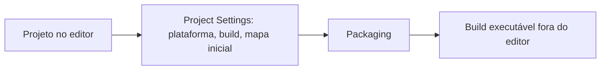
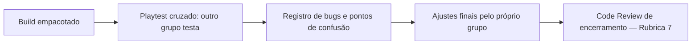
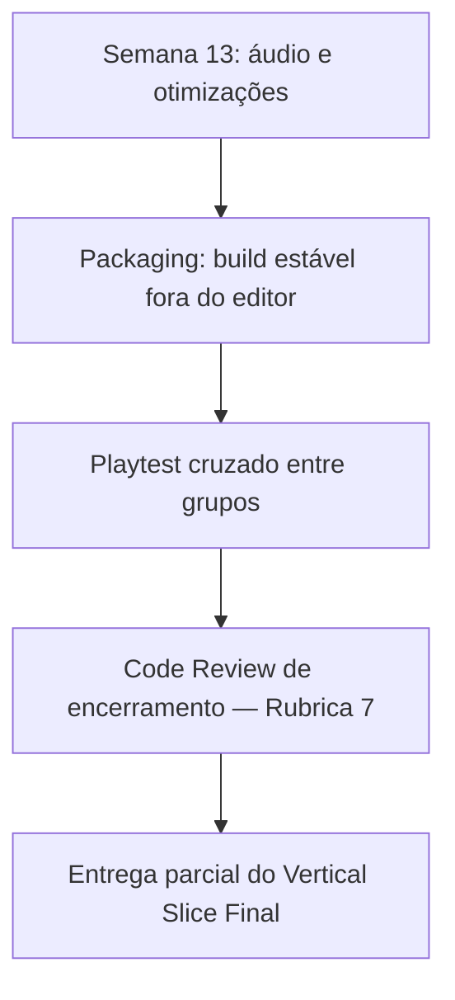

<!-- _class: cover -->

# Semana 14

## Packaging e Playtest Cruzado — Encerramento do Módulo 4

**Disciplina:** Tendências de Motores de Jogos (IN46A)
**Instituição:** IFMS — Campus Dourados
**Curso:** Tecnologia em Jogos Digitais
**Módulo 4 — Produzir como um Pequeno Estúdio**

<!--
### Notas do apresentador
A Semana 14 encerra a Unidade IV — Produzir como um Pequeno Estúdio. Depois de a Semana 13 ter tratado áudio de eventos e profiling como etapa obrigatória de produção, esta semana conclui o ciclo com o pipeline de Packaging e uma revisão geral do Vertical Slice sob a perspectiva de um pequeno estúdio, encerrada por Playtest cruzado entre grupos e Code Review de encerramento do Módulo 4. Não há tutorial para esta semana — Módulo 4 não produz tutoriais passo a passo, conforme PEDAGOGICAL_RULES.md. Esta entrega corresponde à "entrega parcial" da Rubrica 7 (Vertical Slice Final), reconfirmada na Semana 17. Nenhum sistema de gameplay dos Módulos 1 a 3, nem a camada visual (Semana 12) ou sonora/otimizada (Semana 13), é alterado.
-->

---

## Objetivos da Semana

- Compreender o que diferencia um protótipo rodando no editor de um build distribuível
- Compreender as configurações de Packaging e a escolha de plataforma-alvo como decisões técnicas, não apenas passos operacionais
- Empacotar o Vertical Slice de cada grupo em um build estável, executável fora do editor
- Validar o build de um colega via Playtest cruzado e conduzir o Code Review de encerramento do Módulo 4

<!--
### Notas do apresentador
Resultado esperado: build empacotado e estável de cada grupo, testado pelo próprio grupo e por outro grupo via Playtest cruzado, com bugs e pontos de confusão registrados e discutidos no Code Review de encerramento. Insumo direto da Rubrica 7 (Vertical Slice Final), entrega parcial desta semana e reconfirmada na Semana 17.
-->

---

<!-- _class: timeline -->

## Como a semana está organizada

- **Encontro 1** Pipeline de Packaging — do protótipo no editor ao build distribuível
- **Encontro 2** Playtest cruzado + Code Review de encerramento do Módulo 4

<!--
### Notas do apresentador
Metodologia: Studio Based Learning, autonomia alta, professor como diretor técnico. Encontro 1 é pré-requisito direto do Encontro 2 — nenhum grupo pode chegar ao Playtest cruzado sem um build gerado (nota de contingência do Plano de Aula). Encontro 2 concentra o Code Review de encerramento — não deve ser comprimido.
-->

---

<!-- _class: chapter -->

## Encontro 1

# Pipeline de Packaging

01

<!--
### Notas do apresentador
Primeiro momento do semestre em que o projeto sai do ambiente de edição. Depende diretamente do profiling e das otimizações da Semana 13 — um projeto com gargalos não tratados chega ao build do mesmo jeito, apenas mais difícil de diagnosticar fora do editor.
-->

---

<!-- _class: question -->

# O jogador final vai abrir o editor da Unreal para jogar seu projeto?

Pense no que precisa acontecer entre "o jogo roda no meu editor" e "qualquer pessoa consegue jogar sem instalar nada além do jogo".

<!--
### Notas do apresentador
Deixar a turma responder antes de introduzir Packaging. Resposta esperada: não — o jogador recebe um executável compilado e independente do ambiente de desenvolvimento; algo precisa transformar o projeto editável nesse produto final.
-->

---

## Separar o ambiente de edição do produto final

- Todo motor de jogo separa o editor (iteração rápida) do build (produto que o jogador executa)
- Packaging compila o projeto, empacota os assets referenciados e gera um executável autônomo para uma plataforma-alvo
- O processo expõe problemas invisíveis no editor: referências quebradas, assets não incluídos, dependências ausentes
- Por isso Packaging não é um passo burocrático de final de produção — é o momento em que o projeto enfrenta as condições reais do jogador

Um projeto com gargalos não tratados na Semana 13 chega ao build do mesmo jeito — só que mais difícil de diagnosticar fora do editor.

<!--
### Notas do apresentador
Conceito universal do encontro. Reforçar a ligação direta com a Semana 13: profiling e otimização precedem o Packaging porque um build já é o pior lugar para descobrir um gargalo.
Referência: Unreal Engine — Packaging Your Project (dev.epicgames.com/documentation).
-->

---

## O que muda entre Play In Editor e o build empacotado

- Play In Editor carrega o projeto com todo o ambiente de desenvolvimento por trás
- O build empacotado depende exclusivamente do que foi explicitamente incluído no pacote
- Configurações relevantes: plataforma-alvo, configuração de build (Development/Shipping), mapa inicial (Maps & Modes)
- Espaço em disco e tempo de build variam com o tamanho do projeto — devem ser estimados antes da aula

<!--
### Notas do apresentador
Pergunta de verificação: por que um asset referenciado apenas em um nível de teste esquecido pode quebrar o build, mesmo funcionando normalmente no editor?
-->

---

<!-- _class: comparison -->

## Packaging: Unreal × Unity

### Unreal

Project Settings concentra as configurações de Packaging (plataforma, build, mapa inicial) antes de uma única ação de empacotamento

### Unity

Build Settings expõe plataforma-alvo e configuração de build (Debug/Release) diretamente na janela, a cada execução

<!--
### Notas do apresentador
O princípio é idêntico nas duas engines — separar o ambiente de edição do produto executável final, compilando e empacotando apenas o necessário para a plataforma escolhida. A diferença está em onde a configuração se concentra: Project Settings antecipado versus Build Settings recorrente. Não aprofundar mais — retomado na Unidade V.
-->

---

<!-- _class: diagram -->

## Do projeto editável ao build distribuível

<!--
### Notas do apresentador
Diagrama conceitual. Reforçar que cada seta depende da anterior: sem configuração correta em Project Settings, o Packaging expõe erros de referência ou conteúdo ausente antes mesmo de gerar o executável.
-->

---

## Demonstração: configuração e empacotamento guiado

O professor configura plataforma-alvo, build (Development/Shipping) e mapa inicial em um projeto de teste, executa o Packaging completo e mostra o build resultante rodando fora do editor.

**Resultado esperado:** um executável autônomo, gerado a partir das mesmas configurações que cada grupo aplicará ao próprio Vertical Slice.

<!--
### Notas do apresentador
Não detalhar o passo a passo — não há tutorial para este módulo, conforme PEDAGOGICAL_RULES.md. Dificuldade esperada: assumir que tudo que funciona no editor necessariamente entra no build empacotado.
-->

---

> **Imagem sugerida**
>
> Objetivo: mostrar a transição entre o projeto rodando no editor e o mesmo projeto rodando como build empacotado.
> Enquadramento: duas capturas de tela lado a lado — a Unreal Engine em Play In Editor à esquerda, o executável empacotado rodando em janela própria fora do editor à direita.
> Elementos presentes: interface do editor com o nível carregado; janela do build empacotado com o mesmo nível, sem nenhum elemento de editor visível.
> Destaque visual: a ausência total da interface do editor no build da direita.
> Legenda sugerida: "O jogador nunca vê o editor — apenas o build."

<!--
### Notas do apresentador
Print pode ser montado a partir do projeto de teste pré-empacotado antes da aula, fora da visão da turma.
-->

---

## Boas práticas

- Testar o Packaging cedo, nunca apenas no fim do prazo — problemas de referência só aparecem no build
- Definir o mapa inicial (Maps & Modes) explicitamente, nunca depender do último nível aberto no editor
- Isolar assets de teste/temporários fora da estrutura final antes de empacotar, conforme PROJECT_ARCHITECTURE.md

<!--
### Notas do apresentador
Grupos que só tentam empacotar no fim do encontro perdem a folga necessária para resolver referências quebradas — reforçar que o tempo de laboratório já reserva 60 minutos exatamente por isso.
-->

---

<!-- _class: exercise -->

# Laboratório do Encontro 1

Cada grupo empacota o próprio Vertical Slice, já otimizado desde a Semana 13, resolvendo problemas de referência ou conteúdo ausente que surjam no processo.

Critério de sucesso: build empacotado do próprio Vertical Slice, executável fora do editor, sem erros de referência ou conteúdo ausente, preservando intactos todos os sistemas construídos até a Semana 13.

<!--
### Notas do apresentador
Sem desafio de liberdade de solução neste encontro — o empacotamento é aplicação guiada, garantindo que todos os grupos cheguem ao Encontro 2 com um build funcional. Nota de contingência: priorizar a conclusão do empacotamento de todos os grupos sobre a profundidade da fundamentação teórica.
-->

---

<!-- _class: summary-slide -->

## Fechando o Encontro 1

- Packaging separa o ambiente de edição do produto que o jogador realmente executa
- O build expõe problemas invisíveis no editor — por isso depende do profiling já feito na Semana 13
- Cada grupo já possui um build estável, pronto para o Playtest cruzado do Encontro 2

<!--
### Notas do apresentador
Reforçar que nenhum grupo deve avançar ao Encontro 2 sem um build funcional — é pré-requisito, não um item opcional do laboratório.
-->

---

<!-- _class: chapter -->

## Encontro 2

# Playtest Cruzado e Code Review de Encerramento

02

<!--
### Notas do apresentador
Encerramento do Módulo 4 e da Unidade IV. O Code Review desta semana não avalia mais sistemas isolados como nos Code Reviews anteriores — avalia o produto como um todo entregável, conforme a Rubrica 7 (Vertical Slice Final).
-->

---

<!-- _class: question -->

# Quem enxerga melhor os problemas do seu projeto: sua equipe ou um jogador de fora?

Pense em algo que você já testou tantas vezes que parou de perceber como um problema.

<!--
### Notas do apresentador
Deixar a turma responder antes de introduzir o Playtest cruzado. Resposta esperada: um jogador externo — a equipe que construiu o sistema perde a capacidade de vê-lo com olhos novos.
-->

---

## A perspectiva que a própria equipe não tem

- Nenhuma equipe de desenvolvimento avalia objetivamente o próprio produto — confusões e bugs ficam invisíveis para quem construiu o sistema
- O Playtest cruzado formaliza a perspectiva externa: cada grupo passa a ocupar, por um momento, o papel de jogador final de outro grupo
- Essa prática é universal a qualquer produção de jogos, independentemente da engine utilizada
- Antecipa o papel do Code Review de encerramento: avaliar o produto entregável como um todo, não sistemas isolados

O Code Review desta semana não pergunta mais "este sistema funciona?" — pergunta "este produto está pronto para alguém de fora jogar?"

<!--
### Notas do apresentador
Conceito universal do encontro. Reforçar que o Playtest cruzado não é uma etapa de QA burocrática — é a única forma de capturar o que a equipe deixou de enxergar depois de meses de contato direto com o próprio projeto.
Referência: Unreal Engine — Packaging Your Project, seção de testes fora do editor (dev.epicgames.com/documentation).
-->

---

## Como o rodízio funciona

- O professor organiza previamente o esquema de rodízio — nenhum grupo testa o próprio build
- Cada grupo executa o build empacotado de outro grupo e registra bugs e pontos de confusão observados
- O registro recebido é usado pelo próprio grupo para tratar os problemas mais críticos dentro do tempo disponível
- Não há lista fechada de correções — cada grupo prioriza o que compromete jogabilidade ou estabilidade sobre ajustes cosméticos

<!--
### Notas do apresentador
Pergunta de verificação: se dois grupos registrarem o mesmo tipo de confusão em builds diferentes, o que isso pode indicar sobre um padrão comum de erro na turma?
-->

---

<!-- _class: comparison -->

## Validação de build: Unreal × Unity

### Unreal

Build empacotado testado fora do editor, revisão de conteúdo via Content Browser durante o Code Review

### Unity

Processos equivalentes de build testing e revisão de projeto antes de um marco de entrega, sem ferramenta dedicada distinta

<!--
### Notas do apresentador
O princípio de produção é o mesmo nas duas engines — validar o build fora do ambiente de quem o construiu, antes de considerá-lo pronto — independentemente de qual engine gerou o executável. Não aprofundar mais — retomado na Unidade V.
-->

---

<!-- _class: diagram -->

## Do build ao ajuste final

<!--
### Notas do apresentador
Diagrama conceitual. Reforçar que o Code Review de encerramento só acontece depois do registro produzido pelo Playtest cruzado — a ordem não pode ser invertida.
-->

---

## Demonstração: como registrar um bug ou ponto de confusão

O professor demonstra, sobre um build de teste, como diferenciar um bug (algo que quebra) de um ponto de confusão (algo que funciona mas não é claro para quem joga pela primeira vez), usando um modelo simples de registro.

**Resultado esperado:** cada grupo sai do Playtest cruzado com um registro claro, priorizável por impacto, do build que testou.

<!--
### Notas do apresentador
Não detalhar passo a passo de ferramenta específica — o registro pode ser um checklist simples. Dificuldade esperada: registrar apenas bugs técnicos, ignorando pontos de confusão de design que são igualmente valiosos para o grupo autor do build.
-->

---

> **Imagem sugerida**
>
> Objetivo: ilustrar o momento do Playtest cruzado, com um grupo jogando o build de outro grupo.
> Enquadramento: foto ou captura de tela do build empacotado rodando em uma máquina, com um formulário/checklist de registro de bugs visível ao lado.
> Elementos presentes: janela do build fora do editor; checklist com colunas "bug" e "ponto de confusão"; anotação de exemplo preenchida.
> Destaque visual: a separação visual entre "bug" e "ponto de confusão" no checklist.
> Legenda sugerida: "Registrar o que confunde é tão valioso quanto registrar o que quebra."

<!--
### Notas do apresentador
Pode ser montado a partir do modelo de registro preparado antes da aula.
-->

---

## Boas práticas

- Priorizar por impacto (jogabilidade/estabilidade) antes de iniciar qualquer correção, nunca corrigir por ordem de registro
- Tratar o registro do Playtest cruzado como dado de produção, não como crítica pessoal ao grupo
- Documentar as decisões técnicas do projeto de forma que alguém de fora consiga entendê-las sem o grupo presente

<!--
### Notas do apresentador
Grupos que reagem defensivamente aos bugs apontados devem ser lembrados de que o objetivo do Playtest cruzado é justamente capturar o que a própria equipe não consegue ver.
-->

---

<!-- _class: exercise -->

# Laboratório/Desafio: Playtest cruzado e ajustes finais

Cada grupo testa o build empacotado de outro grupo, registra bugs e pontos de confusão, e depois trata os problemas mais críticos apontados no próprio build, priorizando por impacto.

Critério de sucesso: build de outro grupo testado com registro produzido; problemas mais críticos do próprio build tratados dentro do tempo disponível, sem regressão em nenhum sistema já construído.

<!--
### Notas do apresentador
A autonomia alta do Módulo 4 se expressa na priorização de cada grupo — não há lista fechada de correções. Nota de contingência: se necessário, reduzir o tempo de Playtest cruzado, mantendo intacto o tempo do Code Review de encerramento.
-->

---

<!-- _class: exercise -->

# Code Review de Encerramento do Módulo 4 — Rubrica 7

Avaliação formal do Vertical Slice como produto entregável: arquitetura, gameplay, organização, qualidade técnica, polimento, uso correto dos recursos da Unreal, consistência, documentação, empacotamento e capacidade de explicar decisões.

Esta é a entrega parcial da Rubrica 7 (Vertical Slice Final), reconfirmada na Semana 17 — não avaliar qualidade artística nem quantidade de assets.

<!--
### Notas do apresentador
Avaliação: Rubrica 7, dez critérios completos (ver Sistema de Avaliação). O professor atua como diretor técnico, revisando o Vertical Slice de cada grupo e verificando especialmente se o build de fato empacota e roda fora do editor — erro comum é avaliar apenas a versão rodando no editor. Reconfirmada na Semana 17 junto com a Rubrica 6 (Apresentações).
-->

---

<!-- _class: diagram -->

## Onde a Semana 14 se encaixa no Vertical Slice

<!--
### Notas do apresentador
Diagrama conceitual, retomando a seção 11 do PROJECT_ARCHITECTURE.md. Reforçar que a Semana 14 não adiciona gameplay novo — encerra a Unidade IV empacotando e validando externamente o mesmo Vertical Slice construído até a Semana 13.
-->

---

<!-- _class: summary-slide -->

## Resumo da Semana 14

- Packaging separa o ambiente de edição do produto que o jogador realmente executa
- A perspectiva externa de um jogador é insubstituível na revisão de um produto — nenhuma equipe se avalia objetivamente
- Cada grupo possui um build estável, testado por outro grupo, com ajustes críticos tratados
- Code Review de encerramento do Módulo 4 concluído (Rubrica 7 — entrega parcial)

<!--
### Notas do apresentador
Reforçar que Packaging e Playtest cruzado resolvem problemas diferentes, mas fecham o mesmo ciclo: transformar o Vertical Slice em um produto que alguém de fora da equipe consegue jogar e avaliar.
-->

---

## Checklist Final do Encontro

- Build do Vertical Slice empacotado, executável fora do editor, sem erros de referência
- Build testado via Playtest cruzado por outro grupo, com registro de bugs e pontos de confusão
- Problemas mais críticos do próprio build tratados dentro do tempo disponível
- Todos os sistemas dos Módulos 1 a 4 intactos no build final
- Code Review de encerramento do Módulo 4 concluído (Rubrica 7)

<!--
### Notas do apresentador
Este checklist confirma que a Unidade IV — Produzir como um Pequeno Estúdio está encerrada, com um Vertical Slice empacotado e validado externamente, pronto para a análise comparativa da Unidade V.
-->

---

## Próximos passos

A Semana 15 abre a Unidade V — Comparar Arquiteturas, com metodologia de Reverse Engineering e autonomia muito alta: os estudantes passam a analisar projetos profissionais (Lyra, Stack O Bot, Content Examples) em vez de continuar construindo o próprio Vertical Slice. O build estável desta semana serve como ponto de comparação concreto entre as decisões arquiteturais de cada grupo e as decisões observadas nos projetos profissionais.

**Leitura recomendada:** Unreal Engine — Packaging Your Project (Epic Games Documentation).

<!--
### Notas do apresentador
Reforçar que o build gerado nesta semana não é descartado — passa a ser referência concreta de comparação arquitetural a partir da Semana 15.
-->
