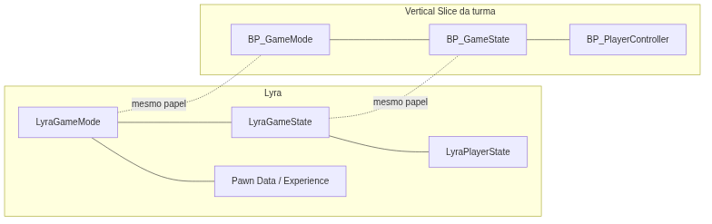
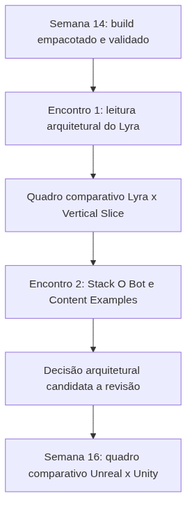

<!-- _class: cover -->

# Semana 15

## Engenharia Reversa de Projetos Profissionais — Abertura da Unidade V

**Disciplina:** Tendências de Motores de Jogos (IN46A)
**Instituição:** IFMS — Campus Dourados
**Curso:** Tecnologia em Jogos Digitais
**Módulo 5 — Comparar Arquiteturas**

<!--
### Notas do apresentador
A Semana 15 abre a Unidade V, encerrando o ciclo de produção da Unidade IV (Semanas 12–14) e inaugurando a metodologia de Reverse Engineering, com autonomia muito alta: o professor deixa de atuar como diretor técnico de produção e passa a conduzir discussões e análises comparativas. Nenhum sistema novo é implementado no Vertical Slice a partir desta semana — tudo o que foi construído até a Semana 14 (HealthComponent, InteractionComponent, InventoryComponent, BPI_Interactable, WBP_HUD, BP_Enemy com Behavior Tree/Blackboard, materiais, foliage, áudio e o build empacotado) permanece intacto. Não há tutorial para esta semana — Módulo 5 não produz tutoriais passo a passo, conforme PEDAGOGICAL_RULES.md.
-->

---

## Objetivos da Semana

- Analisar a arquitetura de gameplay framework de um projeto profissional em produção real (Lyra Starter Game)
- Identificar paralelos e divergências entre as decisões arquiteturais do Lyra e as decisões tomadas no Vertical Slice da turma
- Analisar as soluções arquiteturais do Stack O Bot e do Content Examples e compará-las com as soluções do próprio projeto
- Propor, com justificativa técnica, ao menos uma decisão arquitetural própria que poderia ser refeita à luz dos projetos analisados

<!--
### Notas do apresentador
Resultado esperado: cada grupo produz uma análise arquitetural comparando o próprio Vertical Slice com Lyra Starter Game, Stack O Bot e Content Examples, identificando pelo menos uma decisão de projeto que poderia ser reformulada, com justificativa técnica registrada. Esta entrega corresponde ao Feedback formal previsto no Cronograma e alimenta diretamente o quadro comparativo Unreal x Unity da Semana 16.
-->

---

<!-- _class: timeline -->

## Como a semana está organizada

- **Encontro 1** Estudo de caso — Lyra Starter Game: leitura arquitetural guiada do gameplay framework
- **Encontro 2** Estudo de caso — Stack O Bot e Content Examples + Desafio de revisão arquitetural

<!--
### Notas do apresentador
Metodologia: Reverse Engineering, autonomia muito alta. Encontro 1 é leitura guiada, condição de base para o desafio do Encontro 2. Nenhum encontro constrói sistema novo — ambos analisam projetos de referência e o próprio PROJECT_ARCHITECTURE.md.
-->

---

<!-- _class: chapter -->

## Encontro 1

# Lyra Starter Game: Arquitetura em Escala de Produção

01

<!--
### Notas do apresentador
Primeiro contato da turma com um projeto profissional completo da Epic. Depende diretamente do gameplay framework construído desde a Semana 4 — sem esse vocabulário comum, a leitura do Lyra vira exploração sem propósito.
-->

---

<!-- _class: question -->

# Por que um projeto profissional precisaria de mais camadas do que o seu Vertical Slice?

Pense no que o seu GameMode faz hoje — e no que ele precisaria fazer se o projeto tivesse dez modos de jogo diferentes, mantidos por equipes distintas.

<!--
### Notas do apresentador
Deixar a turma responder antes de apresentar o Lyra. Resposta esperada: escala e requisitos — mais modos de jogo, mais plataformas, mais pessoas trabalhando em paralelo — exigem camadas de abstração que um escopo fixo de um semestre não precisa resolver.
-->

---

## Arquitetura é resposta a escala, não um padrão fixo

- O Vertical Slice resolveu GameMode/GameState/PlayerController de forma direta porque o escopo é fixo e conhecido desde a Semana 4
- O Lyra resolve o mesmo papel com camadas adicionais — Game Feature Plugins, Experience Primary Data Assets, Pawn Data
- Essas camadas existem porque o Lyra sustenta múltiplos modos de jogo, plataformas e equipes trabalhando sobre a mesma base de código
- O papel arquitetural (separar regras de partida de estado compartilhado) é o mesmo nos dois projetos — muda o grau de indireção necessário

Reconhecer o que é universal (o papel arquitetural) e o que é contextual (o grau de abstração exigido pela escala) é a generalização central da Unidade V.

<!--
### Notas do apresentador
Conceito universal do encontro. Referência: Epic Developer Community — documentação oficial de Gameplay Framework (GameMode, GameState, PlayerState), dev.epicgames.com/documentation.
-->

---

## Estrutura geral do Lyra Starter Game

- Organização de pastas voltada a Game Feature Plugins — módulos de gameplay que podem ser ativados/desativados independentemente
- Experience Primary Data Assets concentram a configuração de "o que é jogado" separada de "como o framework funciona"
- `LyraGameMode`, `LyraGameState`, `LyraPlayerState` e `LyraPawnData` cumprem os mesmos papéis de `BP_GameMode`, `BP_GameState` e `BP_PlayerController` do Vertical Slice

<!--
### Notas do apresentador
Pergunta de verificação: por que separar dados de configuração (Pawn Data, Experience) da lógica de framework custaria complexidade desnecessária se aplicado ao escopo desta disciplina?
Referência: Lyra Starter Game — Epic Games Launcher/Fab, Samples and Tutorials.
-->

---

<!-- _class: comparison -->

## Gameplay Framework: Lyra × Vertical Slice

### Lyra Starter Game

`LyraGameMode`, `LyraGameState`, `LyraPlayerState`, `LyraPawnData`, Experience Primary Data Assets, Game Feature Plugins

### Vertical Slice da turma

`BP_GameMode`, `BP_GameState`, `BP_PlayerController`, `BP_GameInstance` — construídos desde a Semana 4

<!--
### Notas do apresentador
O papel arquitetural é idêntico — apenas o grau de indireção muda em função da escala. Não aprofundar em Game Feature Plugins além do necessário para reconhecer o paralelo; o foco é a correspondência de papéis, não a implementação interna do Lyra.
-->

---

<!-- _class: diagram -->

## Correspondência de papéis: Lyra × Vertical Slice

<!--
### Notas do apresentador
Diagrama conceitual, retomando PROJECT_ARCHITECTURE.md, seção 7. Reforçar que as linhas tracejadas indicam equivalência de papel, não equivalência de implementação — o Lyra resolve o mesmo papel com mais camadas.
-->

---

## Comparação com Unity

Times de Unity normalmente constroem seu próprio Game Manager/Singleton para cumprir o papel que o Lyra formaliza nativamente — o grau de abstração depende de convenção interna do estúdio, não de uma estrutura imposta pela engine.

<!--
### Notas do apresentador
O Lyra evidencia um caso em que a Unreal formaliza nativamente uma decisão arquitetural que a Unity deixa em aberto. Não aprofundar — retomado de forma sistemática na Semana 16.
-->

---

## Demonstração: leitura arquitetural guiada do Lyra

O professor percorre o Content Browser do Lyra Starter Game, mostrando `LyraGameMode`, `LyraGameState`, `LyraPlayerState` e `LyraPawnData`, sempre voltando ao paralelo com os Blueprints equivalentes do Vertical Slice.

**Resultado esperado:** a turma reconhece, em cada elemento do Lyra apresentado, qual Blueprint do próprio projeto cumpre o mesmo papel.

<!--
### Notas do apresentador
Preparação prévia: baixar e abrir o Lyra Starter Game (Epic Games Launcher/Fab) em máquina de demonstração; selecionar 3–4 pontos de navegação que ilustrem o paralelo com BP_GameMode, BP_GameState, BP_PlayerController e BP_GameInstance; projetar PROJECT_ARCHITECTURE.md (seção 7) ao lado do Lyra. Opcional: disponibilizar a leitura como material dirigido prévio se a Semana 14 tiver atrasado.
-->

---

> **Imagem sugerida**
>
> Objetivo: ilustrar o paralelo entre a estrutura do Lyra Starter Game e o gameplay framework do Vertical Slice da turma.
> Enquadramento: duas colunas lado a lado — Content Browser do Lyra à esquerda, com `LyraGameMode`, `LyraGameState` e `LyraPawnData` visíveis; Content Browser do projeto da disciplina à direita, com `BP_GameMode`, `BP_GameState` e `BP_PlayerController`.
> Elementos presentes: hierarquia de pastas de ambos os projetos, ícones de Blueprint destacados.
> Destaque visual: setas conectando os elementos equivalentes entre as duas colunas.
> Legenda sugerida: "O mesmo papel arquitetural, resolvido com graus diferentes de abstração."

<!--
### Notas do apresentador
Print pode ser montado a partir de capturas do Lyra e de um projeto de exemplo da turma, preparadas antes da aula.
-->

---

## Boas práticas

- Ao navegar por um projeto profissional, perguntar sempre "qual papel isso cumpre?" antes de "como isso é implementado?"
- Usar o vocabulário já consolidado do próprio Vertical Slice como ponte para entender arquiteturas maiores
- Reconhecer complexidade adicional como resposta a escala, nunca como sinal de que a solução própria estava errada

<!--
### Notas do apresentador
Reforçar que grupos frequentemente confundem "mais complexo" com "mais correto" — a complexidade do Lyra é resposta a requisitos que o Vertical Slice da disciplina nunca teve.
-->

---

<!-- _class: exercise -->

# Laboratório do Encontro 1

Cada grupo constrói um quadro comparativo simples entre os elementos do Lyra Starter Game e os elementos equivalentes do próprio gameplay framework, registrando também o que o Lyra resolve que o Vertical Slice não precisou resolver.

Critério de sucesso: quadro comparativo identificando corretamente ao menos três correspondências (GameMode, GameState, PlayerController/PlayerState), com justificativa de por que o Lyra adiciona camadas ausentes no projeto da disciplina.

<!--
### Notas do apresentador
Sem desafio de solução aberta neste encontro — é leitura arquitetural guiada, condição de base para o desafio do Encontro 2. Dificuldade esperada: grupos se perdem na complexidade visual do Lyra tentando entender cada Blueprint em profundidade; redirecionar constantemente para "qual papel isso cumpre, e quem cumpre esse papel no nosso projeto?".
-->

---

<!-- _class: summary-slide -->

## Fechando o Encontro 1

- Arquitetura é resposta a escala e requisitos, não um padrão fixo a ser copiado
- Lyra e Vertical Slice resolvem o mesmo papel arquitetural com graus diferentes de abstração
- Cada grupo produziu um quadro comparativo entre o gameplay framework do Lyra e o próprio projeto

<!--
### Notas do apresentador
Este quadro comparativo é insumo direto do Encontro 2 e da Semana 16 — não deve ser descartado.
-->

---

<!-- _class: chapter -->

## Encontro 2

# Stack O Bot, Content Examples e o Desafio de Revisão Arquitetural

02

<!--
### Notas do apresentador
Se o Lyra ilustrou arquitetura em escala de produção, este encontro amplia a análise para dois exemplos de escopo mais próximo do Vertical Slice, preparando o desafio central da semana.
-->

---

<!-- _class: question -->

# Toda referência arquitetural precisa vir de um jogo completo?

Pense em uma vez em que você aprendeu algo útil observando apenas um único sistema isolado de outro projeto — sem nunca ter jogado o jogo inteiro.

<!--
### Notas do apresentador
Deixar a turma responder antes de apresentar o Content Examples. Resposta esperada: não — às vezes a referência certa é um exemplo pontual de um único sistema, não um projeto integrado.
-->

---

## Dois extremos de escala, duas formas de referência

- Stack O Bot: projeto pequeno, escopo fechado, decisões arquiteturais mais diretamente comparáveis ao Vertical Slice do que o Lyra
- Content Examples: não é um projeto integrado, mas uma coleção de exemplos pontuais — materiais, iluminação, física, UI
- Nem toda referência arquitetural precisa vir de um jogo completo: às vezes a referência certa é um único Material Instance ou uma configuração de iluminação
- Comparação arquitetural madura não busca copiar soluções, mas justificar tecnicamente por que uma solução própria foi mantida ou deveria ser revista

Esse é o conceito universal fechado neste encontro — e exatamente o que o desafio da semana exige de cada grupo.

<!--
### Notas do apresentador
Referências: Stack O Bot e Content Examples — Epic Games Launcher/Fab, Samples and Tutorials.
-->

---

<!-- _class: comparison -->

## Comparação com Unity

### Unreal

Content Examples mantido como um único projeto integrado por versão da engine

### Unity

Sample Projects distribuídos frequentemente como projetos completos separados por versão do Input System ou Render Pipeline em uso

<!--
### Notas do apresentador
A Unity mantém papel equivalente ao Content Examples através de pacotes de exemplo (Unity Learn, Sample Projects) — a diferença está em como cada empresa organiza a distribuição desses exemplos, não no propósito. Não aprofundar — retomado na Semana 16.
-->

---

## Demonstração: Stack O Bot e Content Examples

O professor percorre 2–3 sistemas do Stack O Bot com paralelo direto ao Vertical Slice (interação, coleta, progressão) e 2–3 exemplos do Content Examples relevantes ao Módulo 4 (materiais, iluminação).

**Resultado esperado:** a turma reconhece, em cada sistema apresentado, uma correspondência concreta com uma decisão já tomada no próprio projeto.

<!--
### Notas do apresentador
Preparação prévia: baixar Stack O Bot e Content Examples (Epic Games Launcher/Fab); selecionar previamente os sistemas e exemplos a percorrer; ter PROJECT_ARCHITECTURE.md do grupo à mão para consulta durante o laboratório.
-->

---

> **Imagem sugerida**
>
> Objetivo: comparar um sistema de interação/coleta do Stack O Bot com o sistema equivalente do Vertical Slice da turma.
> Enquadramento: duas capturas lado a lado — Blueprint de interação do Stack O Bot à esquerda, `BPI_Interactable`/`InteractionComponent` do projeto da disciplina à direita.
> Elementos presentes: grafo de Blueprint de ambos os sistemas, com os nós de disparo do evento de interação destacados.
> Destaque visual: contorno colorido nos nós funcionalmente equivalentes.
> Legenda sugerida: "Escopo compacto, decisão diretamente comparável."

<!--
### Notas do apresentador
Print pode ser montado a partir de capturas do Stack O Bot e do próprio InteractionComponent da turma, preparadas antes da aula.
-->

---

## Boas práticas

- Ao comparar com Stack O Bot, buscar correspondência direta — a diferença de escala com o Vertical Slice é pequena
- Ao comparar com Content Examples, tratar cada exemplo como referência pontual de um único sistema, não como projeto integrado
- Registrar toda decisão candidata a revisão com justificativa técnica, nunca apenas como preferência estética

<!--
### Notas do apresentador
Reforçar que a justificativa técnica é o que distingue uma comparação madura de uma simples lista de diferenças observadas.
-->

---

<!-- _class: exercise -->

# Laboratório/Desafio do Encontro 2

Cada grupo usa Lyra, Stack O Bot e Content Examples para revisar criticamente o próprio PROJECT_ARCHITECTURE.md e identificar ao menos uma decisão arquitetural que poderia ser refeita, registrando a decisão original, a alternativa observada e a justificativa técnica para manter ou revisar.

Critério de sucesso: decisão arquitetural própria apresentada por escrito, com referência concreta a um dos três projetos analisados e justificativa técnica coerente com os princípios do PROJECT_ARCHITECTURE.md (simplicidade, clareza, reutilização, viabilidade em um semestre).

<!--
### Notas do apresentador
O desafio permite diferentes soluções — não há resposta única esperada, e grupos podem legitimamente concluir que a decisão original foi a mais adequada ao escopo da disciplina, desde que a justificativa seja tecnicamente consistente. Dificuldade esperada: grupos propondo revisões que extrapolam o escopo fixo do projeto (ex.: Game Feature Plugins em escala incompatível com um semestre) — intervir lembrando que o objetivo é justificar decisões dentro do escopo já definido, não redesenhar o projeto.
-->

---

<!-- _class: exercise -->

# Feedback Formal — Rubrica 6 e Rubrica 7

Cada grupo apresenta brevemente a decisão arquitetural identificada e recebe retorno do professor.

Este é o Feedback formal previsto no Cronograma da Semana 15, avaliado pela Rubrica 6 (justificativa técnica de decisões) e pela Rubrica 7 (capacidade de explicar decisões arquiteturais do Vertical Slice).

<!--
### Notas do apresentador
Avaliação: ver Sistema de Avaliação para os critérios completos das Rubricas 6 e 7. O registro do desafio é o insumo direto desta entrega e alimenta diretamente o quadro comparativo Unreal x Unity da Semana 16 — não deve ser descartado ou refeito do zero.
-->

---

<!-- _class: diagram -->

## Onde a Semana 15 se encaixa no Vertical Slice

<!--
### Notas do apresentador
Diagrama conceitual. Reforçar que nenhum sistema novo é adicionado nesta semana — o Vertical Slice construído até a Semana 14 permanece intacto; o trabalho é inteiramente analítico.
-->

---

<!-- _class: summary-slide -->

## Resumo da Semana 15

- Arquitetura é resposta a escala e requisitos, não um padrão fixo a ser copiado
- Lyra ilustra escala de produção; Stack O Bot ilustra escopo compacto e comparável; Content Examples ilustra referência pontual
- Cada grupo produziu um quadro comparativo e registrou por escrito uma decisão arquitetural própria, com justificativa técnica
- Nenhum sistema novo foi adicionado ao Vertical Slice — o build da Semana 14 permanece intacto

<!--
### Notas do apresentador
Reforçar que o domínio buscado nesta semana é a leitura crítica de arquitetura profissional e a capacidade de justificar tecnicamente as próprias decisões em contraste com referências externas.
-->

---

## Checklist Final da Semana

- Quadro comparativo entre o gameplay framework do Lyra e o próprio Vertical Slice produzido
- Sistemas do Stack O Bot e do Content Examples analisados e comparados às soluções do próprio projeto
- Ao menos uma decisão arquitetural própria registrada por escrito, com alternativa observada e justificativa técnica
- Feedback formal (Rubrica 6 e Rubrica 7) realizado para cada grupo
- Todos os sistemas dos Módulos 1 a 4 intactos no Vertical Slice

<!--
### Notas do apresentador
Este checklist confirma que a abertura da Unidade V está concluída, com insumos concretos prontos para a consolidação comparativa da Semana 16.
-->

---

## Próximos passos

A Semana 16 consolida a comparação arquitetural sistemática entre Unreal e Unity ao longo de todos os sistemas construídos no semestre, ampliando em seguida para Godot, O3DE, Stride e CryEngine. O quadro comparativo do Encontro 1 e a justificativa técnica do desafio do Encontro 2 desta semana são insumos diretos — nenhum dos dois deve ser descartado ou refeito do zero.

**Leitura recomendada:** Epic Games — Lyra Starter Game, Stack O Bot e Content Examples (Epic Games Launcher/Fab, Samples and Tutorials); Epic Developer Community — documentação oficial de Gameplay Framework.

<!--
### Notas do apresentador
Reforçar que o trabalho analítico desta semana não é descartado — é matéria-prima direta do quadro comparativo Unreal x Unity da Semana 16.
-->
