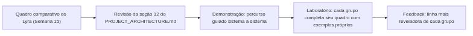
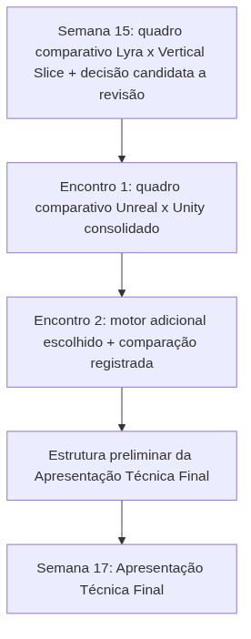

<!-- _class: cover -->

# Semana 16

## Comparação Arquitetural Unreal x Unity x Godot x O3DE x Stride x CryEngine

**Disciplina:** Tendências de Motores de Jogos (IN46A)
**Instituição:** IFMS — Campus Dourados
**Curso:** Tecnologia em Jogos Digitais
**Módulo 5 — Comparar Arquiteturas**

<!--
### Notas do apresentador
A Semana 16 encerra a Unidade V e o ciclo de Reverse Engineering aberto na Semana 15. Se a Semana 15 comparou o Vertical Slice da turma a projetos de referência da própria Unreal (Lyra, Stack O Bot, Content Examples), a Semana 16 amplia o horizonte para fora da Unreal: primeiro consolidando de forma sistemática a comparação Unreal x Unity (seção 12 do PROJECT_ARCHITECTURE.md), depois estendendo a comparação a Godot, O3DE, Stride e CryEngine. Nenhum sistema novo é adicionado ao Vertical Slice — tudo o que foi construído até a Semana 14 permanece intacto. A semana se encerra com o Checkpoint de preparação da apresentação técnica final, marco avaliativo previsto no Cronograma.
-->

---

## Objetivos da Semana

- Consolidar, em um único quadro comparativo, todas as comparações Unreal x Unity construídas ao longo do semestre
- Identificar o que é conceito universal de motores de jogos e o que é decisão específica de implementação da Unreal
- Ampliar a comparação arquitetural para pelo menos um motor adicional (Godot, O3DE, Stride ou CryEngine), com justificativa técnica da escolha
- Preparar a estrutura da Apresentação Técnica Final da Semana 17

<!--
### Notas do apresentador
Resultado esperado: cada grupo produz um quadro comparativo sistemático Unreal x Unity cobrindo todos os sistemas construídos no semestre, escolhe e justifica um motor adicional para aprofundar a comparação, e sai com uma estrutura preliminar da Apresentação Técnica Final. Esta entrega corresponde ao Checkpoint de preparação da apresentação técnica final previsto no Cronograma, avaliado pela Rubrica 6 e pela Rubrica 7. Reutiliza diretamente o quadro comparativo do Lyra e a justificativa técnica registrados na Semana 15 — nenhum dos dois é descartado ou refeito do zero.
-->

---

<!-- _class: timeline -->

## Como a semana está organizada

- **Encontro 1** Consolidação sistemática do quadro comparativo Unreal x Unity, sistema a sistema
- **Encontro 2** Panorama de Godot, O3DE, Stride e CryEngine + Desafio de escolha justificada + estrutura preliminar da apresentação final

<!--
### Notas do apresentador
Metodologia: Reverse Engineering, autonomia muito alta, mesma linha da Semana 15. Nenhum encontro constrói sistema novo — ambos consolidam e ampliam a análise arquitetural já em curso desde a Semana 15. O Encontro 1 é condição de base para o desafio do Encontro 2.
-->

---

<!-- _class: chapter -->

## Encontro 1

# Consolidando o Quadro Comparativo Unreal x Unity

01

<!--
### Notas do apresentador
Depende diretamente da seção 12 do PROJECT_ARCHITECTURE.md, já construída de forma pontual desde o Módulo 2, e do quadro comparativo do Lyra produzido na Semana 15. Sem esses dois insumos, a consolidação vira um exercício genérico em vez de uma síntese do próprio semestre.
-->

---

<!-- _class: question -->

# O que muda de fato entre Unreal e Unity — o problema ou a solução?

Pense no GameMode do seu projeto. Ele resolve um problema que só existe na Unreal, ou um problema que qualquer engine precisaria resolver de algum jeito?

<!--
### Notas do apresentador
Deixar a turma responder antes de retomar a seção 12 do PROJECT_ARCHITECTURE.md. Resposta esperada: o problema é universal (ponto único de regras de partida); a solução (classe nativa GameMode versus Manager/Singleton por convenção) é que muda entre engines.
-->

---

## Todo motor resolve o mesmo conjunto finito de problemas

- Composição de entidades: Actor/Component na Unreal, GameObject/Component na Unity
- Desacoplamento entre input físico e ação lógica
- Um ponto único de regras de partida e estado compartilhado
- Comunicação entre sistemas sem acoplamento direto
- Dados de design separados de lógica, persistência de estado, máquinas de estado de animação, interfaces em tempo real, estruturas de decisão para NPCs

O que muda entre engines não é o problema, mas o grau de formalização nativa da solução. Reconhecer esse padrão é a competência central que a disciplina se propõe a formar.

<!--
### Notas do apresentador
Conceito universal do encontro. Referência: Unreal Engine Documentation — Gameplay Framework; Unity Manual (https://docs.unity3d.com/Manual/).
-->

---

<!-- _class: comparison -->

## Grau de formalização: dois exemplos

### Unreal formaliza nativamente

`GameMode`/`GameState` como classe nativa da engine; `Behavior Tree` nativo para IA

### Unity resolve por convenção

Manager/Singleton próprio do estúdio; pacotes de terceiros (Behavior Designer, NodeCanvas) para IA

<!--
### Notas do apresentador
Dois exemplos já conhecidos da turma desde a Semana 4 (GameMode/GameState) e a Semana 11 (Behavior Tree). O ponto não é que a Unreal seja "melhor" — é que ela formaliza como estrutura nativa o que a Unity deixa como decisão de arquitetura do time.
-->

---

## Revisando a seção 12 do PROJECT_ARCHITECTURE.md

- A tabela já registra, sistema a sistema, o que permanece igual e qual é a principal diferença arquitetural entre Unreal e Unity
- Cobre: Actor/Component, Character Movement, Enhanced Input, GameMode/GameState, Blueprint Interfaces, Event Dispatchers, Data Table/Data Asset, SaveGame, Animation Blueprint, UMG, Behavior Tree/Blackboard
- O trabalho do encontro é revisar essa tabela em conjunto com a turma, completando lacunas com a experiência prática de cada grupo

<!--
### Notas do apresentador
Projetar a seção 12 do PROJECT_ARCHITECTURE.md lado a lado com o quadro comparativo do Lyra produzido na Semana 15. Referência: Unity Manual/Unity Learn para confirmar terminologia atual (ScriptableObject, Animator Controller, Action Maps).
-->

---

<!-- _class: diagram -->

## Fluxo da consolidação

<!--
### Notas do apresentador
Diagrama conceitual do Encontro 1. Reforçar que a consolidação não é um exercício novo — é a costura de comparações pontuais já feitas desde o Módulo 2.
-->

---

## Demonstração: percurso guiado pelo quadro comparativo

O professor percorre a seção 12 do PROJECT_ARCHITECTURE.md sistema a sistema — gameplay framework, input, interação, inventário, save, animação, IA, UI — sempre voltando à pergunta central: o que este sistema resolve, independentemente da engine, e como cada engine formaliza essa solução?

**Resultado esperado:** a turma reconhece, para cada sistema revisado, tanto o conceito universal quanto a decisão específica da Unreal.

<!--
### Notas do apresentador
Preparação prévia: projetar a seção 12 do PROJECT_ARCHITECTURE.md; ter à mão o quadro comparativo do Lyra produzido pelos grupos na Semana 15; selecionar 2–3 páginas da Unity Manual/Unity Learn para consulta rápida em caso de dúvida terminológica (ScriptableObject, Animator Controller, Action Maps).
-->

---

> **Imagem sugerida**
>
> Objetivo: ilustrar o quadro comparativo consolidado Unreal x Unity, com colunas para sistema, equivalente na Unity, o que permanece igual e a principal diferença arquitetural.
> Enquadramento: tabela em tela cheia, projetada durante a demonstração.
> Elementos presentes: linhas para GameMode/GameState, Enhanced Input, Blueprint Interfaces, Data Table/Data Asset, SaveGame, Animation Blueprint, UMG, Behavior Tree/Blackboard.
> Destaque visual: coluna "o que permanece igual" destacada em cor diferente das demais.
> Legenda sugerida: "Mesmo problema, graus diferentes de formalização."

<!--
### Notas do apresentador
Print pode ser montado a partir da própria seção 12 do PROJECT_ARCHITECTURE.md, projetada em aula.
-->

---

## Boas práticas

- Preencher o quadro comparativo com exemplos nomeados do próprio Vertical Slice, nunca apenas com a categoria genérica
- Distinguir sempre "o que permanece igual" (o conceito) de "o que é idêntico na implementação" (raramente é)
- Retomar decisões já tomadas em módulos anteriores em vez de reconstruir a comparação do zero

<!--
### Notas do apresentador
Erro comum a evitar: reduzir a consolidação a uma cópia da seção 12 sem conectá-la a um Blueprint, Component ou evento específico do próprio projeto do grupo.
-->

---

<!-- _class: exercise -->

# Laboratório do Encontro 1

Cada grupo revisa e completa seu próprio quadro comparativo Unreal x Unity, incorporando exemplos concretos do próprio Vertical Slice para cada linha da tabela — por exemplo, não apenas "GameMode versus Manager", mas "o `BP_GameMode` do nosso projeto controla a condição de vitória ao alcançar o objetivo final; em Unity, isso seria um Singleton próprio chamado, por exemplo, `GameManager`".

Critério de sucesso: quadro comparativo cobrindo pelo menos oito sistemas do Vertical Slice, com exemplo concreto do próprio projeto em cada linha e articulação correta entre conceito universal e decisão contextual da Unreal.

<!--
### Notas do apresentador
Dificuldade esperada: grupos reduzindo a consolidação a uma cópia da seção 12 do PROJECT_ARCHITECTURE.md sem conectá-la a exemplos concretos — exigir, para cada linha, um exemplo nomeado (o Blueprint, o Component, o evento específico) do próprio Vertical Slice.
-->

---

<!-- _class: summary-slide -->

## Fechando o Encontro 1

- Todo motor resolve o mesmo conjunto finito de problemas; o que muda é o grau de formalização nativa da solução
- A seção 12 do PROJECT_ARCHITECTURE.md foi revisada e completada com exemplos concretos de cada grupo
- Cada grupo produziu um quadro comparativo Unreal x Unity consolidado, cobrindo pelo menos oito sistemas do semestre

<!--
### Notas do apresentador
Este quadro é insumo direto do Encontro 2 e da estrutura preliminar da Apresentação Técnica Final — não deve ser descartado.
-->

---

<!-- _class: chapter -->

## Encontro 2

# Godot, O3DE, Stride, CryEngine e a Estrutura da Apresentação Final

02

<!--
### Notas do apresentador
Se o Encontro 1 consolidou Unreal x Unity, este encontro amplia o horizonte comparativo e prepara diretamente a Apresentação Técnica Final da Semana 17.
-->

---

<!-- _class: question -->

# Uma comparação precisa ser exaustiva para ser útil?

Pense em qual sistema do seu próprio projeto você mais gostaria de ver resolvido por outro motor — e por quê.

<!--
### Notas do apresentador
Deixar a turma responder antes de apresentar o panorama dos quatro motores. Resposta esperada: não — a maturidade profissional está em escolher a comparação mais relevante para o próprio contexto, não em cobrir todos os motores superficialmente.
-->

---

## Panorama: Godot, O3DE, Stride e CryEngine

- **Godot** — código aberto, cena e nó como unidade de composição (equivalente conceitual ao Actor/Component da Unreal)
- **O3DE** — open-source de licença permissiva, orientado a componentes, com raízes em ferramentas de larga escala
- **Stride** — motor C#/.NET de escopo mais compacto
- **CryEngine** — arquitetura historicamente voltada a fidelidade visual em tempo real

Nenhum desses motores precisa ser dominado pela turma — o objetivo é reconhecer, rapidamente, como cada um resolve os mesmos papéis arquiteturais já identificados na Unreal e na Unity.

<!--
### Notas do apresentador
Nível introdutório, sem aprofundamento. Referências: Godot Documentation (https://docs.godotengine.org/); documentação pública de O3DE, Stride e CryEngine, consultadas de forma pontual e comparativa.
-->

---

<!-- _class: comparison -->

## Content Examples (Unreal) x Sample Projects (Unity)

### Unreal

Content Examples mantido como um único projeto integrado por versão da engine

### Unity

Sample Projects distribuídos frequentemente como projetos completos separados por versão do Input System ou Render Pipeline em uso

<!--
### Notas do apresentador
Retomada direta da comparação iniciada na Semana 15 — reforçar que a Unity mantém papel equivalente ao Content Examples através de pacotes de exemplo (Unity Learn, Sample Projects), mudando apenas a forma de organização e distribuição, não o propósito.
-->

---

## Demonstração: onde cada motor resolveria seu sistema

O professor percorre, em nível introdutório, como Godot resolveria a interação (Node + Signals), como O3DE ou Stride resolveriam Data Assets (componentes de dados), sempre retomando o papel arquitetural já mapeado na Unreal e na Unity.

**Resultado esperado:** a turma reconhece que o papel arquitetural é transferível — só muda o vocabulário e o grau de abstração de cada motor.

<!--
### Notas do apresentador
Preparação prévia: selecionar uma página de documentação oficial pública de cada motor (Godot Documentation, documentação pública de O3DE, Stride e CryEngine) para consulta rápida durante o laboratório, evitando que os grupos percam tempo apenas localizando a fonte.
-->

---

> **Imagem sugerida**
>
> Objetivo: apresentar um panorama visual comparativo dos quatro motores adicionais (Godot, O3DE, Stride, CryEngine) lado a lado com Unreal e Unity.
> Enquadramento: tabela ou quadro com seis colunas (Unreal, Unity, Godot, O3DE, Stride, CryEngine) e uma linha exemplo (unidade de composição de entidades).
> Elementos presentes: ícone ou logo de cada motor, nome da unidade de composição correspondente em cada um.
> Destaque visual: coluna da Unreal e Unity destacada como referência central, as demais em tom secundário.
> Legenda sugerida: "O papel é o mesmo — muda o vocabulário e o grau de abstração de cada motor."

<!--
### Notas do apresentador
Print pode ser montado a partir de capturas das páginas de documentação oficial de cada motor, preparadas antes da aula.
-->

---

## Boas práticas

- Escolher apenas um motor adicional para aprofundar — profundidade em uma comparação vale mais que superficialidade em quatro
- Associar cada tópico da estrutura da apresentação final a uma evidência nomeada do semestre, nunca a uma descrição genérica
- Tratar o panorama dos quatro motores como introdutório, sem se aprofundar além do necessário para justificar a escolha do desafio

<!--
### Notas do apresentador
Reforçar que a ampliação para Godot, O3DE, Stride e CryEngine não substitui a comparação sistemática com Unity feita no Encontro 1 — é um exercício pontual e complementar, escolhido individualmente por cada grupo.
-->

---

<!-- _class: exercise -->

# Desafio do Encontro 2

Cada grupo escolhe, entre Godot, O3DE, Stride e CryEngine, o motor mais relevante para comparação com o próprio Vertical Slice, registrando por escrito a escolha, a justificativa técnica e a comparação de pelo menos um sistema do próprio projeto com a solução equivalente no motor escolhido.

O desafio permite diferentes soluções: não há motor "correto" a ser escolhido, desde que a justificativa relacione a escolha a uma característica concreta do próprio projeto ou do próprio interesse do grupo.

<!--
### Notas do apresentador
Exemplo dado no Plano de Aula: um grupo que valorizou a Behavior Tree nativa da Unreal pode comparar com o sistema de IA do Godot; um grupo que discutiu bastante Data Assets pode comparar com o equivalente em O3DE ou Stride. Dificuldade esperada: grupos tentando comparar superficialmente com os quatro motores ao mesmo tempo — exigir a escolha de apenas um.
-->

---

## Estruturando a Apresentação Técnica Final

- Visão geral do Vertical Slice completo
- Decisões arquiteturais centrais, com justificativa técnica
- Quadro comparativo Unreal x Unity (Encontro 1)
- Comparação com o motor adicional escolhido (desafio deste encontro)
- Cada tópico deve estar associado a uma evidência concreta já produzida no semestre

<!--
### Notas do apresentador
Insistir que a estrutura preliminar já deve nomear evidências concretas (o quadro comparativo do Encontro 1, o registro de decisão da Semana 15, o build empacotado da Semana 14), nunca ficar genérica ("vamos mostrar o projeto e comparar com Unity").
-->

---

<!-- _class: exercise -->

# Checkpoint — Rubrica 6 e Rubrica 7

Cada grupo apresenta brevemente a escolha do motor adicional, a comparação registrada e a estrutura preliminar da apresentação final; o professor formaliza o Checkpoint da semana.

Este é o Checkpoint de preparação da apresentação técnica final previsto no Cronograma da Semana 16, avaliado pela Rubrica 6 (justificativa técnica de decisões) e pela Rubrica 7 (arquitetura e consistência do Vertical Slice, em sua dimensão de capacidade de explicar decisões).

<!--
### Notas do apresentador
Avaliação: ver Sistema de Avaliação para os critérios completos das Rubricas 6 e 7. O registro do desafio e a estrutura preliminar da apresentação são insumos diretos da Apresentação Técnica Final da Semana 17 — não devem ser descartados ou refeitos do zero.
-->

---

<!-- _class: diagram -->

## Onde a Semana 16 se encaixa no Vertical Slice

<!--
### Notas do apresentador
Diagrama conceitual. Reforçar que nenhum sistema novo é adicionado nesta semana — o Vertical Slice construído até a Semana 14 permanece intacto; o trabalho é inteiramente analítico e preparatório.
-->

---

<!-- _class: summary-slide -->

## Resumo da Semana 16

- Todo motor resolve o mesmo conjunto finito de problemas; muda o grau de formalização nativa da solução
- O quadro comparativo Unreal x Unity foi consolidado, cobrindo pelo menos oito sistemas do semestre
- Cada grupo escolheu e justificou tecnicamente um motor adicional, comparando pelo menos um sistema do próprio projeto
- A estrutura preliminar da Apresentação Técnica Final foi esboçada, associada a evidências concretas do semestre
- Nenhum sistema novo foi adicionado ao Vertical Slice — o build da Semana 14 permanece intacto

<!--
### Notas do apresentador
Reforçar que o domínio buscado nesta semana é a capacidade de generalizar entre motores, condição direta para a defesa técnica da Semana 17.
-->

---

## Checklist Final da Semana

- Quadro comparativo Unreal x Unity consolidado, cobrindo pelo menos oito sistemas do Vertical Slice
- Motor adicional (Godot, O3DE, Stride ou CryEngine) escolhido e justificado, com comparação de ao menos um sistema registrada
- Estrutura preliminar da Apresentação Técnica Final esboçada, associada a evidências concretas do semestre
- Checkpoint de preparação (Rubrica 6 e Rubrica 7) realizado para cada grupo
- Todos os sistemas dos Módulos 1 a 4 intactos no Vertical Slice

<!--
### Notas do apresentador
Este checklist confirma o encerramento da Unidade V, com insumos concretos prontos para a Apresentação Técnica Final da Semana 17.
-->

---

## Próximos passos

A Semana 17 encerra a disciplina com a Apresentação Técnica Final: cada grupo apresenta o Vertical Slice completo, suas decisões arquiteturais e a comparação entre motores construída nas Semanas 15 e 16. O quadro comparativo consolidado e a estrutura preliminar esboçados nesta semana são os insumos diretos da apresentação final — nenhum dos dois deve ser descartado ou refeito do zero; a Semana 17 refina o que já foi produzido, não recomeça o trabalho.

**Leitura recomendada:** Unity Manual (https://docs.unity3d.com/Manual/) e Unity Learn (https://learn.unity.com/); Godot Documentation (https://docs.godotengine.org/); documentação pública de O3DE, Stride e CryEngine; PROJECT_ARCHITECTURE.md (seções 7 e 12).

<!--
### Notas do apresentador
Reforçar que o trabalho desta semana não é descartado — é matéria-prima direta da Apresentação Técnica Final e do encerramento da disciplina.
-->
