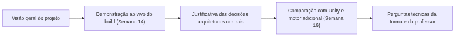
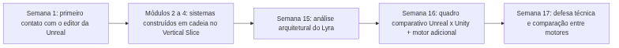

<!-- _class: cover -->

# Semana 17

## Apresentação Técnica Final do Vertical Slice

**Disciplina:** Tendências de Motores de Jogos (IN46A)
**Instituição:** IFMS — Campus Dourados
**Curso:** Tecnologia em Jogos Digitais
**Módulo 5 — Comparar Arquiteturas (encerramento)**

<!--
### Notas do apresentador
A Semana 17 encerra a disciplina com a Apresentação Técnica Final do Vertical Slice, marco de encerramento da Unidade VI e do Módulo 5. Não há conteúdo novo, sistema novo ou desafio de implementação: a semana consome diretamente os insumos das Semanas 15 (análise arquitetural do Lyra) e 16 (quadro comparativo Unreal x Unity consolidado, motor adicional escolhido, estrutura preliminar da apresentação). Metodologia: Reverse Engineering, autonomia muito alta — o professor atua exclusivamente como revisor e mediador, nunca como demonstrador.
-->

---

## Objetivos da Semana

- Apresentar tecnicamente o Vertical Slice completo, construído ao longo de todo o semestre
- Justificar as decisões arquiteturais tomadas, com exemplos concretos do próprio projeto
- Articular a comparação entre Unreal, Unity e o motor adicional escolhido na Semana 16
- Responder a perguntas técnicas sobre arquitetura, decisões e limitações do projeto

<!--
### Notas do apresentador
Resultado esperado: cada grupo apresenta formalmente o Vertical Slice completo, com defesa oral das decisões arquiteturais e da comparação entre motores, encerrando a disciplina com autonomia demonstrada para transitar entre engines. Avaliação: Rubrica 6 (Apresentações) e Rubrica 7 (Vertical Slice Final). Reutiliza diretamente o quadro comparativo e a estrutura preliminar da Semana 16 — nenhum dos dois é refeito do zero.
-->

---

<!-- _class: timeline -->

## Como a semana está organizada

- **Encontro 1** Apresentações técnicas finais do primeiro grupo de equipes
- **Encontro 2** Apresentações técnicas finais dos grupos restantes + discussão coletiva de encerramento da disciplina

<!--
### Notas do apresentador
Não há novo conteúdo introduzido nesta semana. Confirmar previamente a ordem e a divisão dos grupos entre os dois encontros. Testar o build empacotado de cada grupo antes da apresentação — nunca avaliar apenas a versão no editor.
-->

---

<!-- _class: chapter -->

## Encontro 1

# Apresentações Técnicas Finais — Primeiro Grupo

01

<!--
### Notas do apresentador
Depende diretamente do build empacotado da Semana 14, do quadro comparativo Unreal x Unity consolidado na Semana 16 e do registro da comparação com o motor adicional (Godot, O3DE, Stride ou CryEngine) também produzido na Semana 16.
-->

---

<!-- _class: question -->

# Descrever funcionalidades é o mesmo que justificar arquitetura?

Pense na última vez que você explicou uma decisão do seu projeto. Você disse "o que" o sistema faz, ou "por que" ele foi construído daquele jeito?

<!--
### Notas do apresentador
Deixar a turma refletir antes da abertura das apresentações. Resposta esperada: descrever funcionalidade ("o jogador abre a porta") não é o mesmo que justificar arquitetura ("usamos Blueprint Interface para desacoplar o Player da lógica específica da Door"). A apresentação técnica final avalia a segunda coisa, não a primeira.
-->

---

## Critérios de avaliação relembrados

- **Rubrica 6 (Apresentações):** comunicação, demonstração ao vivo, justificativas técnicas, domínio do projeto por todo o grupo, capacidade de responder perguntas
- **Rubrica 7 (Vertical Slice Final):** arquitetura, gameplay, organização, qualidade técnica, polimento, uso correto dos recursos da Unreal, consistência, documentação, empacotamento, capacidade de explicar decisões

Qualidade artística e quantidade de assets **não** são avaliadas em nenhum critério.

<!--
### Notas do apresentador
Abertura do encontro: relembrar critérios, ordem das apresentações e tempo por grupo. Ter em mãos a Rubrica 6 e a Rubrica 7 (Sistema_de_Avaliacao_Tendencias_de_Motores_de_Jogos.md) para preenchimento durante cada apresentação.
-->

---

<!-- _class: diagram -->

## O que cada apresentação precisa cobrir

<!--
### Notas do apresentador
Diagrama conceitual da estrutura de cada apresentação, já esboçada por cada grupo na Semana 16. Reforçar que o build testado deve corresponder ao entregue na Semana 14, sem alterações não documentadas.
-->

---

## O que sustenta a justificativa arquitetural

- Trade-offs do gameplay framework: por que GameMode/GameState/PlayerController/GameInstance foram divididos daquela forma
- Decisões de interação e inventário: por que Blueprint Interfaces, Event Dispatchers, Data Table/Data Asset foram escolhidos
- Trade-offs de polimento e otimização feitos no Módulo 4, com base no profiling da Semana 13
- Comparação nomeada: "em Unity, isso seria resolvido por..."
- Reconhecimento de limitações do próprio projeto, não apenas defesa de acertos

<!--
### Notas do apresentador
Conceito universal que fecha a disciplina: dominar uma engine específica não é o objetivo final — o objetivo é dominar os papéis arquiteturais que qualquer engine precisa resolver (composição de entidades, desacoplamento entre input e ação, ponto único de regras, comunicação entre sistemas, dados separados de lógica, persistência, máquinas de estado, interfaces em tempo real, estruturas de decisão para agentes). Um grupo que só descreve "onde clicou" não demonstrou domínio.
-->

---

> **Imagem sugerida**
>
> Objetivo: ilustrar a estrutura de uma apresentação técnica final bem construída, servindo de checklist visual para os grupos antes de subir ao palco.
> Enquadramento: quadro com cinco blocos sequenciais (visão geral, demonstração, decisões, comparação, perguntas).
> Elementos presentes: ícone simples para cada bloco; setas indicando a sequência.
> Destaque visual: bloco "justificativa das decisões arquiteturais" destacado como o de maior peso avaliativo.
> Legenda sugerida: "Descrever o quê não basta — a apresentação técnica cobra o porquê."

<!--
### Notas do apresentador
Pode ser projetado na abertura do encontro, junto com a relembrança dos critérios das Rubricas 6 e 7.
-->

---

## Boas práticas para a apresentação

- Distribuir a fala entre todos os integrantes — domínio do projeto é avaliado individualmente
- Nomear sempre um exemplo concreto do próprio projeto, nunca uma categoria genérica
- Testar o build empacotado antes da apresentação, não apenas a versão no editor
- Reconhecer limitações do próprio projeto com a mesma clareza com que se defendem acertos

<!--
### Notas do apresentador
Erro comum a evitar: apresentação concentrada em um único integrante, mascarando desconhecimento dos demais (penalizado na Rubrica 6, critério "Domínio do projeto"). Erro comum: build divergente do entregue na Semana 14 sem aviso — perguntar explicitamente se houve alterações.
-->

---

<!-- _class: exercise -->

# Apresentações do Encontro 1

O primeiro grupo de equipes apresenta o Vertical Slice completo dentro do tempo estabelecido: visão geral, demonstração ao vivo do build empacotado da Semana 14, justificativa das decisões arquiteturais centrais e comparação com Unity e com o motor adicional escolhido na Semana 16.

Critério de sucesso: build funcionando, pelo menos três decisões arquiteturais justificadas com exemplos nomeados, comparação articulada com Unity e o motor adicional.

<!--
### Notas do apresentador
Perguntas de sondagem sugeridas: "por que essa decisão e não outra?", "como isso seria feito em Unity?". Se a apresentação permanecer descritiva, redirecionar com essas perguntas. Preencher a Rubrica 6 e a Rubrica 7 durante ou imediatamente após cada apresentação.
-->

---

<!-- _class: summary-slide -->

## Fechando o Encontro 1

- Cada grupo do primeiro bloco apresentou o Vertical Slice completo e demonstrou o build empacotado funcionando
- Decisões arquiteturais centrais foram justificadas com exemplos nomeados do próprio projeto
- A comparação com Unity e com o motor adicional escolhido na Semana 16 foi articulada
- Feedback formal foi dado aos grupos que já apresentaram

<!--
### Notas do apresentador
Reservar tempo de troca de equipamento entre apresentações (build, projetor, áudio). Encerrar com síntese das apresentações do dia e organização para o Encontro 2.
-->

---

<!-- _class: chapter -->

## Encontro 2

# Apresentações Finais e Encerramento da Disciplina

02

<!--
### Notas do apresentador
Mesma dinâmica do Encontro 1 para os grupos restantes, seguida de uma discussão coletiva final que fecha a disciplina. Nenhum conteúdo novo é introduzido.
-->

---

<!-- _class: question -->

# O que você levaria para uma engine que nunca usou?

Pense em um conceito do semestre que você reconheceria em qualquer motor novo — não um botão ou menu específico, mas um papel arquitetural.

<!--
### Notas do apresentador
Pergunta de abertura para preparar a discussão final coletiva do fim do encontro. Deixar a turma responder informalmente antes de retomar ao final do encontro.
-->

---

<!-- _class: exercise -->

# Apresentações do Encontro 2

Os grupos restantes apresentam o Vertical Slice completo, seguindo exatamente a mesma estrutura do Encontro 1: demonstração ao vivo do build empacotado, justificativa das decisões arquiteturais e comparação com Unity e com o motor adicional escolhido.

Mesmo critério de sucesso do Encontro 1, aplicado a cada grupo restante.

<!--
### Notas do apresentador
Confirmar a ordem dos grupos restantes antes do início. Preencher a Rubrica 6 e a Rubrica 7 durante ou imediatamente após cada apresentação, verificando divergências não documentadas entre o build testado e o entregue na Semana 14.
-->

---

<!-- _class: diagram -->

## Da Semana 1 à Semana 17

<!--
### Notas do apresentador
Diagrama de apoio à discussão final coletiva. Reforçar que cada etapa alimentou diretamente a seguinte — nada na apresentação final é produzido do zero.
-->

---

## Discussão final coletiva

- O que mudou na forma de pensar arquitetura de jogos ao longo do semestre?
- Que papéis arquiteturais (composição de entidades, desacoplamento input/ação, ponto único de regras, comunicação entre sistemas, dados separados de lógica, persistência, máquinas de estado, UI em tempo real, estruturas de decisão) você reconheceria em qualquer motor novo?
- O que a Unreal formaliza nativamente e o que exigiria convenção própria em outra engine?

O aprendizado central desta disciplina foi arquitetural e transferível — a Unreal foi o estudo de caso, não o objetivo final.

<!--
### Notas do apresentador
Conduzida pelo professor após todas as apresentações do Encontro 2. Dificuldade esperada: alunos restringindo a síntese a "aprendemos Unreal Engine" — redirecionar sempre para o objetivo real: dominar papéis arquiteturais transferíveis entre engines.
-->

---

> **Imagem sugerida**
>
> Objetivo: sintetizar visualmente a trajetória da disciplina, do primeiro contato com o editor à apresentação final.
> Enquadramento: linha do tempo horizontal com seis marcos (Semana 1, Módulo 2, Módulo 3, Módulo 4, Semana 15/16, Semana 17).
> Elementos presentes: ícone simples para cada marco; rótulo curto indicando o que foi construído ou consolidado em cada um.
> Destaque visual: marco final (Semana 17) destacado como ponto de chegada.
> Legenda sugerida: "De aprender a ferramenta a comparar arquiteturas — a mesma trajetória, em qualquer motor."

<!--
### Notas do apresentador
Pode ser projetado durante a discussão final coletiva, como apoio visual à síntese da disciplina.
-->

---

## Boas práticas para o encerramento

- Verbalizar a síntese em termos de papéis arquiteturais, não de telas ou botões específicos da Unreal
- Reconhecer explicitamente o que foi aprendido sobre autonomia para consultar documentação oficial e aprender motores novos
- Registrar, como turma, pelo menos um exemplo concreto de "mesmo problema, solução diferente" entre Unreal e Unity

<!--
### Notas do apresentador
A discussão final não gera nota, mas encerra formalmente a verificação de autonomia que orientou toda a disciplina desde o Módulo 1.
-->

---

<!-- _class: summary-slide -->

## Resumo da Semana 17

- Todos os grupos apresentaram tecnicamente o Vertical Slice completo construído ao longo do semestre
- Decisões arquiteturais foram justificadas com exemplos nomeados do próprio projeto
- A comparação entre Unreal, Unity e o motor adicional escolhido na Semana 16 foi articulada por cada grupo
- A disciplina se encerrou com discussão coletiva sobre autonomia para aprender e transitar entre motores de jogos

<!--
### Notas do apresentador
Resultado final ao término da Semana 17: Vertical Slice funcional completo; domínio dos principais sistemas da Unreal explorados na disciplina; compreensão da arquitetura da Unreal; capacidade de comparação técnica entre Unreal, Unity e outros motores; autonomia para aprendizagem de novos motores.
-->

---

## Checklist Final da Disciplina

- Vertical Slice completo apresentado e demonstrado ao vivo (build da Semana 14, sem alterações não documentadas)
- Pelo menos três decisões arquiteturais justificadas por grupo, com exemplos nomeados
- Comparação com Unity e com o motor adicional articulada por todos os grupos
- Rubrica 6 e Rubrica 7 preenchidas para cada grupo
- Discussão final coletiva realizada, encerrando formalmente a disciplina

<!--
### Notas do apresentador
Preparar o encerramento formal da disciplina: devolutiva geral, lançamento de notas, encaminhamentos finais. Não há próxima semana — a Semana 17 encerra o Cronograma.
-->

---

## Próximos passos

Não há próxima semana: a Semana 17 encerra o Cronograma e a disciplina. O que permanece é a autonomia construída para reconhecer, em qualquer motor de jogos, os mesmos papéis arquiteturais estudados neste semestre — e a capacidade de aprender uma engine nova formalizando esses papéis a partir do que já foi dominado na Unreal.

**Leitura recomendada:** PROJECT_ARCHITECTURE.md (referência de consistência entre o apresentado e o efetivamente construído); Sistema_de_Avaliacao_Tendencias_de_Motores_de_Jogos.md — Rubrica 6 e Rubrica 7; documentação oficial de Unity, Godot, O3DE, Stride ou CryEngine, conforme o motor escolhido por cada grupo na Semana 16.

<!--
### Notas do apresentador
Encerramento formal da disciplina. Reforçar publicamente, se pertinente, exemplos de justificativa técnica bem construída observados durante as apresentações — isso eleva o padrão de referência para turmas futuras.
-->
