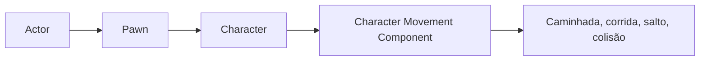
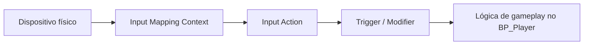

<!-- _class: cover -->

# Semana 2

## Character, Movimentação e Enhanced Input

**Disciplina:** Tendências de Motores de Jogos (IN46A)
**Instituição:** IFMS — Campus Dourados
**Curso:** Tecnologia em Jogos Digitais
**Módulo 1 — Aprender a Ferramenta**

<!--
### Notas do apresentador
Retomar rapidamente o Actor com Components da Semana 1 antes de abrir os slides. A turma já sabe compor um Actor puro — hoje a pergunta é: o que muda quando esse Actor precisa ser controlado por um jogador?
-->

---

## Objetivos da Semana

- Distinguir Pawn de Character e o papel do Character Movement Component
- Configurar o `BP_Player` como Character controlável no nível de teste
- Compreender Enhanced Input como desacoplamento entre dispositivo e intenção
- Implementar movimentação, câmera e uma Input Action própria

<!--
### Notas do apresentador
Resultado esperado ao final da semana: BP_Player funcional, controlado por um esquema próprio de Enhanced Input, com ao menos uma Input Action adicional do desafio. Ainda nenhum sistema de gameplay além de locomoção e câmera — resultado estrutural.
-->

---

<!-- _class: timeline -->

## Como a semana está organizada

- **Encontro 1** Pawn x Character + Character Movement Component + BP_Player no nível de teste
- **Encontro 2** Enhanced Input (Input Actions, Mapping Context) + desafio de nova ação

<!--
### Notas do apresentador
Metodologia: Scaffolded Learning, autonomia ainda muito baixa. O primeiro grau de liberdade restrita só aparece no desafio do Encontro 2 — reforçar isso para a turma não esperar autonomia total ainda.
-->

---

<!-- _class: chapter -->

## Encontro 1

# Pawn, Character e Movimentação

01

<!--
### Notas do apresentador
Partir do BP_TesteComposicao da Semana 1: ele é um Actor qualquer, não controlável. A pergunta de hoje é o que falta para torná-lo controlável.
-->

---

<!-- _class: question -->

# Por que não controlar diretamente o Actor da Semana 1?

Pense no que seria necessário reimplementar manualmente: input, caminhada, salto, colisão com o chão.

<!--
### Notas do apresentador
Deixar a turma discutir por 1-2 minutos. A resposta esperada aponta para a necessidade de uma especialização própria de Actor — chegar a Pawn e Character.
-->

---

## Pawn x Character

- **Pawn** — Actor que pode ser possuído por um Controller, sem locomoção pronta
- **Character** — especialização de Pawn com Character Movement Component embutido
- Character resolve caminhada, corrida, salto, natação, voo e colisão com o terreno

O mesmo problema de locomoção que toda engine de terceira pessoa precisa resolver.

<!--
### Notas do apresentador
Conceito universal do encontro. Erro comum: tratar Pawn e Character como sinônimos, ou tentar reimplementar movimentação manualmente em vez de usar o Component já embutido.
Referência: Gameplay Framework in Unreal Engine (dev.epicgames.com/documentation).
-->

---

<!-- _class: diagram -->

## De Actor a Character

<!--
### Notas do apresentador
Diagrama conceitual. Reforçar que Character não é uma classe isolada — é uma especialização em camadas de Actor, preparando a distinção que será retomada na Semana 4 com GameMode e PlayerController.
-->

---

<!-- _class: comparison -->

## Locomoção: Unreal × Unity

### Unreal

Character já embute Character Movement Component completo por padrão

### Unity

GameObject + CharacterController/Rigidbody + script de movimento próprio

<!--
### Notas do apresentador
Diferença arquitetural relevante, sem aprofundar: a Unreal entrega uma solução pronta maior por padrão; a Unity normalmente exige compor a partir de peças mais genéricas. O ponto será retomado, se necessário, na Unidade V.
-->

---

## Demonstração: criando o BP_Player

O professor cria `BP_Player` como subclasse de Character (não Actor, não Pawn) e ajusta parâmetros de movimento.

**O que muda:** velocidade de caminhada e altura de salto perceptivelmente diferentes do padrão do template.

<!--
### Notas do apresentador
Não detalhar o passo a passo aqui — o tutorial faz isso. Demonstrar a ordem: criar Blueprint Class → escolher Character → nomear BP_Player → ajustar Max Walk Speed e Jump Z Velocity → compilar.
-->

---

> **Imagem sugerida**
>
> Objetivo: mostrar o painel de Components do BP_Player recém-criado.
> Enquadramento: editor de Blueprint com o painel de Components à esquerda.
> Elementos presentes: Capsule Component, Arrow Component, Mesh Component e a entrada do Character Movement Component.
> Destaque visual: contorno ao redor da entrada do Character Movement Component, ausente no BP_TesteComposicao da Semana 1.
> Legenda sugerida: "O Character já nasce com Capsule, Mesh e Character Movement Component — nada disso precisa ser montado manualmente."

<!--
### Notas do apresentador
Print pode ser tirado do BP_Player de exemplo preparado antes da aula, fora da visão da turma.
-->

---

## Arquitetura: BP_Player no projeto

- `Blueprints/Characters/BP_Player` — Blueprint central do projeto
- Default Pawn Class do projeto passa a apontar para `BP_Player`
- Base sobre a qual Input, Interaction e outros sistemas serão anexados

O mesmo Blueprint concentra, ao longo do semestre, locomoção, câmera, input e Components de gameplay do jogador.

<!--
### Notas do apresentador
Reforçar PROJECT_ARCHITECTURE.md, seção 7: o BP_Player é o Blueprint central do projeto. Trocar o Default Pawn Class em Project Settings > Maps & Modes é o que faz o jogador de fato controlar o BP_Player ao dar Play.
-->

---

## Boas práticas

- Partir de Character sempre que houver locomoção física e controle direto
- Reservar Actor puro para objetos do mundo sem controle do jogador
- Ajustar parâmetros de movimento em pequenos incrementos, testando a cada mudança

<!--
### Notas do apresentador
O hábito de testar incrementalmente antecipa a mentalidade de Profiling que será formalizada na Semana 13.
-->

---

<!-- _class: exercise -->

# Laboratório do Encontro 1

Criar o `BP_Player` como subclasse de Character, ajustar Max Walk Speed e Jump Z Velocity, e posicioná-lo controlável no `Map_Exploration`.

Critério de sucesso: BP_Player se move com o controle padrão, com velocidade e salto perceptivelmente diferentes do template.

<!--
### Notas do apresentador
Sem desafio de autonomia neste encontro — demonstração e replicação guiada. Circular pela sala conferindo o Default Pawn Class de cada grupo e a presença de um Player Start no nível.
-->

---

<!-- _class: summary-slide -->

## Fechando o Encontro 1

- Pawn habilita controle; Character adiciona locomoção pronta
- BP_Player criado, ajustado e controlável no nível de teste
- Próximo encontro: substituir o controle padrão por Enhanced Input

<!--
### Notas do apresentador
Retomar o checklist do tutorial do Encontro 1 antes de encerrar. Reforçar que o controle ainda é o padrão do template — isso muda no Encontro 2.
-->

---

<!-- _class: chapter -->

## Encontro 2

# Enhanced Input

02

<!--
### Notas do apresentador
Retomar o BP_Player do Encontro 1 e o fato de que ele ainda depende do esquema de controle padrão do template — ninguém decidiu nada sobre esse mapeamento ainda.
-->

---

<!-- _class: question -->

# O que acontece se a lógica de gameplay checar diretamente "a tecla W foi pressionada"?

Pense em trocar de teclado para controle, remapear teclas ou dar suporte a acessibilidade.

<!--
### Notas do apresentador
Deixar a turma responder antes de introduzir Enhanced Input. A resposta esperada aponta para a necessidade de desacoplar dispositivo físico de intenção de jogo.
-->

---

## Enhanced Input: quatro peças

- **Input Action** — intenção abstrata ("mover", "olhar", "pular")
- **Input Mapping Context** — mapeamento entre dispositivo e Input Action
- **Trigger** — quando o valor é considerado acionado
- **Modifier** — transforma o valor bruto (inversão, zona morta, escala)

A lógica de gameplay nunca deveria depender de qual tecla foi pressionada.

<!--
### Notas do apresentador
Conceito universal do encontro. Erro comum: nomear Input Actions pelo dispositivo (IA_TeclaW) em vez de pela intenção. Redirecionar sempre para o nome da intenção.
Referência: Enhanced Input in Unreal Engine (dev.epicgames.com/documentation).
-->

---

<!-- _class: diagram -->

## Do dispositivo à ação no mundo

<!--
### Notas do apresentador
Diagrama conceitual. Reforçar que o Mapping Context pode ser trocado ou combinado em runtime — por exemplo, um esquema para exploração a pé e outro para dirigir um veículo, sem alterar a Input Action nem a lógica de gameplay.
-->

---

<!-- _class: comparison -->

## Enhanced Input × Input System

### Unreal

Input Mapping Contexts combináveis e priorizáveis em runtime

### Unity

Action Maps dentro de um único Input Actions Asset, ativados via código

<!--
### Notas do apresentador
Mesmo princípio de desacoplamento nas duas engines. Não aprofundar mais que isso — o objetivo é reconhecer a equivalência conceitual, não decorar diferenças de configuração.
-->

---

## Demonstração: criando IA_Move, IA_Look e IA_Jump

O professor cria três Input Actions e um Input Mapping Context (`IMC_Player`), mapeando WASD, mouse e barra de espaço.

**Por que:** separar a intenção (mover, olhar, pular) do dispositivo que a aciona.

<!--
### Notas do apresentador
Não detalhar o passo a passo aqui — o tutorial faz isso. Demonstrar a ordem: criar as três Input Actions com Value Type correto → criar IMC_Player → mapear cada ação a uma tecla ou eixo.
-->

---

## Demonstração: conectando ao BP_Player

Add Mapping Context no BeginPlay, depois os nós Enhanced Input Action conectados a Add Movement Input, Add Controller Yaw/Pitch Input e Jump.

**Resultado esperado:** controle exclusivamente via `IMC_Player`, sem resquício do template.

<!--
### Notas do apresentador
Reforçar que criar as Input Actions não basta — é preciso adicionar o Mapping Context no BeginPlay e traduzir cada evento em uma chamada real sobre o Character Movement Component herdado no Encontro 1.
Referência: Enhanced Input in Unreal Engine (dev.epicgames.com/documentation).
-->

---

> **Imagem sugerida**
>
> Objetivo: mostrar o Event Graph do BP_Player com os nós de Enhanced Input conectados às funções de movimento.
> Enquadramento: captura do Event Graph, centralizada nos nós Enhanced Input Action Move/Look/Jump.
> Elementos presentes: nó "Add Mapping Context" no Event BeginPlay; nós "Enhanced Input Action" para IA_Move, IA_Look e IA_Jump; conexões para Add Movement Input, Add Controller Yaw/Pitch Input e Jump.
> Destaque visual: o fluxo desde o evento de input abstrato até a chamada concreta de movimentação.
> Legenda sugerida: "Do dispositivo físico à ação no mundo: o fluxo completo do Enhanced Input no BP_Player."

<!--
### Notas do apresentador
Print pode ser tirado do BP_Player de exemplo preparado antes da aula, fora da visão da turma.
-->

---

## Boas práticas

- Nomear Input Actions pela intenção, nunca pelo dispositivo (`IA_Sprint`, não `IA_TeclaShift`)
- Organizar os nós de input em uma Comment Box separada no Event Graph
- Cada tecla mapeada a uma única intenção dentro do mesmo Mapping Context

<!--
### Notas do apresentador
A Comment Box de input evita o Event Graph gigante mencionado no PROJECT_ARCHITECTURE.md, seção 10 — útil desde já, pois Interaction, Inventory e Health serão anexados ao mesmo Blueprint nos módulos seguintes.
-->

---

<!-- _class: exercise -->

# Laboratório do Encontro 2

Criar `IA_Move`, `IA_Look`, `IA_Jump` e `IMC_Player`, e conectar ao BP_Player, substituindo o controle padrão do template.

Critério de sucesso: movimentação, câmera e salto funcionais exclusivamente via Enhanced Input.

<!--
### Notas do apresentador
Verificação sugerida no tutorial: desativar temporariamente o Add Mapping Context e confirmar que o personagem para de responder — prova que não há resquício do template.
-->

---

<!-- _class: exercise -->

# Desafio: uma nova Input Action

Escolher entre correr, agachar ou uma variação de salto, e implementar com liberdade de Trigger e Modifier.

Nomear pela intenção, nunca pela tecla. Sem gabarito único.

<!--
### Notas do apresentador
Primeiro exercício de decisão técnica autônoma da disciplina, em escopo estreito e seguro. Fazer um showcase rápido das soluções de cada grupo ao final — reforçar que diferentes escolhas de Trigger e Modifier são igualmente válidas.
Avaliação: Rubrica 2 — Desafios Técnicos, aplicável desde esta semana.
-->

---

<!-- _class: summary-slide -->

## Resumo da Semana 2

- Character = Pawn + Character Movement Component pronto
- BP_Player controlável no nível de teste
- Enhanced Input desacopla dispositivo de intenção de jogo
- Cada grupo implementou uma Input Action própria

<!--
### Notas do apresentador
Retomar o checklist do tutorial do Encontro 2 antes de encerrar.
-->

---

## Próximos passos

Na Semana 3, o material simples e o terreno via Landscape serão aplicados ao mesmo nível em que o BP_Player já se move — e a turma fará o primeiro build empacotado da disciplina.

**Leitura recomendada:** Enhanced Input in Unreal Engine · Gameplay Framework in Unreal Engine (Epic Games Documentation).

<!--
### Notas do apresentador
Antecipar que Nanite e Lumen, na Semana 3, retomam a mesma distinção entre conceito universal e implementação específica já exercitada com Enhanced Input.
-->
