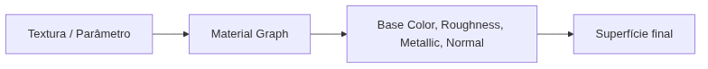
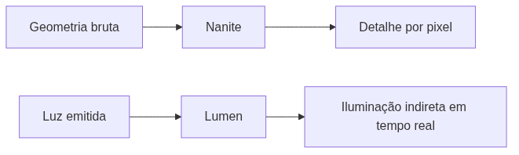

<!-- _class: cover -->

# Semana 3

## Material, Landscape, Nanite, Lumen e o primeiro Build

**Disciplina:** Tendências de Motores de Jogos (IN46A)
**Instituição:** IFMS — Campus Dourados
**Curso:** Tecnologia em Jogos Digitais
**Módulo 1 — Aprender a Ferramenta**

<!--
### Notas do apresentador
Esta é a última semana do Módulo 1 e da Unidade I. Retomar rapidamente o BP_Player consolidado nas Semanas 1 e 2: ele já se move sobre um graybox neutro. A pergunta de hoje é diferente das anteriores — como a engine resolve a aparência de uma superfície e a geometria de um terreno, e como tudo isso vira um produto executável fora do Editor.
-->

---

## Objetivos da Semana

- Compreender o Material Graph como shader nodal universal
- Modelar um terreno básico via Landscape
- Compreender Nanite e Lumen como soluções para dois problemas universais de renderização
- Compreender Packaging e gerar o primeiro build executável do Vertical Slice

<!--
### Notas do apresentador
Resultado esperado ao final da semana: nível de teste com material e terreno básicos, Nanite e Lumen ativos, e o primeiro build executável — com o BP_Player funcional dentro dele. Este é o Checkpoint de encerramento do Módulo 1. Não há desafio de liberdade de solução nesta semana: a prioridade é todo grupo chegar a um build funcional.
-->

---

<!-- _class: timeline -->

## Como a semana está organizada

- **Encontro 1** Material Graph + criação de material simples + Landscape (terreno)
- **Encontro 2** Nanite + Lumen + Packaging + Checkpoint/Showcase de encerramento do Módulo 1

<!--
### Notas do apresentador
Metodologia: Scaffolded Learning, autonomia ainda muito baixa. Não há desafio técnico de solução aberta nesta semana — o Encontro 2 concentra o Checkpoint de encerramento de módulo, e a prioridade é garantir que todo grupo chegue a um build funcional.
-->

---

<!-- _class: chapter -->

## Encontro 1

# Material Graph e Landscape

01

<!--
### Notas do apresentador
Partir do nível de teste ainda em graybox, com o BP_Player já se movendo desde a Semana 2. Hoje resolvemos dois problemas distintos: aparência de superfície (material) e geometria de terreno (Landscape).
-->

---

<!-- _class: question -->

# Como uma engine decide a cor, o brilho e o relevo de uma superfície sem código de shader escrito à mão?

Pense em texturas, valores numéricos e operações matemáticas combinados visualmente.

<!--
### Notas do apresentador
Deixar a turma discutir por 1-2 minutos. A resposta esperada aponta para um grafo visual de nós — o shader nodal — que qualquer engine moderna oferece como alternativa a escrever código de shader.
-->

---

## Material Graph: shader nodal universal

- **Texture Sample** — lê os pixels de uma textura
- **Scalar Parameter** — valor numérico ajustável (ex.: rugosidade)
- **Vector Parameter** — cor ou vetor ajustável
- Tudo se conecta aos pinos finais: Base Color, Roughness, Metallic, Normal
- **Material Domain** define o uso do material (ex.: Surface)

Todo material resolve o mesmo problema: transformar textura + parâmetros em aparência de superfície.

<!--
### Notas do apresentador
Conceito universal do encontro. Erro comum: confundir Scalar Parameter com Constant — o Parameter pode ser exposto e reaproveitado em Material Instances a partir do Módulo 4; a Constant não.
Referência: Unreal Engine Materials (dev.epicgames.com/documentation).
-->

---

<!-- _class: diagram -->

## Da textura à superfície

<!--
### Notas do apresentador
Diagrama conceitual. Reforçar que o Material Graph é a implementação específica da Unreal para o conceito universal de shader nodal — o mesmo problema que o Shader Graph da Unity resolve de outra forma.
-->

---

<!-- _class: comparison -->

## Shader nodal: Unreal × Unity

### Unreal

Material Graph integrado nativamente ao pipeline desde a primeira versão, com Material Domains e blend modes no próprio grafo

### Unity

Shader Graph pleno apenas nos pipelines modernos (URP/HDRP); histórico dividido com o Built-in Render Pipeline

<!--
### Notas do apresentador
Diferença arquitetural relevante, sem aprofundar. O ponto será retomado, se necessário, na Unidade V.
-->

---

## Demonstração: criando o M_Ground

O professor cria `M_Ground` em `Materials/Base`, conecta uma textura do Kenney ao Base Color via Texture Sample, e um Scalar Parameter (`Roughness_Amount`) ao Roughness.

**O que muda:** a superfície de pré-visualização passa de cinza genérica para uma textura reconhecível e ajustável.

<!--
### Notas do apresentador
Não detalhar o passo a passo aqui — o tutorial faz isso. Demonstrar a ordem: criar Material → nomear M_Ground → arrastar textura para o grafo → conectar RGB ao Base Color → adicionar Scalar Parameter → conectar ao Roughness → Apply → Save.
-->

---

> **Imagem sugerida**
>
> Objetivo: mostrar o Material Graph do M_Ground já conectado.
> Enquadramento: Material Editor centralizado no grafo de nós.
> Elementos presentes: nó Texture Sample conectado ao Base Color; nó Scalar Parameter (`Roughness_Amount`) conectado ao Roughness; painel de pré-visualização com a esfera de exemplo.
> Destaque visual: contorno nas duas conexões (Base Color e Roughness) que levam ao nó principal do material.
> Legenda sugerida: "Textura e parâmetro convergindo para as propriedades finais da superfície."

<!--
### Notas do apresentador
Print pode ser tirado do M_Ground de exemplo preparado antes da aula, fora da visão da turma.
-->

---

<!-- _class: question -->

# Por que não usar um Static Mesh comum como terreno?

Pense em uma superfície de centenas de metros, com variações suaves de altura.

<!--
### Notas do apresentador
Deixar a turma responder antes de introduzir Landscape. A resposta esperada aponta para a escala e a esculpibilidade que um Static Mesh comum não resolve com eficiência.
-->

---

## Landscape: geometria de terreno em larga escala

- Heightmap define a elevação do terreno ponto a ponto
- Ferramentas de **Sculpt** (elevar, abaixar, suavizar) em tempo real
- **Paint Layers** aplicam material sobre a superfície esculpida
- Resolve um problema diferente do material: geometria, não aparência

Material resolve aparência; Landscape resolve geometria de terreno. Nunca confundir os dois.

<!--
### Notas do apresentador
Erro comum: tentar usar Static Mesh como terreno, ou confundir parâmetros de material com iluminação de cena (isso será tratado no Encontro 2, com Lumen).
Referência: Landscape Outdoor Terrain in Unreal Engine (dev.epicgames.com/documentation).
-->

---

<!-- _class: comparison -->

## Terreno: Unreal × Unity

### Unreal

Landscape — heightmap + Paint Layers, sculpt em tempo real dentro do editor

### Unity

Terrain — papel equivalente: heightmap + camadas de material

<!--
### Notas do apresentador
Equivalência conceitual direta. Não aprofundar mais que isso — a comparação arquitetural mais profunda (streaming, desempenho) é retomada, se necessário, na Unidade V.
-->

---

## Demonstração: esculpindo o terreno

O professor cria o Landscape no `Map_Exploration`, esculpe pequenas variações de elevação com a ferramenta Sculpt, suaviza com Smooth, e pinta a superfície com o `M_Ground` via Paint Layer.

**Por que:** um terreno visualmente reconhecível, sem comprometer a locomoção já testada do BP_Player.

<!--
### Notas do apresentador
Reforçar: esculpir em pequenos incrementos, testando a locomoção a cada ajuste relevante — mesmo hábito de ajuste incremental já recomendado para movimento na Semana 2. Elevações bruscas podem prender o BP_Player.
-->

---

## Arquitetura: Material e Landscape no projeto

- `Materials/Base/M_Ground` — convenção `M_` do PROJECT_ARCHITECTURE.md
- `Textures/` — primeira semana com assets externos ao template (Kenney)
- Landscape do `Map_Exploration` — geometria do nível de teste

O mesmo nível de teste que já hospeda o BP_Player agora ganha aparência e geometria próprias.

<!--
### Notas do apresentador
Reforçar PROJECT_ARCHITECTURE.md, seção 8 e 9: convenção M_ e subpasta Materials/Base/. Usar como oportunidade para revisar a organização de pastas do projeto com a turma.
-->

---

## Boas práticas

- Nomear parâmetros pela propriedade que representam (`Roughness_Amount`), nunca `Param1`
- Esculpir o terreno em pequenos incrementos, testando a locomoção a cada ajuste
- Nunca usar Static Mesh comum como substituto de terreno em larga escala

<!--
### Notas do apresentador
O hábito de nomear parâmetros pela propriedade facilita a criação de Material Instances no Módulo 4, quando os mesmos parâmetros serão reaproveitados para variações do material.
-->

---

<!-- _class: exercise -->

# Laboratório do Encontro 1

Cada grupo cria seu próprio `M_Ground` e esculpe o terreno do `Map_Exploration` com Landscape, aplicando o material à superfície.

Critério de sucesso: material simples aplicado a um terreno básico via Landscape, com o BP_Player se movendo normalmente sobre ele, seguindo a convenção `M_` do PROJECT_ARCHITECTURE.md.

<!--
### Notas do apresentador
Sem desafio de autonomia neste encontro — demonstração e replicação guiada. Circular pela sala conferindo a nomenclatura do material e o comportamento do BP_Player sobre as elevações esculpidas.
-->

---

<!-- _class: summary-slide -->

## Fechando o Encontro 1

- Material Graph resolve aparência; Landscape resolve geometria de terreno
- `M_Ground` criado e aplicado ao terreno esculpido no `Map_Exploration`
- Próximo encontro: renderização moderna (Nanite, Lumen) e o primeiro build

<!--
### Notas do apresentador
Retomar o checklist do tutorial do Encontro 1 antes de encerrar. Reforçar que o nível ainda não usa Nanite/Lumen ativamente nem foi empacotado — isso é o Encontro 2.
-->

---

<!-- _class: chapter -->

## Encontro 2

# Nanite, Lumen e Packaging

02

<!--
### Notas do apresentador
Retomar o material e o Landscape do Encontro 1. Hoje fechamos o Módulo 1: dois problemas de renderização moderna (geometria e iluminação) e a etapa que transforma tudo isso em um produto executável.
-->

---

<!-- _class: question -->

# Como exibir geometria muito detalhada sem comprometer a performance a cada quadro?

Pense no custo de renderizar milhões de polígonos, e na solução tradicional de LODs manuais.

<!--
### Notas do apresentador
Deixar a turma responder antes de introduzir Nanite. A resposta esperada aponta para trocar modelos simplificados conforme a distância — o que Nanite substitui por virtualização de geometria.
-->

---

## Nanite: geometria virtualizada

- Problema universal: complexidade geométrica custa caro a cada quadro
- Solução tradicional: **LODs** manuais, trocados por distância da câmera
- Nanite exibe apenas o detalhe necessário **por pixel**, sem LODs manuais

Nanite não aumenta o limite de polígonos — muda como a geometria é processada e exibida.

<!--
### Notas do apresentador
Erro comum: achar que Nanite é "mais polígonos permitidos". Para geometria já muito leve (graybox), o ganho é imperceptível — o conceito importa mais que o ajuste fino neste estágio.
Referência: Nanite Virtualized Geometry (dev.epicgames.com/documentation).
-->

---

## Lumen: iluminação global dinâmica

- Problema universal: simular luz que rebate entre superfícies (iluminação indireta)
- Solução tradicional: **bake de lightmaps**, desatualizado se a cena mudar
- Lumen calcula iluminação indireta **em tempo real**, sem bake prévio

Lumen calcula a propagação da luz existente — não gera luz onde não há fonte alguma.

<!--
### Notas do apresentador
Nanite resolve geometria; Lumen resolve luz — dois problemas independentes, cada um com sua própria configuração. Não confundir como uma única "opção de gráficos melhores".
Referência: Lumen Global Illumination and Reflections (dev.epicgames.com/documentation).
-->

---

<!-- _class: diagram -->

## Dois problemas, duas soluções

<!--
### Notas do apresentador
Diagrama conceitual. Reforçar que Nanite e Lumen são independentes: um projeto pode ativar um sem o outro, embora a Unreal os entregue juntos por padrão em projetos novos.
-->

---

<!-- _class: comparison -->

## Renderização moderna: Unreal × Unity

### Unreal

Nanite (sem equivalente direto) e Lumen ativados por padrão em projetos novos

### Unity

LODs manuais e contagem de polígonos cuidadosa; GI dinâmico (URP/HDRP) ou bake via Progressive Lightmapper

<!--
### Notas do apresentador
Não aprofundar mais que isso — o objetivo é reconhecer a equivalência (ou ausência dela) conceitual. A comparação arquitetural mais profunda é retomada na Unidade V.
-->

---

## Demonstração: ativando Nanite e Lumen

O professor confirma Lumen como método de Global Illumination e Reflections em Project Settings, habilita Nanite em Static Meshes do nível, e move uma luz em Play para mostrar a resposta em tempo real.

**Resultado esperado:** iluminação indireta muda instantaneamente, sem qualquer bake.

<!--
### Notas do apresentador
Não detalhar o passo a passo aqui — o tutorial faz isso. Reforçar: ajustar iluminação observando o resultado em tempo real, em vez de ajustar "no escuro" e só verificar depois de um bake.
-->

---

> **Imagem sugerida**
>
> Objetivo: mostrar o nível de teste antes e depois da ativação de Lumen.
> Enquadramento: duas capturas lado a lado do mesmo trecho do `Map_Exploration`.
> Elementos presentes: à esquerda, iluminação estática/plana; à direita, iluminação indireta dinâmica com sombras suaves.
> Destaque visual: seta indicando a mudança de intensidade da luz refletida entre as duas capturas.
> Legenda sugerida: "A mesma cena, antes e depois da iluminação global dinâmica do Lumen."

<!--
### Notas do apresentador
Print pode ser preparado previamente comparando o nível com e sem Lumen ativo, fora da visão da turma.
-->

---

<!-- _class: question -->

# O que falta para um jogo rodar fora do Unreal Editor?

Pense em tudo que já existe — BP_Player, material, Landscape, Nanite, Lumen — e onde isso "mora" hoje.

<!--
### Notas do apresentador
Deixar a turma responder antes de introduzir Packaging. A resposta esperada aponta para uma etapa explícita de conversão em executável — nenhuma engine entrega isso automaticamente.
-->

---

## Packaging: do projeto ao executável

- Nenhuma engine entrega um jogo jogável fora do Editor sem conversão explícita
- Compila o projeto para uma plataforma-alvo (neste curso, Windows)
- Empacota todos os assets necessários em um executável autocontido

O momento em que o trabalho do módulo deixa de ser protótipo e vira produto distribuível.

<!--
### Notas do apresentador
Conceito universal do encontro. Reforçar tempo de build no cronograma — builds não são instantâneos, especialmente a primeira compilação de shaders.
Referência: Packaging Your Project (dev.epicgames.com/documentation).
-->

---

<!-- _class: comparison -->

## Packaging: Unreal × Unity

### Unreal

Platforms > Package Project, plataforma-alvo + configuração (Development/Shipping)

### Unity

File > Build Settings, mesmo problema de gerar executável a partir do projeto editável

<!--
### Notas do apresentador
Equivalência conceitual direta em intenção (Windows, Mac, consoles, mobile). Diferença perceptível no dia a dia: tempo de compilação de shaders na primeira build de um projeto Unreal.
-->

---

## Demonstração: gerando o primeiro build

O professor confirma `Map_Exploration` como Editor Startup Map e Game Default Map, seleciona Windows + Development em Package Project, e executa o `.exe` gerado fora do Editor.

**Resultado esperado:** BP_Player controlável por Enhanced Input dentro do executável.

<!--
### Notas do apresentador
Reforçar: iniciar o packaging de cada grupo o quanto antes no laboratório — builds podem levar alguns minutos e o tempo do Checkpoint é limitado. Testar o passo a passo previamente na mesma versão de engine da turma.
-->

---

## Arquitetura: do Editor ao Build

- Nível de teste consolidado (material + Landscape) recebe Nanite/Lumen
- `Editor Startup Map` e `Game Default Map` apontam para `Map_Exploration`
- Packaging gera o executável em `Builds/Semana03` (fora da pasta do projeto)

O mesmo pipeline — configurar mapa padrão, empacotar, testar fora do editor — se repete em qualquer entrega futura da disciplina.

<!--
### Notas do apresentador
Reforçar PROJECT_ARCHITECTURE.md quanto à organização geral do nível. Esta é a primeira vez que o projeto existe fora do Editor — marco simbólico do encerramento do Módulo 1.
-->

---

## Boas práticas

- Testar o passo a passo de Packaging na mesma versão de engine antes da aula
- Iniciar o packaging o mais cedo possível no laboratório, nunca no último minuto
- Ajustar iluminação observando o resultado em tempo real do Lumen, não "no escuro"

<!--
### Notas do apresentador
Builds não são instantâneos — deixar o Packaging para o último minuto de qualquer Checkpoint futuro é um risco técnico evitável, não apenas nesta semana.
-->

---

<!-- _class: exercise -->

# Laboratório do Encontro 2

Cada grupo ativa Nanite/Lumen no próprio nível e conduz o packaging do seu projeto até gerar um executável funcional.

Critério de sucesso: build executável do Vertical Slice, gerado fora do Editor, com Nanite e Lumen ativos e o BP_Player controlável dentro do executável.

<!--
### Notas do apresentador
Não é um desafio de solução aberta — é o Checkpoint de encerramento do Módulo 1 (Rubrica 3). Iniciar o packaging de cada grupo o quanto antes. Grupos que não concluírem a tempo apresentam o estado do Editor no Showcase, com o build como pendência registrada.
-->

---

<!-- _class: exercise -->

# Checkpoint + Showcase

Cada grupo executa seu build empacotado e demonstra o BP_Player controlável dentro dele.

Preenchimento do Modelo de Avaliação de Checkpoint (Rubrica 3) durante o Showcase.

<!--
### Notas do apresentador
Instrumento avaliativo de encerramento do Módulo 1. Registrar eventuais bloqueios técnicos identificados durante a execução, sem que isso implique reabertura do módulo seguinte.
-->

---

<!-- _class: summary-slide -->

## Resumo da Semana 3

- Nanite resolve complexidade geométrica; Lumen resolve iluminação indireta
- Packaging transforma o projeto editável em produto executável
- Primeiro build do Vertical Slice gerado, com BP_Player funcional dentro dele
- Encerramento do Módulo 1 — Aprender a Ferramenta

<!--
### Notas do apresentador
Retomar o checklist dos dois tutoriais antes de encerrar. Este é o fechamento simbólico da Unidade I: o projeto deixou de existir só dentro do Editor.
-->

---

## Próximos passos

A Semana 4 abre a Unidade II — Construir Sistemas. GameMode, GameState, PlayerController e GameInstance passam a organizar, por trás do que já é visível, um jogo que até aqui era apenas um protótipo navegável.

**Leitura recomendada:** Unreal Engine Materials · Nanite Virtualized Geometry · Lumen Global Illumination and Reflections · Packaging Your Project (Epic Games Documentation).

<!--
### Notas do apresentador
Antecipar que a distinção entre conceito universal e implementação específica, já exercitada com Enhanced Input e agora com Nanite/Lumen, será retomada ao comparar GameMode/GameState com a ausência de um equivalente direto na Unity (padrão de Managers/Singletons).
-->
