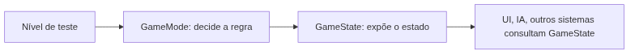
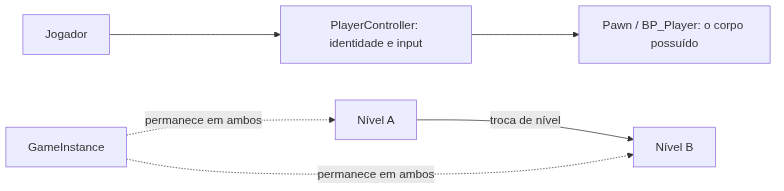

<!-- _class: cover -->

# Semana 4

## GameMode, GameState, PlayerController e GameInstance

**Disciplina:** Tendências de Motores de Jogos (IN46A)
**Instituição:** IFMS — Campus Dourados
**Curso:** Tecnologia em Jogos Digitais
**Módulo 2 — Construir Sistemas**

<!--
### Notas do apresentador
Esta é a primeira semana da Unidade II e a primeira mudança de metodologia da disciplina: de Scaffolded Learning (Módulo 1) para Studio Based Learning. O professor ainda demonstra, mas agora o aluno adapta em vez de apenas replicar — autonomia sobe de "muito baixa" para "baixa". Retomar rapidamente o build da Semana 3: o Vertical Slice já é um protótipo navegável e empacotado. A pergunta de hoje é onde mora a organização por trás desse protótipo.
-->

---

## Objetivos da Semana

- Compreender o Gameplay Framework como conjunto de papéis universais que toda engine precisa resolver
- Diferenciar GameMode (regra da partida) de GameState (estado compartilhado)
- Diferenciar PlayerController (ponte jogador–Pawn) de GameInstance (persistência entre níveis)
- Implementar as quatro classes customizadas no Vertical Slice, com uma variável persistente funcional

<!--
### Notas do apresentador
Resultado esperado ao final da semana: Vertical Slice operando sobre um Gameplay Framework próprio — BP_GameMode, BP_GameState, BP_PlayerController e BP_GameInstance customizados, substituindo as classes padrão da engine — com uma variável definida pelo próprio grupo persistindo entre níveis. O nível de teste e o BP_Player continuam os mesmos desde a Semana 1; muda apenas a camada de organização por trás deles.
-->

---

<!-- _class: timeline -->

## Como a semana está organizada

- **Encontro 1** GameMode (regra da partida) + GameState (estado compartilhado)
- **Encontro 2** PlayerController (ponte jogador–Pawn) + GameInstance (persistência entre níveis) + primeiro desafio de solução aberta

<!--
### Notas do apresentador
Metodologia: Studio Based Learning, autonomia baixa. Diferente do Módulo 1, aqui já existe adaptação guiada em vez de replicação pura, mas o primeiro desafio de liberdade total só aparece no Encontro 2.
-->

---

<!-- _class: chapter -->

## Encontro 1

# GameMode e GameState

01

<!--
### Notas do apresentador
Partir do nível de teste consolidado na Semana 3: material, Landscape, Nanite, Lumen ativos, primeiro build empacotado. Nada disso muda hoje — o que muda é que, pela primeira vez, o projeto passa a ter classes próprias na pasta Framework/.
-->

---

<!-- _class: question -->

# Quem decide as regras de uma partida, e quem guarda o que os outros sistemas precisam saber sobre ela?

Pense em um jogo com vida, pontuação ou condição de vitória: onde esses dados deveriam morar?

<!--
### Notas do apresentador
Deixar a turma discutir por 1-2 minutos. A resposta esperada aponta para dois papéis distintos: quem decide (regra) e o que pode ser consultado (estado) — mesmo em um jogo single-player como o Vertical Slice desta disciplina.
-->

---

## GameMode: regra da partida

- Classe nativa que concentra a lógica autoritativa de uma partida
- Decide como a partida começa, quando termina e as condições de vitória/derrota
- Existe apenas no servidor — mesmo em um projeto single-player, a arquitetura mantém essa separação
- Nenhuma regra de partida deveria estar espalhada dentro do BP_Player

Um lugar único que toda engine estruturada precisa ter, com ou sem múltiplos jogadores.

<!--
### Notas do apresentador
Conceito universal da primeira metade do encontro. Erro comum: achar que GameMode só importa em multiplayer. Reforçar que a Unreal formaliza esse papel como arquitetura nativa desde a criação do projeto, independentemente do modo de jogo final.
Referência: Gameplay Framework in Unreal Engine (dev.epicgames.com/documentation).
-->

---

## GameState: estado compartilhado

- Classe nativa que replica, para todos os clientes, um retrato do estado da partida
- Qualquer sistema — UI, IA, outro jogador — consulta o GameState, nunca o GameMode diretamente
- Critério prático: se o dado precisa ser lido por outros sistemas, é GameState; se é decisão de como a partida se desenrola, é GameMode

GameMode decide; GameState informa.

<!--
### Notas do apresentador
Erro comum: confundir os dois papéis, colocando uma variável de estado dentro do GameMode ou vice-versa. Reforçar o critério de decisão sempre que surgir dúvida durante o laboratório.
Referência: Gameplay Framework in Unreal Engine (dev.epicgames.com/documentation).
-->

---

<!-- _class: diagram -->

## Regra e estado no nível de teste

<!--
### Notas do apresentador
Diagrama conceitual. Reforçar que nenhum sistema deveria consultar o GameMode diretamente para ler estado — o GameState existe exatamente para intermediar essa leitura.
-->

---

<!-- _class: comparison -->

## Regra e estado: Unreal × Unity

### Unreal

GameMode e GameState são classes nativas, com lugar único e nomeado desde a criação do projeto

### Unity

Sem equivalente nativo — o mesmo problema é resolvido por convenção, tipicamente um GameManager singleton (MonoBehaviour com instância estática) ou um ScriptableObject de estado

<!--
### Notas do apresentador
A diferença não é de capacidade, mas de formalização: a Unreal impõe um lugar único desde o primeiro projeto criado; na Unity essa organização depende inteiramente da disciplina da equipe. Não aprofundar mais — a comparação arquitetural ampla é retomada na Unidade V.
-->

---

## Demonstração: BP_GameMode e BP_GameState

O professor cria `BP_GameMode` (Game Mode Base) e `BP_GameState` (Game State Base) na pasta `Framework/`, com uma variável de exemplo em cada um.

**Resultado esperado:** as duas classes vinculadas entre si e atribuídas ao nível de teste via Project Settings > Maps & Modes.

<!--
### Notas do apresentador
Não detalhar o passo a passo aqui — o tutorial faz isso. Demonstrar a ordem: criar BP_GameMode → adicionar variável de regra → criar BP_GameState → adicionar variável de estado → vincular GameState ao GameMode em Class Defaults → atribuir GameMode em Project Settings.
-->

---

> **Imagem sugerida**
>
> Objetivo: mostrar o campo "Game State Class" no painel Class Defaults do BP_GameMode.
> Enquadramento: editor de Blueprint do BP_GameMode, painel Class Defaults visível.
> Elementos presentes: campo "Game State Class" preenchido com BP_GameState; painel Variables ao lado com a variável de regra criada.
> Destaque visual: contorno ao redor do campo "Game State Class".
> Legenda sugerida: "O vínculo entre GameMode e GameState é explícito — nenhum dos dois assume o outro por padrão."

<!--
### Notas do apresentador
Print pode ser tirado do BP_GameMode de exemplo preparado antes da aula, fora da visão da turma.
-->

---

## Arquitetura: Framework no projeto

- `Blueprints/Framework/BP_GameMode` e `BP_GameState` — primeiras classes da subpasta Framework/
- Project Settings > Maps & Modes aponta para `BP_GameMode` como Default GameMode
- Base sobre a qual PlayerController e GameInstance serão anexados no Encontro 2

Um ponto único de verdade sobre qual GameMode está de fato ativo no nível — independentemente do que existe no Content Browser.

<!--
### Notas do apresentador
Reforçar PROJECT_ARCHITECTURE.md, seção 7 e 8: a pasta Framework/ concentra as quatro classes desta semana. Sem a atribuição em Project Settings, o projeto continua usando as classes padrão da engine mesmo com BP_GameMode criado.
-->

---

## Boas práticas

- Nomear a variável de regra pela função, não por "Var1" ou "Bool1"
- Aplicar sempre o critério "isso precisa ser consultado por outros sistemas?" antes de decidir onde uma variável mora
- Revisar Project Settings > Maps & Modes ao final de qualquer alteração no Gameplay Framework

<!--
### Notas do apresentador
O hábito de revisar Project Settings evita o erro mais comum da semana: criar as classes customizadas e esquecer de atribuí-las, mantendo o projeto rodando com as classes padrão sem que o grupo perceba.
-->

---

<!-- _class: exercise -->

# Laboratório do Encontro 1

Criar `BP_GameMode` e `BP_GameState` na pasta `Framework/`, vincular um ao outro e atribuir ao nível de teste do Vertical Slice.

Critério de sucesso: as duas classes customizadas ativas no nível, confirmadas via Print String ou teste em modo Play, com nomenclatura conforme PROJECT_ARCHITECTURE.md.

<!--
### Notas do apresentador
Sem desafio de liberdade neste encontro — demonstração e adaptação guiada, coerente com a transição inicial para Studio Based Learning. Circular pela sala conferindo Project Settings > Maps & Modes de cada grupo antes do fim do encontro.
-->

---

<!-- _class: summary-slide -->

## Fechando o Encontro 1

- GameMode decide a regra da partida; GameState expõe o estado compartilhado
- BP_GameMode e BP_GameState customizados, vinculados e atribuídos ao nível de teste
- Próximo encontro: a ponte com o jogador e a persistência entre níveis

<!--
### Notas do apresentador
Retomar o checklist do tutorial do Encontro 1 antes de encerrar. Reforçar que o nível de teste e o BP_Player continuam idênticos — apenas a camada de organização por trás mudou.
-->

---

<!-- _class: chapter -->

## Encontro 2

# PlayerController e GameInstance

02

<!--
### Notas do apresentador
Retomar o BP_GameMode/BP_GameState do Encontro 1. Faltam dois papéis: a ponte entre o jogador humano e o BP_Player, e um lugar que sobreviva à troca de nível.
-->

---

<!-- _class: question -->

# O que acontece com a maioria dos objetos de um nível quando o jogador troca de mapa?

Pense em progresso, pontuação ou configurações que precisam sobreviver a essa troca.

<!--
### Notas do apresentador
Deixar a turma responder antes de introduzir GameInstance. A resposta esperada aponta para a necessidade de um objeto que não seja destruído na troca de nível — diferente de Pawn, PlayerController, GameMode e GameState, todos recriados a cada nível.
-->

---

## PlayerController: jogador × corpo

- Representa a identidade e o input de alto nível do jogador — não a locomoção
- O Pawn/Character (`BP_Player`) é apenas o corpo que ele possui, e pode trocar ou perder sem deixar de existir
- Input não relacionado a locomoção direta (abrir inventário, pausar) pertence ao PlayerController, não ao Pawn

O mesmo problema que toda engine com possessão de personagem precisa resolver.

<!--
### Notas do apresentador
Conceito universal da primeira metade do encontro. Erro comum: adicionar lógica de locomoção diretamente no PlayerController — locomoção pertence ao Pawn/Character, já resolvido na Semana 2.
Referência: Gameplay Framework in Unreal Engine (dev.epicgames.com/documentation).
-->

---

## GameInstance: o que sobrevive à troca de nível

- Única instância que existe do lançamento ao fechamento do jogo
- Por padrão, Pawn, PlayerController, GameMode e GameState são destruídos a cada troca de nível — o GameInstance não
- Guarda dados que não pertencem a nenhum nível específico: progresso, pontuação, configurações

Pergunte primeiro "isso sobrevive à troca de nível?" — só depois "isso é compartilhado entre sistemas?".

<!--
### Notas do apresentador
A primeira pergunta já elimina GameMode e GameState como candidatos, direcionando corretamente para GameInstance. Erro comum: guardar no GameInstance um dado que só precisa ser compartilhado dentro do nível atual — isso é GameState.
Referência: Gameplay Framework in Unreal Engine (dev.epicgames.com/documentation).
-->

---

<!-- _class: diagram -->

## Jogador, corpo e persistência

<!--
### Notas do apresentador
Diagrama conceitual em duas partes: a separação jogador/corpo (PlayerController/Pawn) e a persistência através da troca de nível (GameInstance). Reforçar que os dois problemas são distintos, embora resolvidos na mesma semana.
-->

---

<!-- _class: comparison -->

## Jogador, corpo e persistência: Unreal × Unity

### Unreal

PlayerController separa nativamente identidade de corpo; GameInstance é uma classe dedicada e única

### Unity

Corpo e controle normalmente no mesmo GameObject; persistência via DontDestroyOnLoad ou ScriptableObject, por convenção do time

<!--
### Notas do apresentador
Nas duas comparações desta semana, a diferença é de formalização, não de capacidade. Não aprofundar mais — a comparação arquitetural ampla é retomada na Unidade V.
-->

---

## Demonstração: BP_PlayerController

O professor cria `BP_PlayerController`, atribui-o ao `BP_GameMode` e confirma, via Print String, que o BP_Player continua controlável normalmente.

**Por que:** provar que a troca de PlayerController não altera locomoção, já resolvida na Semana 2.

<!--
### Notas do apresentador
Não detalhar o passo a passo aqui — o tutorial faz isso. Demonstrar a ordem: criar BP_PlayerController → Print String no BeginPlay → atribuir em Class Defaults do BP_GameMode → testar em Play.
-->

---

## Demonstração: BP_GameInstance e persistência

O professor cria `BP_GameInstance` com uma variável simples, atribui nas Project Settings, cria um segundo nível mínimo e prova a persistência trocando de nível em modo Play.

**Resultado esperado:** o valor da variável não reinicia ao trocar de nível.

<!--
### Notas do apresentador
Reforçar que parar e reiniciar o Play não é o mesmo teste — é preciso usar Open Level (ou equivalente) durante a própria sessão para validar a persistência real, conforme o tutorial detalha.
Referência: Gameplay Framework in Unreal Engine (dev.epicgames.com/documentation).
-->

---

> **Imagem sugerida**
>
> Objetivo: mostrar a troca de nível em modo Play com o valor persistente exibido em tela.
> Enquadramento: duas capturas lado a lado — nível de teste principal e o segundo nível mínimo — cada uma com um Print String do contador do GameInstance.
> Elementos presentes: valor do contador visível nas duas capturas, com o segundo valor maior que o primeiro (prova de continuidade, não de reinício).
> Destaque visual: seta ligando as duas capturas, indicando a troca de nível.
> Legenda sugerida: "O valor não reinicia — o GameInstance sobreviveu à troca de nível."

<!--
### Notas do apresentador
Print pode ser montado a partir do projeto de demonstração preparado antes da aula.
-->

---

## Arquitetura: Framework completo

- `Framework/` agora reúne `BP_GameMode`, `BP_GameState`, `BP_PlayerController` e `BP_GameInstance`
- As quatro classes substituem, no projeto, as classes padrão da engine
- Base pronta para Interfaces e Event Dispatchers da Semana 5

O PlayerController já criado hoje será reaproveitado, sem refatoração, para input de alto nível como interagir e pausar.

<!--
### Notas do apresentador
Reforçar PROJECT_ARCHITECTURE.md, seção 6 e 7: a linha "Framework (Módulo 2)" do roadmap arquitetural fica completa ao final desta semana.
-->

---

## Boas práticas

- Manter o PlayerController enxuto neste estágio — funcionalidades futuras (inventário, pausa) reutilizarão esta mesma classe
- Testar persistência sempre trocando de nível em Play, nunca reiniciando a sessão
- Aplicar o critério "sobrevive à troca de nível?" antes de "é compartilhado entre sistemas?"

<!--
### Notas do apresentador
O hábito de decidir corretamente entre GameState e GameInstance evita retrabalho nas semanas seguintes, quando ambos já estarão povoados de dados reais do Vertical Slice.
-->

---

<!-- _class: exercise -->

# Laboratório do Encontro 2

Criar `BP_PlayerController` e `BP_GameInstance`, atribuir corretamente e implementar uma variável persistente de exemplo, verificada entre dois níveis.

Critério de sucesso: PlayerController ativo sem alterar locomoção; variável do GameInstance demonstravelmente persistente na troca de nível.

<!--
### Notas do apresentador
Verificação sugerida no tutorial: desativar temporariamente o Add Mapping Context não se aplica aqui — a verificação é a troca de nível real via Open Level, não reinício de Play.
-->

---

<!-- _class: exercise -->

# Desafio: um dado próprio e persistente

Cada grupo escolhe e implementa um dado que deve persistir entre níveis — pontuação, item coletado ou estado de progresso — com liberdade total sobre qual dado e como é atualizado.

A persistência via GameInstance precisa ser demonstrável entre o nível de teste e um segundo nível. Sem gabarito único.

<!--
### Notas do apresentador
Primeiro desafio de solução aberta da disciplina, coerente com o início da transição para Studio Based Learning. Fazer um showcase rápido ao final: cada grupo apresenta o dado escolhido e demonstra a persistência.
Avaliação: Rubrica 1 — Desenvolvimento Semanal, critérios Execução e Autonomia. Este desafio antecipa o formato de feedback direto que se torna instrumento formal na Semana 5.
-->

---

<!-- _class: summary-slide -->

## Resumo da Semana 4

- GameMode decide a regra; GameState expõe o estado compartilhado
- PlayerController separa jogador de corpo; GameInstance sobrevive à troca de nível
- Gameplay Framework completo: quatro classes customizadas na pasta Framework/
- Primeiro desafio de solução aberta da disciplina concluído

<!--
### Notas do apresentador
Retomar o checklist dos dois tutoriais antes de encerrar. Reforçar que o nível de teste e o BP_Player permanecem os mesmos desde a Semana 1 — o que mudou nesta semana foi inteiramente estrutural.
-->

---

## Próximos passos

A Semana 5 usa o BP_PlayerController já existente como ponto de entrada de input de alto nível (interagir) e introduz Blueprint Interfaces e Event Dispatchers, para que um objeto interativo do nível comunique sua ativação sem depender diretamente do BP_Player.

**Leitura recomendada:** Gameplay Framework in Unreal Engine (Epic Games Documentation).

<!--
### Notas do apresentador
Antecipar que a distinção entre conceito universal e implementação específica, já exercitada em Enhanced Input, Nanite/Lumen e agora no Gameplay Framework, será retomada ao comparar Blueprint Interfaces com Interfaces em C# na Unity.
-->
