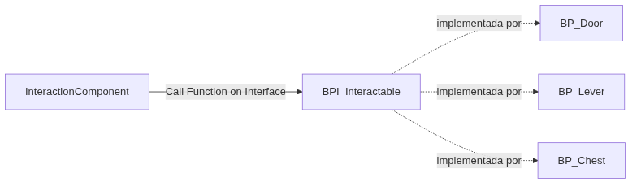
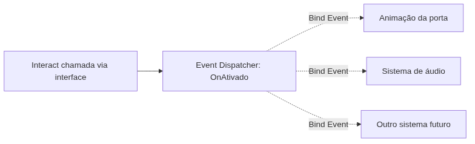

<!-- _class: cover -->

# Semana 5

## Blueprint Interfaces e Event Dispatchers

**Disciplina:** Tendências de Motores de Jogos (IN46A)
**Instituição:** IFMS — Campus Dourados
**Curso:** Tecnologia em Jogos Digitais
**Módulo 2 — Construir Sistemas**

<!--
### Notas do apresentador
O Gameplay Framework da Semana 4 (BP_GameMode, BP_GameState, BP_PlayerController, BP_GameInstance) está completo e intacto. Esta semana inaugura a linha "Interactables" do roadmap (PROJECT_ARCHITECTURE.md, seção 6): o Vertical Slice passa a acumular objetos do mundo com os quais o jogador interage. Metodologia permanece Studio Based Learning, autonomia baixa, mas em ritmo crescente — a Semana 4 já trouxe o primeiro desafio de solução aberta, e esta semana amplia esse formato com o primeiro Feedback Formal da disciplina.
-->

---

## Objetivos da Semana

- Compreender a comunicação desacoplada entre sistemas como problema universal de arquitetura
- Diferenciar Blueprint Interface (contrato) de Event Dispatcher (notificação de evento)
- Implementar `BPI_Interactable` e conectá-la ao `InteractionComponent` de `BP_Player`
- Implementar um Event Dispatcher acionado por interação, aplicado a um objeto interativo concreto

<!--
### Notas do apresentador
Resultado esperado ao final da semana: cada grupo com um objeto interativo funcional no Vertical Slice — implementando BPI_Interactable e reagindo via Event Dispatcher a uma ação do jogador — com mecanismo de acionamento (alavanca, chave, proximidade ou outro) definido pelo próprio grupo.
-->

---

<!-- _class: timeline -->

## Como a semana está organizada

- **Encontro 1** Blueprint Interface `BPI_Interactable` como contrato de comunicação
- **Encontro 2** Event Dispatcher, objeto interativo concreto e primeiro Feedback Formal da disciplina

<!--
### Notas do apresentador
Metodologia: Studio Based Learning, autonomia baixa. O Encontro 1 é demonstração e adaptação guiada — não há desafio de liberdade ainda. O desafio de solução aberta (mecanismo de acionamento) e o Feedback Formal só aparecem no Encontro 2.
-->

---

<!-- _class: chapter -->

## Encontro 1

# Blueprint Interface: BPI_Interactable

01

<!--
### Notas do apresentador
Partir do InteractionComponent já previsto na arquitetura (PROJECT_ARCHITECTURE.md, seção 7). Ele existe desde a concepção do projeto, mas ainda não tem com quem "conversar" de forma genérica — é isso que a interface resolve hoje.
-->

---

<!-- _class: question -->

# Como o InteractionComponent do jogador pode "chamar" uma porta, uma alavanca e um baú sem conhecer nenhum dos três?

Pense no que aconteceria se cada objeto exigisse um bloco de decisão próprio no Player.

<!--
### Notas do apresentador
Deixar a turma discutir por 1-2 minutos. A resposta esperada aponta para um contrato comum: o chamador só precisa saber que o alvo "responde a uma chamada esperada", nunca como. Essa é a definição de desacoplamento por contrato.
-->

---

## Desacoplamento por contrato

- Sistema chamador (InteractionComponent) precisa agir sobre sistemas diferentes sem conhecer a implementação de cada um
- A engine garante apenas que o alvo "responde a uma chamada esperada" — nunca como
- Sem esse contrato, o InteractionComponent precisaria de um bloco de decisão por tipo de objeto, crescendo a cada novo interativo

Problema universal: todo sistema de comunicação entre objetos independentes precisa de um contrato, não de conhecimento mútuo.

<!--
### Notas do apresentador
Conceito universal do encontro. Antes de qualquer implementação na Unreal, garantir que a turma entende o problema em abstrato: comunicação sem dependência direta de classe.
-->

---

## Blueprint Interface: o contrato da Unreal

- Interface declara funções sem implementação — nenhuma lógica dentro dela
- Qualquer Actor pode implementá-la, sendo chamado de forma genérica por quem só conhece o contrato
- `Call Function on Interface` chama a função sem exigir conversão para a classe concreta
- Interface nunca é instanciável por si só

A interface nunca carrega estado nem lógica — apenas declara o que deve existir. A lógica pertence inteiramente a quem implementa.

<!--
### Notas do apresentador
Erro comum antecipado: tentar colocar lógica dentro da própria interface. Reforçar que se o Event Graph pedir lógica, o Blueprint criado é uma classe comum, não uma interface — revisar o tipo escolhido na criação.
Referência: Blueprints Visual Scripting in Unreal Engine (dev.epicgames.com/documentation).
-->

---

<!-- _class: diagram -->

## Contrato × implementação concreta

<!--
### Notas do apresentador
Diagrama conceitual. Reforçar que o InteractionComponent nunca conhece BP_Door, BP_Lever ou BP_Chest diretamente — apenas o contrato BPI_Interactable. Esse é o mesmo diagrama que aparece na seção 7 do PROJECT_ARCHITECTURE.md, com a linha tracejada representando comunicação via interface.
-->

---

<!-- _class: comparison -->

## Contrato de comunicação: Unreal × Unity

### Unreal

Blueprint Interfaces funcionam nativamente em visual scripting; `Call Function on Interface` chama sem referência de classe concreta

### Unity

Interfaces em C# resolvem o mesmo problema; tipicamente exige `GetComponent<IInteragivel>()` para obter a referência tipada, em código

<!--
### Notas do apresentador
O princípio — definir o que um objeto deve responder, não como — é idêntico nas duas engines. A diferença é de camada de execução: visual scripting nativo na Unreal versus C# na Unity. Não aprofundar mais — a comparação arquitetural ampla é retomada na Unidade V.
-->

---

## Demonstração: criando BPI_Interactable

O professor cria a Blueprint Interface `BPI_Interactable` em `Interactables/`, com uma função `Interact` sem corpo de execução, e a implementa em um Actor de demonstração.

**Resultado esperado:** o InteractionComponent chama `Interact` via "Call Function on Interface" sobre o Actor de demonstração, sem conhecer sua classe concreta.

<!--
### Notas do apresentador
Não detalhar o passo a passo aqui — o tutorial faz isso. Demonstrar a ordem: criar BPI_Interactable em Interactables/ → função Interact sem corpo → implementar em um Actor via Class Settings > Implemented Interfaces → reação simples (Print String ou cor) → Call Function on Interface a partir do InteractionComponent.
-->

---

> **Imagem sugerida**
>
> Objetivo: mostrar o painel Class Settings de um Actor com `BPI_Interactable` adicionada em Implemented Interfaces.
> Enquadramento: editor de Blueprint do Actor de demonstração, painel Class Settings visível com a lista de interfaces implementadas.
> Elementos presentes: `BPI_Interactable` destacada na lista; aba Functions ao lado mostrando `Interact` disponível sob a seção Interfaces.
> Destaque visual: contorno ao redor da interface na lista de Implemented Interfaces.
> Legenda sugerida: "Implementar uma interface não copia comportamento — apenas garante que a função exigida pode ser chamada."

<!--
### Notas do apresentador
Print pode ser montado a partir do Actor de demonstração preparado antes da aula, fora da visão da turma.
-->

---

## Arquitetura: onde a interface mora

- `Blueprints/Interactables/BPI_Interactable` — primeira classe da subpasta Interactables/
- Convenção de nomenclatura `BPI_` conforme PROJECT_ARCHITECTURE.md, seção 9
- Base para `BP_Door`, `BP_Lever`, `BP_Chest`, `BP_Pickup` e `BP_Checkpoint` nas próximas semanas

Toda interação futura do Vertical Slice — porta, baú, alavanca, checkpoint — reutiliza este mesmo contrato, sem refatoração.

<!--
### Notas do apresentador
Reforçar PROJECT_ARCHITECTURE.md, seção 6 e 8: BPI_Interactable é dependência direta de todos os Actors interativos futuros do roadmap.
-->

---

## Boas práticas

- Manter a interface com o menor número possível de funções — apenas o que precisa ser chamado de forma genérica
- Nunca duplicar lógica dentro da interface; a lógica pertence ao Actor que implementa
- Preferir "Call Function on Interface" a qualquer chamada direta pela referência de classe concreta

<!--
### Notas do apresentador
Funções auxiliares específicas de um Actor pertencem ao próprio Actor, não à interface — reforçar esse critério se algum grupo tentar adicionar funções extras a BPI_Interactable.
-->

---

<!-- _class: exercise -->

# Laboratório do Encontro 1

Criar `BPI_Interactable` em `Interactables/` e implementá-la em ao menos um Actor do nível de teste, com o InteractionComponent chamando `Interact` via interface.

Critério de sucesso: Actor implementando `BPI_Interactable` reagindo de forma simples e visível (Print String ou cor) quando chamado pelo InteractionComponent, com nomenclatura conforme PROJECT_ARCHITECTURE.md.

<!--
### Notas do apresentador
Sem desafio de liberdade neste encontro — demonstração e adaptação guiada, preparando a base técnica para o Encontro 2. Grupos sem Actor candidato no próprio nível devem receber sugestão direta do professor para não atrasar o Encontro 2.
-->

---

<!-- _class: summary-slide -->

## Fechando o Encontro 1

- Blueprint Interface é contrato de comunicação sem conhecimento de classe concreta
- `BPI_Interactable` criada e implementada em ao menos um Actor do nível de teste
- Próximo encontro: como o objeto ativado avisa sua própria reação, sem conhecer quem escuta

<!--
### Notas do apresentador
Retomar o checklist do tutorial do Encontro 1 antes de encerrar. Reforçar que a interface apenas garante a chamada — a reação definitiva via Event Dispatcher ainda não existe.
-->

---

<!-- _class: chapter -->

## Encontro 2

# Event Dispatcher e o objeto interativo

02

<!--
### Notas do apresentador
Retomar a BPI_Interactable do Encontro 1, já implementada em um Actor de teste. Falta o problema complementar: como esse Actor avisa sua própria reação a quem quiser ouvir, sem uma lista fixa de interessados.
-->

---

<!-- _class: question -->

# Se uma porta precisar avisar sua animação, um sistema de áudio e uma missão ao mesmo tempo, ela deveria conhecer os três?

Pense em como um objeto notifica vários sistemas sem manter uma lista fixa de quem reagir.

<!--
### Notas do apresentador
Deixar a turma responder antes de introduzir Event Dispatcher. A resposta esperada aponta para notificação sem lista fixa de destinatários — o objeto declara "aconteceu algo", e quem quiser reage, sem que o emissor precise saber quantos ou quais sistemas estão ouvindo.
-->

---

## Event Dispatcher: o padrão observer

- Resolve o problema inverso da interface: quem precisa ser avisado quando algo acontece, sem que o emissor conheça os interessados
- Um objeto declara um evento (ex.: "fui ativado"); qualquer sistema pode se inscrever para reagir
- `Bind Event to` inscreve uma reação; o disparo ocorre dentro da função de interface já garantida pelo contrato

Interface resolve "quem pode ser chamado sem conhecer a classe"; Event Dispatcher resolve "quem precisa ser avisado sem que o emissor conheça os inscritos".

<!--
### Notas do apresentador
Conceito universal complementar ao do Encontro 1. Erro comum: confundir Event Dispatcher com uma função comum — Dispatchers não retornam valor e podem ter múltiplos inscritos.
Referência: Blueprints Visual Scripting in Unreal Engine (dev.epicgames.com/documentation).
-->

---

<!-- _class: diagram -->

## Emissor e inscritos

<!--
### Notas do apresentador
Diagrama conceitual. Reforçar que o emissor (o Actor interativo) nunca precisa conhecer quantos ou quais sistemas estão inscritos — apenas dispara o Dispatcher dentro da função Interact.
-->

---

<!-- _class: comparison -->

## Notificação de eventos: Unreal × Unity

### Unreal

Event Dispatchers configuráveis visualmente no Blueprint Editor, conectados via `Bind Event to` sem escrever código

### Unity

UnityEvent (via Inspector ou código) e C# Actions (`Action`, `Action<T>`); inscrição via `AddListener` ou `+=`

<!--
### Notas do apresentador
O princípio — observer, inversão de controle da notificação — é o mesmo nas duas engines. A diferença é de camada de configuração: visual na Unreal, majoritariamente por código na Unity. Não aprofundar mais — a comparação ampla é retomada na Unidade V.
-->

---

## Demonstração: Event Dispatcher acionado pela interface

O professor cria um Event Dispatcher no Actor de demonstração, dispara-o dentro da função `Interact` e conecta (`Bind Event to`) uma reação simples, sem que o Actor conheça quem reage.

**Resultado esperado:** o Actor dispara a notificação; a reação ocorre por inscrição, nunca por chamada direta.

<!--
### Notas do apresentador
Não detalhar o passo a passo aqui — o tutorial faz isso. Demonstrar a ordem: criar Event Dispatcher com nome descritivo → Call do Dispatcher dentro de Interact → Bind Event to conectando uma reação simples → testar em Play.
Referência: Blueprints Visual Scripting in Unreal Engine (dev.epicgames.com/documentation).
-->

---

> **Imagem sugerida**
>
> Objetivo: mostrar o Event Graph do Actor de demonstração com o Event Dispatcher disparado dentro de Interact e a reação conectada via Bind Event.
> Enquadramento: Event Graph completo do Actor, com os dois blocos (disparo e inscrição) visíveis lado a lado.
> Elementos presentes: nó "Call OnAtivado" dentro da função Interact; nó "Bind Event to OnAtivado" conectado a uma reação simples (mudança de cor ou movimento).
> Destaque visual: seta ligando o disparo à inscrição, reforçando que são dois pontos distintos do grafo.
> Legenda sugerida: "O Actor dispara a notificação; a reação pertence a quem se inscreve, não a quem dispara."

<!--
### Notas do apresentador
Print pode ser montado a partir do Actor de demonstração preparado antes da aula.
-->

---

## Arquitetura: Interactables consolidado

- `BPI_Interactable` e os Event Dispatchers de interação tornam-se a base de comunicação reutilizada por todo objeto interativo futuro
- `BP_Door`, `BP_Lever`, `BP_Chest`, `BP_Pickup` e `BP_Checkpoint` (próximas semanas) reutilizam a mesma estrutura, sem refatoração
- Mecanismo de acionamento é decisão de design do grupo; a estrutura de comunicação é fixa

A mesma dupla Interface + Event Dispatcher construída hoje será reaproveitada para baús, checkpoints e pickups, sem retrabalho.

<!--
### Notas do apresentador
Reforçar PROJECT_ARCHITECTURE.md, seção 6 e 7: início da linha "Interactables" do roadmap arquitetural.
-->

---

## Boas práticas

- Nomear o Event Dispatcher de forma descritiva (`OnAtivado`, `OnPortaAberta`), nunca genérica (`Event1`)
- Disparar o Dispatcher sempre dentro da função que a interface já garante ser chamada de forma desacoplada
- Remover nós de teste temporários (Print String) antes da apresentação do Feedback Formal

<!--
### Notas do apresentador
Erro comum antecipado: chamar a reação diretamente da função Interact, sem passar pelo Dispatcher — pergunta-chave para intervir: "e se outro sistema também precisasse reagir a essa ativação?".
-->

---

<!-- _class: exercise -->

# Desafio: objeto interativo com mecanismo próprio

Cada grupo implementa um objeto interativo (porta ou equivalente) combinando `BPI_Interactable` + Event Dispatcher, com liberdade total sobre o mecanismo de acionamento — alavanca, chave, proximidade ou solução própria.

O objeto deve reagir de forma demonstrável a uma ação do jogador via InteractionComponent. Sem gabarito único para o mecanismo de acionamento.

<!--
### Notas do apresentador
Se o mecanismo envolver um segundo Actor (ex.: alavanca separada que abre uma porta), garantir que ele também implemente BPI_Interactable, mantendo a mesma estrutura de comunicação em todo o sistema.
Avaliação: Rubrica 1 — Desenvolvimento Semanal, critérios Execução e Preparação, registrada no Feedback Formal desta semana.
-->

---

<!-- _class: exercise -->

# Feedback Formal

Cada grupo apresenta seu mecanismo de acionamento e recebe o primeiro Feedback Formal registrado da disciplina.

Critério de avaliação: funcionamento demonstrável do objeto interativo, clareza da justificativa do mecanismo escolhido e organização/nomenclatura conforme PROJECT_ARCHITECTURE.md.

<!--
### Notas do apresentador
Primeiro instrumento avaliativo formal desse tipo na disciplina, conforme Sistema de Avaliação. Grupos que não concluírem o mecanismo a tempo registram a interface e o Dispatcher criados como pendência, sem bloquear o Feedback Formal — que pode avaliar o raciocínio mesmo com a solução incompleta.
-->

---

<!-- _class: summary-slide -->

## Resumo da Semana 5

- Blueprint Interface é contrato; Event Dispatcher é notificação — peças complementares, não substituíveis
- Objeto interativo funcional integrado ao Vertical Slice, com mecanismo de acionamento definido pelo grupo
- Primeiro Feedback Formal da disciplina concluído
- Base de comunicação pronta para todo interativo futuro (baús, checkpoints, pickups)

<!--
### Notas do apresentador
Retomar o checklist dos dois tutoriais antes de encerrar. Reforçar que o Gameplay Framework da Semana 4 permanece intacto — a novidade desta semana é a primeira forma de comunicação desacoplada entre sistemas do Vertical Slice.
-->

---

## Próximos passos

A Semana 6 reutiliza o mesmo par Interface + Event Dispatcher para modelar itens coletáveis (baús, moedas, recursos) via Data Assets, Data Tables, Structs e Enums, separando dados de design da lógica de gameplay.

**Leitura recomendada:** Blueprints Visual Scripting in Unreal Engine (Epic Games Documentation).

<!--
### Notas do apresentador
Antecipar a comparação entre Data Table/Data Asset e ScriptableObject na Unity, retomando a mesma distinção entre conceito universal e implementação específica já exercitada nas Semanas 1–5.
-->
