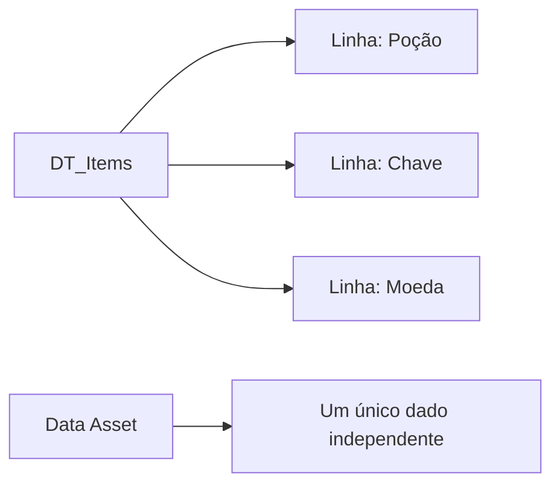
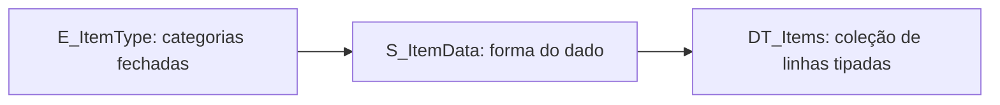

<!-- _class: cover -->

# Semana 6

## Data Tables, Data Assets, Structs e Enums

**Disciplina:** Tendências de Motores de Jogos (IN46A)
**Instituição:** IFMS — Campus Dourados
**Curso:** Tecnologia em Jogos Digitais
**Módulo 2 — Construir Sistemas**

<!--
### Notas do apresentador
Esta semana encerra a fundamentação teórica da Unidade II, retomando o objeto interativo funcional (BPI_Interactable + Event Dispatcher) construído na Semana 5. Até aqui, todo comportamento do Vertical Slice foi definido por lógica dentro de Blueprints. Hoje o problema é inverso: onde mora a informação de design, sem que ela fique presa dentro da lógica de um Actor específico. Fecha com o Checkpoint de progresso do Módulo 2, primeiro checkpoint desde a Semana 3.
-->

---

## Objetivos da Semana

- Compreender a separação entre dados de design e lógica de gameplay como problema universal de arquitetura
- Diferenciar Data Table (coleção tabular) de Data Asset (instância independente)
- Criar `DT_Items` tipada por `S_ItemData` e `E_ItemType`, conforme PROJECT_ARCHITECTURE.md
- Aplicar `DT_Items` a um Actor de coleta que reutiliza `BPI_Interactable` e o Event Dispatcher da Semana 5

<!--
### Notas do apresentador
Resultado esperado ao final da semana: cada grupo com DT_Items funcional, estruturada por S_ItemData e E_ItemType, populada com seu próprio conjunto de itens coletáveis, e um Actor de coleta no Vertical Slice que lê essa tabela ao ser interagido — reutilizando integralmente o par Interface + Event Dispatcher da Semana 5.
-->

---

<!-- _class: timeline -->

## Como a semana está organizada

- **Encontro 1** Data Table e Data Asset — criação de `DT_Items`
- **Encontro 2** Struct e Enum — tipagem de `DT_Items` + Actor de coleta + Checkpoint do Módulo 2

<!--
### Notas do apresentador
Metodologia: Studio Based Learning, autonomia baixa, mas o desafio de final de semana já exige que cada grupo modele seu próprio conjunto de itens coletáveis. O Encontro 1 é compressível em até 20 minutos caso necessário, já que o conteúdo é retomado e aprofundado no Encontro 2.
-->

---

<!-- _class: chapter -->

## Encontro 1

# Data Table e Data Asset

01

<!--
### Notas do apresentador
Partir do objeto interativo da Semana 5, funcional mas sem nenhuma informação estruturada sobre o que está sendo coletado ou ativado. Hoje começa a linha "DT_Items" do roadmap (PROJECT_ARCHITECTURE.md, seção 6).
-->

---

<!-- _class: question -->

# Se o mesmo item aparecer em três baús diferentes do nível, quantos lugares você precisaria editar para mudar seu nome?

Pense em onde essa informação deveria morar.

<!--
### Notas do apresentador
Deixar a turma responder antes de introduzir Data Table. Resposta esperada: se a informação estiver hardcoded em cada Actor, seriam três lugares — sinal de que o dado pertence a uma fonte central, não ao Actor.
-->

---

## Data Table: coleção tabular de dados

- Estrutura tabular, editável como planilha, onde cada linha é uma instância de dado
- Ferramenta correta quando existem várias instâncias com os mesmos atributos
- `DT_Items` centraliza nome, descrição e ícone de cada item do Vertical Slice
- Existe de forma independente de qualquer Actor específico

Toda engine madura precisa de uma camada de dados que exista fora da lógica que a consome.

<!--
### Notas do apresentador
Conceito universal da primeira metade do encontro. Reforçar que, até a Semana 5, cada Actor interativo carregava sua própria lógica de reação — adequado para comportamento, problemático para dado.
Referência: Gameplay Framework in Unreal Engine (dev.epicgames.com/documentation).
-->

---

## Data Asset: instância independente

- Asset independente que representa um único dado, mais complexo ou não tabular por natureza
- Usado quando a informação não se organiza bem em linhas e colunas
- Nesta aula o foco é a Data Table, por ser a ferramenta correta para uma coleção homogênea de itens

Data Table e Data Asset resolvem o mesmo problema — dado fora do Actor — por caminhos diferentes.

<!--
### Notas do apresentador
Não aprofundar Data Asset nesta semana; o objetivo é que a turma saiba diferenciar quando usar cada um, não implementar os dois. Data Asset pode ser retomado em módulos futuros se um dado único e complexo aparecer.
-->

---

<!-- _class: diagram -->

## Data Table × Data Asset

<!--
### Notas do apresentador
Diagrama conceitual. Reforçar que a Data Table concentra várias instâncias homogêneas em um único asset, enquanto o Data Asset representa uma instância única e independente.
-->

---

<!-- _class: comparison -->

## Dado desacoplado da lógica: Unreal × Unity

### Unreal

Data Table já nasce orientada a coleção — uma única planilha com uma linha por item

### Unity

ScriptableObject é um asset independente por instância; uma coleção exige organizar manualmente uma lista ou array desses assets

<!--
### Notas do apresentador
O princípio — dado como asset, não como variável hardcoded em um Blueprint — é o mesmo nas duas engines. A diferença está em qual caminho é mais direto para dados homogêneos em grande quantidade (Data Table) versus um dado único e complexo com lógica própria (ScriptableObject). Não aprofundar mais — a comparação ampla é retomada na Unidade V.
-->

---

## Demonstração: criando DT_Items

O professor cria `DT_Items` na subpasta `Data/DataTables/`, ainda com o tipo de linha padrão do editor, populando duas ou três linhas de exemplo.

**Resultado esperado:** tabela existindo de forma independente de qualquer Actor, pronta para receber tipagem no Encontro 2.

<!--
### Notas do apresentador
Não detalhar o passo a passo aqui — o tutorial faz isso. Demonstrar a ordem: Content Browser → Data/DataTables/ → Miscellaneous > Data Table → estrutura padrão → nomear DT_Items → preencher linhas de exemplo → salvar.
-->

---

> **Imagem sugerida**
>
> Objetivo: mostrar a diferença conceitual entre Data Table e Data Asset.
> Enquadramento: diagrama lado a lado, dois blocos.
> Elementos presentes: à esquerda, uma planilha estilizada com várias linhas rotuladas "Item 1", "Item 2", "Item 3"; à direita, um único ícone de asset isolado.
> Destaque visual: a Data Table concentra várias instâncias homogêneas; o Data Asset representa uma instância única.
> Legenda sugerida: "Data Table: coleção tabular de itens homogêneos — Data Asset: instância única e independente."

<!--
### Notas do apresentador
Print pode ser montado a partir do DT_Items de exemplo preparado antes da aula, fora da visão da turma.
-->

---

## Arquitetura: onde o dado mora

- `Data/DataTables/DT_Items` — nova subpasta temática do projeto
- `BPI_Interactable` e Event Dispatcher da Semana 5 permanecem intactos
- Base para a tipagem via Struct/Enum e para o Actor de coleta do Encontro 2

Nenhum sistema futuro — como o Inventário da Semana 10 — poderia consultar dados que não existem em um lugar central.

<!--
### Notas do apresentador
Reforçar PROJECT_ARCHITECTURE.md, seção 6: a linha "DT_Items (Data Table + Struct + Enum)" do roadmap começa nesta subpasta.
-->

---

## Boas práticas

- Tratar `DT_Items` como única fonte de verdade sobre os itens do Vertical Slice
- Nunca duplicar nome, descrição ou ícone em variáveis dentro de um Actor
- Renomear sempre o asset para `DT_Items`, nunca manter o nome padrão do editor

<!--
### Notas do apresentador
O hábito de centralizar o dado evita retrabalho quando o mesmo item precisar aparecer em múltiplos Actors nas semanas seguintes.
-->

---

<!-- _class: exercise -->

# Laboratório do Encontro 1

Criar `DT_Items` na subpasta `Data/DataTables/`, com nomenclatura conforme PROJECT_ARCHITECTURE.md e ao menos uma linha de exemplo preenchida.

Critério de sucesso: `DT_Items` existente, organizada e com ao menos uma linha preenchida, pronta para tipagem no Encontro 2.

<!--
### Notas do apresentador
Sem desafio de liberdade neste encontro — demonstração e adaptação guiada. Grupos com dificuldade para definir as colunas iniciais devem receber sugestão direta do professor (nome, descrição, ícone).
-->

---

<!-- _class: summary-slide -->

## Fechando o Encontro 1

- Data Table centraliza uma coleção de dados homogêneos; Data Asset representa uma instância independente
- `DT_Items` criada na subpasta `Data/DataTables/`, ainda sem tipagem forte
- Próximo encontro: dar forma e categoria a cada linha da tabela

<!--
### Notas do apresentador
Retomar o checklist do tutorial do Encontro 1 antes de encerrar. Reforçar que a tabela existe, mas qualquer campo ainda pode receber qualquer valor — isso é resolvido no Encontro 2.
-->

---

<!-- _class: chapter -->

## Encontro 2

# Struct, Enum e o Actor de coleta

02

<!--
### Notas do apresentador
Retomar DT_Items do Encontro 1. Falta garantir que cada linha tenha uma forma confiável, e conectar a tabela a um Actor concreto do Vertical Slice.
-->

---

<!-- _class: question -->

# Se outro colega do grupo digitar a categoria de um item de forma ligeiramente diferente na próxima linha, o sistema perceberia isso como erro?

Pense no que acontece quando um campo de categoria é apenas texto livre.

<!--
### Notas do apresentador
Deixar a turma responder antes de introduzir Enum. Resposta esperada: não, texto livre não impede erro de digitação — é exatamente esse problema que o Enum resolve.
-->

---

## Struct: a forma do dado

- Agrupa campos relacionados sob um único tipo nomeado
- `S_ItemData` reúne nome, descrição, ícone e valor em uma estrutura
- Torna `DT_Items` fortemente tipada: toda linha passa a ter exatamente os mesmos campos, na mesma forma

Se a Data Table resolve "onde o dado mora", o Struct resolve "que forma esse dado deve ter".

<!--
### Notas do apresentador
Conceito universal da primeira metade do encontro. Reforçar que, sem tipagem, cada linha poderia receber qualquer valor em qualquer campo.
Referência: Gameplay Framework in Unreal Engine (dev.epicgames.com/documentation).
-->

---

## Enum: categorias fechadas

- Restringe um campo a um conjunto fechado e nomeado de opções
- `E_ItemType` define categorias como Consumível, Chave ou Recurso
- Elimina ambiguidade e permite que sistemas futuros — como o Inventário — decidam com base na categoria, não em texto livre

Nenhum campo de opções fechadas deveria ser texto livre.

<!--
### Notas do apresentador
Erro comum: criar um campo de texto livre para categoria em vez de usar Enum, reproduzindo o mesmo problema que o Enum resolve.
Referência: Gameplay Framework in Unreal Engine (dev.epicgames.com/documentation).
-->

---

<!-- _class: diagram -->

## Struct, Enum e Data Table juntos

<!--
### Notas do apresentador
Diagrama conceitual. Reforçar que o Enum é usado dentro do Struct, e o Struct passa a ser a Row Structure da Data Table — os três conceitos se encaixam em camadas.
-->

---

<!-- _class: comparison -->

## Tipagem de dado: Unreal × Unity

### Unreal

Struct definido em Blueprint gera colunas automaticamente na Data Table, editável nativamente no Data Table Editor

### Unity

Classe serializável (`[System.Serializable] class`) e `enum` de C# resolvem o mesmo problema, com exibição no Inspector dependendo de como o campo é declarado

<!--
### Notas do apresentador
O princípio — tipagem forte de dados de design — é o mesmo nas duas engines. A diferença está na integração com a ferramenta de edição. Não aprofundar mais — a comparação ampla é retomada na Unidade V.
-->

---

## Demonstração: S_ItemData e E_ItemType

O professor cria `S_ItemData` (nome, descrição, ícone, valor, tipo) e `E_ItemType` (Consumível, Chave, Recurso), aplica o Struct como Row Structure de `DT_Items` e repopula a tabela.

**Resultado esperado:** `DT_Items` com um menu suspenso de categorias em vez de texto livre.

<!--
### Notas do apresentador
Não detalhar o passo a passo aqui — o tutorial faz isso. Demonstrar a ordem: criar E_ItemType → criar S_ItemData com campo Tipo do tipo E_ItemType → trocar Row Structure de DT_Items → repopular linhas.
-->

---

## Demonstração: conectando ao Actor de coleta

O professor conecta `DT_Items` tipada a um Actor que já implementa `BPI_Interactable`: ao interagir, o Actor consulta a tabela via **Get Data Table Row** e dispara o Event Dispatcher da Semana 5 com os dados obtidos.

**Por que:** provar que o Actor de coleta não guarda dado — apenas um identificador de linha.

<!--
### Notas do apresentador
Não detalhar o passo a passo aqui — o tutorial faz isso. Reforçar que a consulta precisa ocorrer antes do disparo do Event Dispatcher, para que os dados estejam disponíveis aos inscritos no momento da notificação.
-->

---

> **Imagem sugerida**
>
> Objetivo: mostrar o fluxo completo de consulta de dado no momento da interação.
> Enquadramento: diagrama de fluxo horizontal, três blocos conectados por setas.
> Elementos presentes: bloco 1 — "Jogador interage" (ícone de Actor de coleta); bloco 2 — "Get Data Table Row com ItemRowName" (ícone de tabela); bloco 3 — "Event Dispatcher dispara com dados de S_ItemData" (ícone de sino).
> Destaque visual: a seta entre bloco 1 e bloco 2 representa `BPI_Interactable`; a seta entre bloco 2 e bloco 3 representa a consulta tipada retornando `S_ItemData`.
> Legenda sugerida: "Do clique do jogador ao dado tipado: interação, consulta e notificação em três passos."

<!--
### Notas do apresentador
Print pode ser montado a partir do BP_Chest/BP_Pickup de exemplo preparado antes da aula.
-->

---

## Arquitetura: roadmap atualizado

- `Data/Structs_Enums/S_ItemData` e `E_ItemType` — novas classes centralizadas
- `Blueprints/Interactables/BP_Chest` ou `BP_Pickup` reutiliza `BPI_Interactable` e o Event Dispatcher da Semana 5
- Linha "DT_Items (Data Table + Struct + Enum)" do roadmap encerrada; "BP_Chest, BP_Pickup" iniciada

O Actor de coleta guarda apenas um identificador de linha — nunca os dados do item em si.

<!--
### Notas do apresentador
Reforçar PROJECT_ARCHITECTURE.md, seção 6: este é o ponto em que dado de design (Data Table/Struct/Enum) e lógica de gameplay (Interface/Event Dispatcher) se encontram pela primeira vez no Vertical Slice.
-->

---

## Boas práticas

- Manter `S_ItemData` apenas com campos que qualquer item tem em comum — exceções específicas pertencem a módulos futuros
- Structs e Enums usados por mais de um sistema ficam em `Data/Structs_Enums/`, nunca duplicados dentro de um Actor
- O Actor de coleta permanece enxuto: sua única responsabilidade é consultar e notificar, nunca reagir

<!--
### Notas do apresentador
O mesmo princípio de responsabilidade única já aplicado na Semana 5 se repete aqui: a reação mais elaborada pertence a quem se inscreve no Event Dispatcher, não ao Actor de coleta.
-->

---

<!-- _class: exercise -->

# Laboratório do Encontro 2

Criar `S_ItemData` e `E_ItemType`, aplicar como Row Structure de `DT_Items` e conectar a tabela a um Actor de coleta que reutiliza `BPI_Interactable` e o Event Dispatcher da Semana 5.

Critério de sucesso: `DT_Items` tipada, consulta funcionando na interação, Event Dispatcher disparado com os dados obtidos.

<!--
### Notas do apresentador
Verificação sugerida no tutorial: Print String temporário no resultado de Get Data Table Row, removido antes da apresentação do Checkpoint.
-->

---

<!-- _class: exercise -->

# Desafio: seu próprio conjunto de itens

Cada grupo modela seu conjunto de itens coletáveis (baús, moedas, recursos ou categoria própria), com liberdade sobre categorias e atributos, desde que o Actor de coleta reutilize `BPI_Interactable` e o Event Dispatcher da Semana 5.

Sem gabarito único de categorias ou atributos — a única exigência é a reutilização do par Interface + Event Dispatcher.

<!--
### Notas do apresentador
Fazer um showcase rápido ao final: cada grupo apresenta seu conjunto de itens e demonstra a consulta funcionando. Avaliação: Checkpoint de progresso do Módulo 2, Rubrica 3, critérios Funcionalidades implementadas e Estabilidade.
-->

---

<!-- _class: summary-slide -->

## Resumo da Semana 6

- Data Table centraliza dado; Struct dá forma; Enum fecha categorias — três peças complementares
- `DT_Items` tipada e populada, conectada a um Actor de coleta funcional no Vertical Slice
- Dado de design e lógica de gameplay (Interface + Event Dispatcher) integrados pela primeira vez
- Checkpoint de progresso do Módulo 2 concluído

<!--
### Notas do apresentador
Retomar o checklist dos dois tutoriais antes de encerrar. Reforçar que BPI_Interactable e o Event Dispatcher da Semana 5 permanecem intactos — a novidade desta semana é a camada de dado que os alimenta.
-->

---

## Próximos passos

A Semana 7 integra, em um único fluxo jogável, todos os sistemas construídos desde a Semana 4 (GameMode, GameState, PlayerController, GameInstance, Interfaces, Event Dispatchers, Data Tables, Structs, Enums), encerrando a Unidade II com Code Review e Playtest coletivo. O SaveGame Object da Semana 7 precisará serializar o progresso construído até aqui.

**Leitura recomendada:** Gameplay Framework in Unreal Engine (Epic Games Documentation).

<!--
### Notas do apresentador
Antecipar que a distinção entre conceito universal e implementação específica, já exercitada nas Semanas 1–6, será retomada ao comparar SaveGame com PlayerPrefs/serialização própria na Unity.
-->
