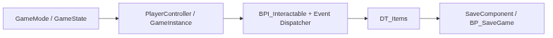
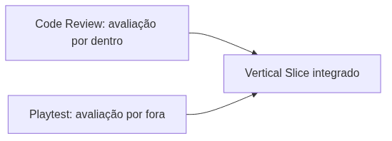

<!-- _class: cover -->

# Semana 7

## SaveGame, Integração e Encerramento do Módulo 2

**Disciplina:** Tendências de Motores de Jogos (IN46A)
**Instituição:** IFMS — Campus Dourados
**Curso:** Tecnologia em Jogos Digitais
**Módulo 2 — Construir Sistemas**

<!--
### Notas do apresentador
A Semana 7 encerra a Unidade II. O Encontro 1 fecha o ciclo teórico do módulo com a serialização de estado (SaveGame Object); o Encontro 2 não introduz nada novo — é integração final, Code Review (Rubrica 4) e Playtest coletivo (Rubrica 5), os primeiros instrumentos desse tipo na disciplina.
-->

---

## Objetivos da Semana

- Compreender a serialização e recuperação de estado como problema universal de persistência entre sessões
- Implementar `BP_SaveGame` e `SaveComponent`, centralizando gravação e leitura do progresso de coleta de itens
- Integrar, em um único fluxo jogável, todos os sistemas do Módulo 2 (GameMode a SaveGame)
- Justificar tecnicamente, em Code Review, as decisões de arquitetura adotadas

<!--
### Notas do apresentador
Resultado esperado: SaveGame funcional gravando/recuperando o progresso de coleta, e todos os sistemas do módulo integrados em um único percurso jogável, avaliado por Code Review e Playtest coletivo (Rubricas 4 e 5).
-->

---

<!-- _class: timeline -->

## Como a semana está organizada

- **Encontro 1** SaveGame Object — `BP_SaveGame` e `SaveComponent`
- **Encontro 2** Integração final do Módulo 2 — Code Review e Playtest coletivo

<!--
### Notas do apresentador
Metodologia: Studio Based Learning, autonomia se aproximando do limite superior do módulo. Encontro 1 é fundamentação técnica não compressível — alimenta diretamente a integração do Encontro 2. Encontro 2 concentra os instrumentos avaliativos de encerramento; não comprimir Code Review nem Playtest.
-->

---

<!-- _class: chapter -->

## Encontro 1

# SaveGame Object

01

<!--
### Notas do apresentador
Partir da constatação de que, desde a Semana 6, cada grupo já coleta itens de DT_Items, mas esse progresso se perde a cada nova sessão. Hoje inicia a linha "SaveComponent / BP_SaveGame" do roadmap (PROJECT_ARCHITECTURE.md, seção 6).
-->

---

<!-- _class: question -->

# Se você fechar o jogo agora e reabrir, o que sobra do progresso do jogador?

Pense no que existe apenas enquanto o jogo está rodando.

<!--
### Notas do apresentador
Deixar a turma responder antes de introduzir SaveGame Object. Resposta esperada: nada — todo progresso (itens coletados, portas abertas) existe apenas em memória, enquanto o jogo está em execução.
-->

---

## Persistência de estado: o problema universal

- Todo progresso do jogador existe apenas em memória enquanto o jogo roda
- Ao fechar o editor ou o build, esse estado desaparece
- Toda engine madura precisa capturar uma fração do estado e gravá-la em formato recuperável
- A Unreal resolve isso com uma classe dedicada, fora do fluxo normal de Actors

Um SaveGame Object não existe no nível, não é renderizado e não recebe Tick — sua única responsabilidade é ser serializado.

<!--
### Notas do apresentador
Conceito universal do encontro. Reforçar que, diferente de um Actor, o SaveGame Object existe exclusivamente para ser gravado e lido — nunca para conter lógica de gameplay.
Referência: Saving and Loading Your Game (dev.epicgames.com/documentation).
-->

---

## SaveComponent: ponto único de acesso

- Centraliza toda leitura/escrita de `BP_SaveGame` em um único Actor Component
- Evita que cada Actor de coleta implemente sua própria lógica de Save/Load
- Qualquer sistema futuro (como o Inventário, na Semana 10) depende de uma única função exposta
- Mesmo princípio de responsabilidade única já aplicado ao `InteractionComponent` da Semana 5

Nenhum Actor deve implementar sua própria lógica de leitura/escrita de arquivo — essa responsabilidade é sempre centralizada.

<!--
### Notas do apresentador
Reforçar PROJECT_ARCHITECTURE.md: o SaveComponent é o ponto único de acesso a BP_SaveGame no Vertical Slice. Pergunta de verificação: se o próximo sistema persistente precisar salvar dados, ele duplicaria essa lógica?
-->

---

<!-- _class: diagram -->

## Estado em memória × Estado serializado

<!--
### Notas do apresentador
Diagrama conceitual. Reforçar que todas as setas de gravação e leitura passam pelo bloco central do SaveComponent, nunca diretamente entre Actors e o arquivo salvo.
-->

---

<!-- _class: comparison -->

## Persistência de estado: Unreal × Unity

### Unreal

Classe dedicada `USaveGame`, com suporte nativo a serialização binária de propriedades marcadas

### Unity

`PlayerPrefs` para dados simples, ou serialização própria em JSON (`JsonUtility`) para estados mais complexos — o desenvolvedor define o formato

<!--
### Notas do apresentador
O princípio — isolar o estado que deve persistir em uma estrutura própria, separada da lógica de gameplay em tempo real — é o mesmo nas duas engines. A diferença está no grau de suporte nativo da ferramenta. Não aprofundar mais — retomado na Unidade V.
-->

---

## Demonstração: BP_SaveGame

O professor cria `BP_SaveGame` a partir da classe `SaveGame`, com uma propriedade `ItensColetados` (Array de Name), guardando os identificadores dos itens já coletados.

**Resultado esperado:** classe simples, apenas dados, sem lógica de gameplay.

<!--
### Notas do apresentador
Não detalhar o passo a passo aqui — o tutorial faz isso. Reforçar: classe-pai precisa ser especificamente SaveGame, não Actor. Escopo deste encontro é apenas progresso de coleta de itens.
-->

---

## Demonstração: SaveComponent

O professor cria `SaveComponent` (Actor Component) com as funções `SalvarProgresso` e `CarregarProgresso`, adiciona o componente ao `BP_Player` e conecta a gravação ao Event Dispatcher de coleta já existente.

**Por que:** provar que a gravação ocorre no momento certo — ao coletar — sem duplicar lógica em cada Actor.

<!--
### Notas do apresentador
Não detalhar o passo a passo aqui — o tutorial faz isso. Ordem: Create/Load Save Game Object → adicionar item ao array (verificando duplicata) → Save Game to Slot. CarregarProgresso no BeginPlay do nível reaplica o estado salvo.
-->

---

> **Imagem sugerida**
>
> Objetivo: mostrar a diferença entre estado em memória (runtime) e estado serializado (SaveGame Object), reforçando o papel do SaveComponent como ponto único de acesso.
> Enquadramento: diagrama de duas colunas lado a lado, conectadas por um único ponto central.
> Elementos presentes: coluna esquerda — "Estado em memória (Actors, variáveis em runtime)"; coluna direita — "Estado serializado (BP_SaveGame em disco)"; centro — ícone de engrenagem rotulado "SaveComponent".
> Destaque visual: todas as setas de gravação e leitura passam pelo bloco central do SaveComponent, nunca diretamente entre Actors e o arquivo salvo.
> Legenda sugerida: "Um único ponto de passagem entre o jogo em execução e o progresso salvo em disco."

<!--
### Notas do apresentador
Print pode ser montado a partir do BP_SaveGame de exemplo preparado antes da aula, fora da visão da turma.
-->

---

## Arquitetura: roadmap atualizado

- `BP_SaveGame` e `SaveComponent` — novas classes na subpasta `Blueprints/Components/`
- `SaveComponent` adicionado ao `BP_Player`, conectado ao Event Dispatcher da Semana 5
- Linha "SaveComponent / BP_SaveGame" do roadmap concluída (PROJECT_ARCHITECTURE.md, seção 6)

Nenhum sistema futuro precisará reimplementar Save/Load — todos passarão pelo `SaveComponent` já existente.

<!--
### Notas do apresentador
Reforçar que esta base sustenta diretamente o Inventário da Semana 10, que reutilizará o mesmo SaveComponent.
-->

---

## Boas práticas

- Manter `BP_SaveGame` como estrutura de dados simples — sem lógica de gameplay
- Verificar duplicatas antes de adicionar um item ao array `ItensColetados`
- Nomear o slot de save de forma explícita e centralizada em um único lugar

<!--
### Notas do apresentador
Erro comum: implementar gravação/leitura diretamente no Actor de coleta ou no Player. Outro erro: não testar o fluxo de fechar e reabrir o nível de fato, mascarando problemas de leitura.
-->

---

<!-- _class: exercise -->

# Laboratório do Encontro 1

Implementar `BP_SaveGame` e `SaveComponent`, aplicados ao próprio conjunto de itens de `DT_Items` de cada grupo, validando com um teste de fechar e reabrir o nível.

Critério de sucesso: progresso de coleta gravado e recuperado corretamente, com nomenclatura conforme PROJECT_ARCHITECTURE.md.

<!--
### Notas do apresentador
Sem desafio de liberdade neste encontro — demonstração e adaptação guiada. Grupos com dificuldade para testar a persistência devem receber orientação direta sobre o fluxo de teste (fechar e reabrir o nível, não apenas parar o Play).
-->

---

<!-- _class: summary-slide -->

## Fechando o Encontro 1

- SaveGame Object resolve persistência de estado entre sessões; SaveComponent centraliza o acesso
- `BP_SaveGame` e `SaveComponent` funcionais, integrados ao Event Dispatcher da Semana 5
- Próximo encontro: integrar tudo o que foi construído desde a Semana 4 em um único fluxo jogável

<!--
### Notas do apresentador
Retomar o checklist do tutorial do Encontro 1 antes de encerrar. Reforçar que a recuperação deve ser priorizada sobre a gravação apenas em caso de falta de tempo — retomando a recuperação no início do Encontro 2, se necessário.
-->

---

<!-- _class: chapter -->

## Encontro 2

# Integração, Code Review e Playtest

02

<!--
### Notas do apresentador
Este encontro não introduz nada novo tecnicamente. É dedicado a fechar as pontas soltas do Módulo 2 e aplicar os dois primeiros instrumentos avaliativos formais da disciplina: Code Review (Rubrica 4) e Playtest coletivo (Rubrica 5).
-->

---

## Agenda do Encontro

- Revisão integrada de todos os sistemas do Módulo 2
- Laboratório de integração em um único fluxo jogável
- Code Review em cada grupo
- Playtest coletivo com rodízio entre grupos

<!--
### Notas do apresentador
Cronograma sugerido: 15 min revisão, 60 min integração, 30 min Code Review, 30 min Playtest. Não comprimir Code Review nem Playtest — se faltar tempo, reduzir o tempo de integração livre.
-->

---

## Um Vertical Slice não é a soma de sistemas isolados

- GameMode e GameState fornecem o contexto de partida
- PlayerController e GameInstance fazem a ponte entre jogador e persistência
- `BPI_Interactable` e Event Dispatchers desacoplam a comunicação entre Player e mundo
- `DT_Items` separa dado de lógica; SaveGame garante que tudo sobreviva entre sessões

Um Vertical Slice funcional é a integração coerente entre sistemas — nunca a soma de peças isoladas.

<!--
### Notas do apresentador
Este é o conceito que atravessou todo o Módulo 2, desde a Semana 4. Não é um conceito novo — é a consolidação de cinco problemas complementares de arquitetura resolvidos de forma integrada.
-->

---

<!-- _class: diagram -->

## Sistemas do Módulo 2 integrados

<!--
### Notas do apresentador
Diagrama conceitual. Reforçar que cada bloco foi construído isoladamente em semanas diferentes, e que a integração é o momento em que todos precisam coexistir na mesma sessão de jogo.
-->

---

## Revisão integrada: antes de integrar

- Confirmar que cada Blueprint da lista compila sem erros
- Testar isoladamente, em modo Play, cada objeto interativo já implementado
- Anotar qualquer sistema que não esteja mais funcionando desde o último teste (regressão)

Tratar esta revisão como um smoke test antes de uma entrega em um estúdio profissional: rápido, mas cobrindo todos os sistemas críticos.

<!--
### Notas do apresentador
Regressões acontecem ao longo do semestre e devem ser tratadas antes da integração — por exemplo, uma variável renomeada em uma Data Table que quebra uma referência.
-->

---

## Laboratório de integração

- Organizar em um único percurso navegável os objetos interativos existentes (porta/alavanca, baús/itens, checkpoints)
- Confirmar que cada coleta aciona `SalvarProgresso`, e que o carregamento do nível aciona `CarregarProgresso`
- Testar o percurso completo, do início ao fim, em uma única sessão de Play
- Fechar e reabrir o nível, confirmando que o percurso completo é recuperado

<!--
### Notas do apresentador
Conflitos de integração são esperados nesta etapa — por exemplo, o SaveGame não reconhecendo o estado de um objeto interativo específico. Tratar como parte do processo, não como falha: isolar o sistema que não se comunica corretamente antes de qualquer ajuste emergencial.
-->

---

## O que fazer quando um conflito aparecer

- Isolar qual sistema não está se comunicando corretamente
- Revisar se a comunicação passa pelos padrões corretos: Interface, Event Dispatcher ou SaveComponent
- Corrigir apenas o ponto de falha — nunca recriar o sistema do zero
- Documentar pendências não resolvidas a tempo, para apresentação transparente no Code Review

Sistemas funcionais isoladamente, mas nunca testados em conjunto, é o problema mais esperado deste encontro.

<!--
### Notas do apresentador
Grupos que não concluírem a integração completa a tempo do Playtest devem apresentar o fluxo parcial, registrando as pendências, sem que isso impeça o registro do progresso já alcançado.
-->

---

<!-- _class: comparison -->

## O que muda entre engines nesta integração

### Unreal

GameMode/GameState, Interfaces, Event Dispatchers, Data Table e SaveGame como classes nativas dedicadas

### Unity

Managers/Singletons por convenção, Interfaces em C#, UnityEvent/Actions, ScriptableObject e PlayerPrefs/JSON

<!--
### Notas do apresentador
Não há novo recurso da Unreal a comparar neste encontro — retomar de forma breve o quadro já construído nas Semanas 4 a 7. O ponto central é que a integração entre sistemas desacoplados, não cada peça isoladamente, diferencia um protótipo de um gameplay funcional — princípio válido em qualquer engine.
-->

---

## Code Review: avaliação por dentro

- Verifica organização, nomenclatura, modularidade, reutilização e comunicação desacoplada
- Cada grupo explica por que cada decisão de arquitetura foi tomada
- Exemplo de pergunta: por que um Actor usa Interface em vez de referência direta?
- Conforme Rubrica 4 do Sistema de Avaliação

O Code Review espera que o grupo relacione a decisão ao conceito universal por trás dela, não apenas ao resultado funcional.

<!--
### Notas do apresentador
Distribuir a explicação entre os integrantes do grupo, evitando que apenas uma pessoa domine a explicação — antecipa a exigência da Rubrica 6 (Apresentações) de módulos futuros.
-->

---

## Playtest coletivo: avaliação por fora

- Um jogador externo ao grupo testa o percurso completo, sem explicação prévia além do mínimo necessário
- Registra funcionamento, usabilidade, bugs, feedback visual e clareza de interface
- O grupo observa e evita intervir, exceto em caso de bloqueio real
- Conforme Rubrica 5 do Sistema de Avaliação

A própria equipe jogar o Playtest invalida o instrumento — confunde "funciona para quem desenvolveu" com "funciona para um jogador novo".

<!--
### Notas do apresentador
O grupo tende a subestimar a confusão de um jogador novo justamente por já dominar o próprio projeto — reforçar a importância de um jogador genuinamente externo.
-->

---

<!-- _class: diagram -->

## Duas lentes sobre o mesmo Vertical Slice

<!--
### Notas do apresentador
As duas lentes observam o mesmo objeto, mas em perspectivas complementares, nunca substitutas uma da outra — exatamente o que qualquer estúdio profissional avalia antes de encerrar um módulo.
-->

---

## Boas práticas

- Usar Comment Boxes nos pontos de integração entre sistemas de módulos diferentes
- Preparar o projeto para o Code Review: Blueprints organizados, comentados, sem lógica duplicada visível
- Identificar o jogador externo do Playtest com antecedência, antes do rodízio começar

<!--
### Notas do apresentador
Comment Boxes facilitam a leitura do fluxo completo durante o Code Review, especialmente onde um sistema de um módulo aciona outro (ex.: Event Dispatcher de um baú acionando o SaveComponent).
-->

---

<!-- _class: exercise -->

# Laboratório do Encontro 2

Integrar portas/alavancas, baús/itens e SaveGame em um único percurso jogável, testado do início ao fim, incluindo fechar e reabrir o nível.

Critério de sucesso: progresso completo persistindo corretamente entre sessões, para todos os objetos do percurso — não apenas um item isolado.

<!--
### Notas do apresentador
Este laboratório alimenta diretamente o Code Review e o Playtest da sequência. Reservar tempo suficiente antes de iniciar os instrumentos avaliativos.
-->

---

<!-- _class: exercise -->

# Desafio: justificar a arquitetura

Cada grupo apresenta sua integração completa do Módulo 2, justificando tecnicamente as escolhas de arquitetura adotadas — uso de Interfaces, Event Dispatchers, Data Table e centralização da persistência no `SaveComponent`.

Sem desafio de liberdade de solução — o objetivo é justificar decisões já tomadas ao longo do módulo, não propor uma nova.

<!--
### Notas do apresentador
Avaliação: Code Review (Rubrica 4) e Playtest coletivo (Rubrica 5), os instrumentos formais de encerramento do Módulo 2.
-->

---

<!-- _class: summary-slide -->

## Resumo da Semana 7

- SaveGame Object e SaveComponent resolvem persistência de estado entre sessões
- Todos os sistemas do Módulo 2 (GameMode a SaveGame) integrados em um único fluxo jogável
- Code Review e Playtest coletivo aplicados pela primeira vez na disciplina
- Unidade II — Construir Sistemas — encerrada

<!--
### Notas do apresentador
Retomar o checklist dos dois tutoriais antes de encerrar. Reforçar a distinção entre regras de partida, estado compartilhado, comunicação desacoplada, dado de design e persistência como cinco problemas complementares, resolvidos de forma integrada.
-->

---

## Checklist Final do Módulo 2

- GameMode, GameState, PlayerController e GameInstance funcionais
- `BPI_Interactable` e Event Dispatchers em pelo menos um objeto interativo
- `DT_Items` tipada por `S_ItemData`/`E_ItemType`, aplicada a um Actor de coleta
- `BP_SaveGame`/`SaveComponent` persistindo o progresso entre sessões
- Code Review e Playtest coletivo concluídos, com pendências registradas quando houver

<!--
### Notas do apresentador
Este checklist encerra formalmente a Unidade II. Pendências registradas devem ser acompanhadas nos módulos seguintes, sem impedir o registro do progresso já alcançado.
-->

---

## Próximos passos

A Semana 8 abre a Unidade III — Resolver Problemas, com Animation Blueprint, Blend Spaces e Montages atuando sobre o `BP_Player` já consolidado. A metodologia muda para Challenge Based Learning: a partir de agora, o professor apresenta problemas e os grupos propõem soluções com autonomia crescente, sem tutoriais passo a passo.

**Leitura recomendada:** Saving and Loading Your Game (Epic Games Documentation).

<!--
### Notas do apresentador
Reforçar que o gameplay funcional consolidado nesta semana é a base estável sobre a qual animação, interface, inventário e IA serão construídos até a Semana 11.
-->
