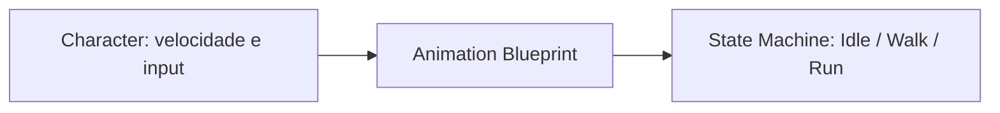
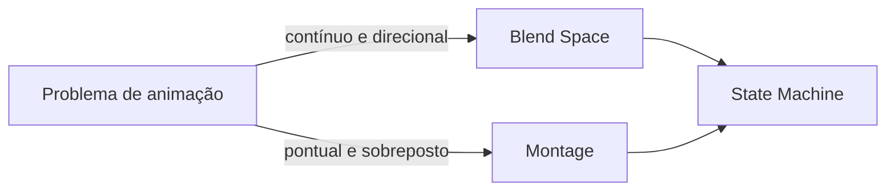

<!-- _class: cover -->

# Semana 8

## Animation Blueprint, State Machine, Blend Spaces e Montages

**Disciplina:** Tendências de Motores de Jogos (IN46A)
**Instituição:** IFMS — Campus Dourados
**Curso:** Tecnologia em Jogos Digitais
**Módulo 3 — Resolver Problemas**

<!--
### Notas do apresentador
A Semana 8 abre a Unidade III e muda a metodologia de Studio Based Learning para Challenge Based Learning: o professor passa a apresentar problemas, e cada grupo propõe a própria solução, com autonomia média. O eixo conceitual é a transição e combinação de animações sobre o `BP_Player` já consolidado nos Módulos 1 e 2. Não há tutorial passo a passo para esta semana — conforme PEDAGOGICAL_RULES.md, a partir do Módulo 3 tutoriais não são produzidos, para preservar o espaço do desafio.
-->

---

## Objetivos da Semana

- Compreender Animation Blueprint e State Machine como mecanismo universal de transição de estados de animação
- Implementar uma State Machine básica (idle, andar, correr) sobre o `BP_Player` já existente
- Compreender Blend Spaces como interpolação multidimensional e Montages como animações pontuais sobrepostas
- Propor e implementar, com autonomia própria, uma animação contextual escolhendo a ferramenta adequada ao problema

<!--
### Notas do apresentador
Resultado esperado ao final da semana: State Machine funcional, Blend Space direcional funcional e uma solução própria de animação contextual (Blend Space ou Montage, à escolha do grupo), tudo integrado ao Vertical Slice sem substituir nenhum sistema do Módulo 2.
-->

---

<!-- _class: timeline -->

## Como a semana está organizada

- **Encontro 1** Animation Blueprint e State Machine — transição entre idle, andar e correr
- **Encontro 2** Blend Spaces e Montages — desafio: animação contextual à escolha do grupo

<!--
### Notas do apresentador
Metodologia: Challenge Based Learning, autonomia média. Encontro 1 é fundamentação não compressível — alimenta diretamente o Blend Space do Encontro 2. Encontro 2 concentra o primeiro desafio real de liberdade de solução da disciplina; não comprimir o laboratório do desafio.
-->

---

<!-- _class: chapter -->

## Encontro 1

# Animation Blueprint e State Machine

01

<!--
### Notas do apresentador
Partir da constatação de que o `BP_Player` já se move corretamente desde o Módulo 1, mas ainda não exibe nenhuma animação de locomoção. Hoje inicia a linha "Animation Blueprint / State Machine" do roadmap (PROJECT_ARCHITECTURE.md, Módulo 3).
-->

---

<!-- _class: question -->

# O seu personagem anda desde o Módulo 1. Mas ele *parece* andar?

Pense na diferença entre o `BP_Player` saber que está em movimento e o jogador ver isso na tela.

<!--
### Notas do apresentador
Deixar a turma responder antes de introduzir Animation Blueprint. Resposta esperada: o Character Movement Component já processa velocidade e input desde o Módulo 1, mas nada traduz esse dado em uma animação visível — falta uma camada dedicada a essa decisão.
-->

---

## Separar decisão de gameplay e apresentação visual

- O `BP_Player` já sabe se está parado, andando ou correndo — isso é velocidade processada pelo Character Movement Component
- Falta uma camada que traduza esse estado interno em uma animação visível
- Misturar essa decisão com a lógica de movimento acoplaria apresentação a gameplay
- Toda engine madura resolve isso com uma camada separada, dedicada apenas a animação

Trocar o esqueleto ou o conjunto de animações nunca deve exigir tocar na lógica de input do personagem.

<!--
### Notas do apresentador
Este é o conceito universal do encontro. Reforçar que a separação entre lógica de gameplay e lógica de apresentação é o motivo de existir de qualquer sistema de animação de engine, não uma particularidade da Unreal.
Referência: Animation Blueprints in Unreal Engine (dev.epicgames.com/documentation).
-->

---

## Animation Blueprint: a camada de decisão

- Asset separado do `BP_Player`, associado ao esqueleto do personagem
- Lê variáveis expostas pelo Character (como velocidade)
- Decide qual animação reproduzir a cada instante
- Nunca contém lógica de gameplay — apenas lógica de apresentação

<!--
### Notas do apresentador
Reforçar que o Animation Blueprint é um asset próprio, não uma extensão do Blueprint do personagem. Pergunta de verificação: onde deveria estar a decisão de "qual animação tocar agora" — no Character ou em um asset separado? Por quê?
-->

---

## State Machine: estados e transições

- Estrutura de estados discretos (Idle, Walk, Run) conectados por regras de transição
- Cada transição é lida a partir de uma variável de gameplay (velocidade), nunca arbitrária
- Aplicada hoje aos estados de locomoção já existentes no `BP_Player`
- Cada seta da State Machine é uma condição verificável, não uma decisão livre

<!--
### Notas do apresentador
Erro comum a antecipar: tratar as transições como regras arbitrárias em vez de leitura direta de uma variável de gameplay. Pedir que o grupo leia em voz alta a condição de cada seta antes de qualquer ajuste.
-->

---

<!-- _class: comparison -->

## Transição de animação: Unreal × Unity

### Unreal

Animation Blueprint com State Machine, acessando propriedades do Character diretamente via nós de Blueprint

### Unity

Animator Controller, acionado por parâmetros expostos no script (`SetFloat`, `SetBool`, `SetTrigger`)

<!--
### Notas do apresentador
O princípio é idêntico nas duas engines: isolar a decisão de animação em um asset dedicado, alimentado por variáveis de gameplay, nunca decidido dentro do próprio script/Blueprint de movimento. A diferença está apenas na forma de integração. Não aprofundar mais — retomado na Unidade V.
-->

---

<!-- _class: diagram -->

## Do dado de gameplay à animação

<!--
### Notas do apresentador
Diagrama conceitual. Reforçar que a seta sempre segue nesse sentido: o Character nunca deveria depender de volta do Animation Blueprint para decidir seu próprio movimento.
-->

---

## Demonstração: State Machine de três estados

O professor cria um Animation Blueprint associado ao esqueleto do personagem, expõe a velocidade do `BP_Player` como variável lida pela State Machine, e constrói os estados Idle, Walk e Run com transições por faixas de velocidade.

**Resultado esperado:** transições visuais corretas entre os três estados, sem interromper o fluxo jogável do Módulo 2.

<!--
### Notas do apresentador
Não detalhar o passo a passo aqui — não há tutorial para este módulo, conforme PEDAGOGICAL_RULES.md; a implementação é adaptação guiada em aula. Dificuldade esperada: faixas de velocidade sobrepostas ou com lacunas, causando animações que travam ou alternam de forma instável entre estados.
-->

---

> **Imagem sugerida**
>
> Objetivo: mostrar a estrutura visual de uma State Machine dentro do Animation Blueprint, reforçando a ideia de estados discretos conectados por transições condicionais.
> Enquadramento: captura de tela do editor de State Machine da Unreal Engine, com três blocos de estado visíveis.
> Elementos presentes: blocos "Idle", "Walk" e "Run" conectados por setas de transição; uma das setas com a condição de velocidade exposta em destaque.
> Destaque visual: a seta de transição em avaliação, com a condição de velocidade visível em primeiro plano.
> Legenda sugerida: "Cada seta é uma condição verificável, nunca uma decisão livre."

<!--
### Notas do apresentador
Print pode ser montado a partir do Animation Blueprint de exemplo preparado antes da aula, fora da visão da turma.
-->

---

## Boas práticas

- Nomear estados da State Machine de forma explícita (Idle, Walk, Run — nunca State_01, State_02)
- Verificar que as faixas de velocidade das transições não se sobrepõem nem deixam lacunas
- Manter o Animation Blueprint livre de qualquer lógica de gameplay

<!--
### Notas do apresentador
Grupos com dificuldade para localizar a variável de velocidade exposta pelo Character Movement Component devem ser direcionados à documentação oficial antes de receber a resposta direta.
-->

---

<!-- _class: exercise -->

# Laboratório do Encontro 1

Implementar uma State Machine básica (Idle, Walk, Run) no Animation Blueprint do próprio `BP_Player`, validando visualmente a transição entre os três estados.

Critério de sucesso: transições fluidas e corretas, sem interromper o fluxo jogável consolidado na Semana 7.

<!--
### Notas do apresentador
Sem desafio de liberdade de solução neste encontro — construção guiada, preparando o desafio de maior autonomia do Encontro 2. Nota de contingência: se faltar tempo, priorizar a transição idle↔andar sobre a inclusão de correr, retomando a transição completa no início do Encontro 2.
-->

---

<!-- _class: summary-slide -->

## Fechando o Encontro 1

- Animation Blueprint separa decisão de animação da lógica de gameplay; State Machine organiza estados e transições
- `BP_Player` de cada grupo exibindo transições corretas entre idle, andar e correr
- Próximo encontro: dois problemas novos de animação — interpolação contínua e ação pontual sobreposta

<!--
### Notas do apresentador
Reforçar que a State Machine construída hoje é a base sobre a qual o Blend Space do Encontro 2 será conectado — nada será substituído.
-->

---

<!-- _class: chapter -->

## Encontro 2

# Blend Spaces e Montages

02

<!--
### Notas do apresentador
Primeiro desafio de liberdade real de solução da disciplina. O enunciado não indica qual ferramenta usar — a decisão entre Blend Space e Montage faz parte do que está sendo avaliado.
-->

---

<!-- _class: question -->

# Andar para os lados é um novo estado, ou uma variação do estado que já existe?

Pense se movimentos direcionais deveriam virar novos blocos na State Machine.

<!--
### Notas do apresentador
Deixar a turma responder antes de introduzir Blend Space. Resposta esperada: não deveria — forçar direções distintas em estados discretos geraria transições artificiais; o problema é contínuo, não discreto.
-->

---

## Dois problemas parecidos, duas soluções distintas

- Combinar continuamente animações conforme uma direção não é o mesmo que sobrepor uma ação pontual a um estado em curso
- Uma State Machine de estados discretos não resolve bem interpolação contínua
- Uma ação pontual (dano, ataque, interação) não deve alterar permanentemente o estado da State Machine
- A engine precisa de uma ferramenta para cada um desses dois problemas

Contínuo e direcional pede Blend Space; pontual e sobreposto pede Montage — a distinção é a base do desafio de hoje.

<!--
### Notas do apresentador
Conceito universal do encontro. Esta distinção é exatamente o que o desafio pede que cada grupo identifique por conta própria, sem indicação prévia do professor.
Referência: Unreal Engine Learning Library — Blend Spaces e Montages.
-->

---

## Blend Space: interpolação multidimensional

- Interpola entre animações-base de acordo com coordenadas (direção, velocidade)
- Resolve movimentos direcionais (frente, lateral, diagonal) como um espaço contínuo
- Conectado à State Machine já existente, não a substitui
- Configurado visualmente como um espaço 1D ou 2D

<!--
### Notas do apresentador
Reforçar que o Blend Space não substitui a State Machine do Encontro 1 — ele opera dentro de um dos estados (por exemplo, dentro de Walk), interpolando direções.
-->

---

## Montage: animação pontual sobreposta

- Reproduzida uma única vez, sobreposta ao estado corrente
- Não altera permanentemente a State Machine — devolve o controle ao final
- Usada para reação a dano, ataque simples ou interação pontual
- Pode reutilizar `BPI_Interactable`, já construído na Semana 5

<!--
### Notas do apresentador
Erro comum a antecipar: escolher Montage para um problema contínuo e direcional, ou o inverso. Pergunta de verificação a usar em aula: "essa animação muda de forma contínua conforme uma direção, ou acontece uma vez e depois volta ao normal?"
-->

---

<!-- _class: comparison -->

## Blend Space e Montage: Unreal × Unity

### Unreal

Blend Space multidimensional nativo; Montage dedicado para animação pontual sobreposta

### Unity

Blend Tree dentro do Animator Controller para interpolação; sem equivalente nomeado ao Montage — efeito obtido combinando Layers e Avatar Masks

<!--
### Notas do apresentador
O princípio — separar animação contínua de locomoção de animação pontual de ação — é o mesmo nas duas engines; o grau de suporte nativo dedicado é maior na Unreal. Não aprofundar mais — retomado na Unidade V.
-->

---

<!-- _class: diagram -->

## Dois problemas, duas ferramentas

<!--
### Notas do apresentador
Diagrama conceitual. Reforçar que ambas as ferramentas convergem de volta para a mesma State Machine, sem substituí-la.
-->

---

## Demonstração: Blend Space e Montage

O professor demonstra um Blend Space direcional simples (frente, lateral, trás) associado à State Machine existente, e depois uma Montage disparada por um evento de teste, mostrando que ela sobrepõe a animação corrente sem interromper a State Machine.

**Resultado esperado:** a turma vê os dois problemas resolvidos lado a lado, antes de decidir sozinha qual se aplica ao próprio desafio.

<!--
### Notas do apresentador
Não detalhar o passo a passo — não há tutorial para este módulo. Após a demonstração, apresentar o desafio sem indicar qual ferramenta usar.
-->

---

> **Imagem sugerida**
>
> Objetivo: mostrar a diferença visual entre um Blend Space (espaço contínuo de interpolação) e uma Montage (linha do tempo de animação pontual), reforçando que são ferramentas para dois problemas distintos.
> Enquadramento: duas capturas de tela lado a lado do editor da Unreal Engine.
> Elementos presentes: à esquerda, um Blend Space 2D com eixos de direção e velocidade e um ponto de amostragem no meio do espaço; à direita, a linha do tempo de uma Montage com uma única animação sobreposta.
> Destaque visual: o contraste entre o espaço contínuo à esquerda e a linha do tempo pontual à direita.
> Legenda sugerida: "Contínuo e direcional à esquerda; pontual e sobreposto à direita."

<!--
### Notas do apresentador
Print pode ser montado a partir do Blend Space e da Montage de exemplo preparados antes da aula, fora da visão da turma.
-->

---

<!-- _class: exercise -->

# Desafio: animação contextual

Cada grupo propõe e implementa uma animação contextual própria — reação a dano, interação com um objeto do mundo ou um ataque simples — escolhendo entre Blend Space ou Montage conforme a natureza do problema.

Não há indicação prévia de qual ferramenta usar. A escolha correta faz parte do desafio.

<!--
### Notas do apresentador
Ao final, cada grupo apresenta brevemente, justificando tecnicamente a escolha entre Blend Space e Montage. Avaliação: Rubrica 2 — Desafios Técnicos, critérios Solução proposta, Uso correto da Unreal e Criatividade. Grupos que travarem na configuração técnica devem ser direcionados à documentação oficial antes de apoio direto.
-->

---

## Boas práticas

- Testar a Montage isoladamente antes de conectá-la a um evento de gameplay
- Nomear eixos do Blend Space de forma explícita (Direção, Velocidade)
- Justificar a escolha da ferramenta a partir da natureza do problema, não da preferência pessoal

<!--
### Notas do apresentador
Reforçar que a justificativa técnica apresentada no desafio é parte da avaliação, tanto quanto o funcionamento da solução.
-->

---

<!-- _class: summary-slide -->

## Resumo da Semana 8

- Animation Blueprint separa decisão de animação de lógica de gameplay; State Machine organiza estados discretos
- Blend Space resolve interpolação contínua; Montage resolve ação pontual sobreposta
- Primeiro desafio de liberdade real de solução da disciplina, com escolha justificada entre as duas ferramentas
- Unidade III — Resolver Problemas — iniciada

<!--
### Notas do apresentador
Reforçar a distinção entre decisão de estado, interpolação contínua e ação pontual sobreposta como três problemas complementares, não hierárquicos.
-->

---

## Checklist da Semana

- State Machine funcional (Idle, Walk, Run) sobre o `BP_Player`
- Blend Space direcional funcional
- Animação contextual própria (Blend Space ou Montage) implementada e justificada
- Nenhum sistema do Módulo 2 substituído ou quebrado

<!--
### Notas do apresentador
Este checklist alimenta a Rubrica 1 — Desenvolvimento Semanal e a Rubrica 2 — Desafios Técnicos.
-->

---

## Próximos passos

A Semana 9 introduz UMG e HUD para comunicar em tempo real o estado de jogo ao jogador, reutilizando dados já expostos pela State Machine e o progresso persistido pelo `SaveComponent`. A metodologia permanece Challenge Based Learning: cada grupo escolhe quais dados compõem o HUD e propõe a própria solução de binding.

**Leitura recomendada:** Animation Blueprints in Unreal Engine (Epic Games Documentation).

<!--
### Notas do apresentador
Reforçar que a autonomia de decisão exercitada no desafio de hoje (escolher a ferramenta certa para o problema) é a mesma que será exigida na Semana 9, sem indicação prévia do professor.
-->
