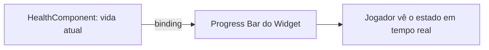
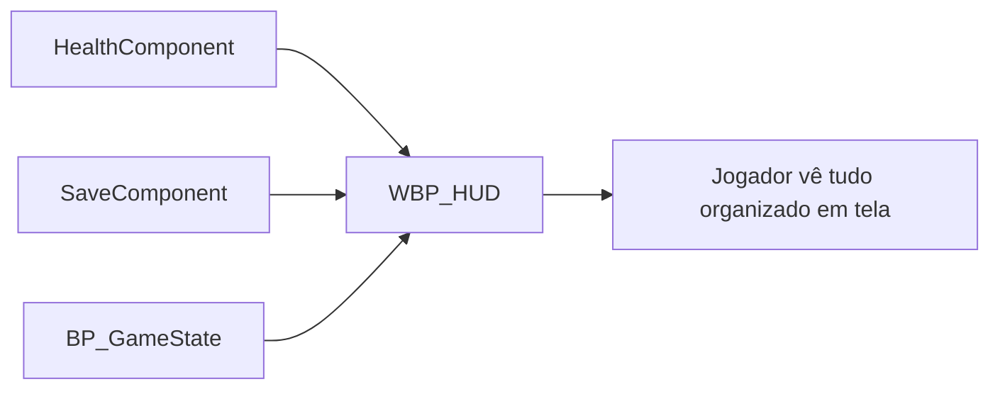

<!-- _class: cover -->

# Semana 9

## UMG, Widgets, Binding de Dados e HUD

**Disciplina:** Tendências de Motores de Jogos (IN46A)
**Instituição:** IFMS — Campus Dourados
**Curso:** Tecnologia em Jogos Digitais
**Módulo 3 — Resolver Problemas**

<!--
### Notas do apresentador
A Semana 9 continua a Unidade III com Challenge Based Learning. O eixo conceitual muda de animação para comunicação com o jogador: como expor, em tempo real, dados de gameplay que já existem (`HealthComponent`, `BP_GameState`, `SaveComponent`) sem acoplar essa camada à lógica de jogo. Não há tutorial para esta semana, conforme PEDAGOGICAL_RULES.md.
-->

---

## Objetivos da Semana

- Compreender UMG como sistema universal de interface em tempo real e o binding de dados como mecanismo de exibição de estado de gameplay
- Criar um Widget simples vinculado a uma variável de gameplay já existente
- Compreender HUD como camada de organização de múltiplos Widgets
- Propor e implementar, com autonomia própria, um HUD que combine os dados de gameplay que o grupo julgar relevantes

<!--
### Notas do apresentador
Resultado esperado ao final da semana: cada grupo com um `WBP_HUD` funcional, exibindo em tempo real os dados que o próprio grupo escolheu, vinculados por binding aos sistemas do Módulo 2, sem substituir nenhum sistema anterior.
-->

---

<!-- _class: timeline -->

## Como a semana está organizada

- **Encontro 1** UMG, Widget Blueprint e binding de dados — exibindo a vida do `HealthComponent`
- **Encontro 2** HUD — desafio: cada grupo escolhe quais dados compõem seu próprio HUD

<!--
### Notas do apresentador
Metodologia: Challenge Based Learning, autonomia média. Encontro 1 é fundamentação guiada, não compressível — alimenta diretamente o desafio do Encontro 2. Encontro 2 concentra o segundo desafio real de liberdade de solução da disciplina.
-->

---

<!-- _class: chapter -->

## Encontro 1

# UMG, Widget e Binding de Dados

01

<!--
### Notas do apresentador
Partir da constatação de que o `HealthComponent` já gerencia vida corretamente desde a Semana 8, mas nenhum dado de gameplay é exibido em tela. Hoje inicia a linha "UMG / HUD" do roadmap (PROJECT_ARCHITECTURE.md, Módulo 3).
-->

---

<!-- _class: question -->

# A vida do seu personagem já existe no projeto. Mas o jogador consegue vê-la?

Pense na diferença entre o dado de gameplay existir internamente e ser comunicado ao jogador em tempo real.

<!--
### Notas do apresentador
Deixar a turma responder antes de introduzir UMG. Resposta esperada: o `HealthComponent` processa vida desde a Semana 8, mas nada exibe esse valor em tela — falta uma camada de interface que leia esse dado.
-->

---

## Separar o dado de gameplay da sua representação visual

- O `HealthComponent` já sabe quanto de vida existe — isso é dado de gameplay, não interface
- Falta uma camada que traduza esse dado em algo visível ao jogador, em tempo real
- Se a interface escrever diretamente na lógica de gameplay, as duas camadas se acoplam
- Toda engine madura resolve isso com uma camada de apresentação de UI separada, atualizada automaticamente

Trocar o layout ou o estilo visual da interface nunca deveria exigir tocar na lógica do `HealthComponent`.

<!--
### Notas do apresentador
Este é o conceito universal do encontro. Reforçar que a separação entre dado de gameplay e representação visual é o motivo de existir de qualquer sistema de UI de engine, não uma particularidade da Unreal.
Referência: UMG UI Designer (dev.epicgames.com/documentation).
-->

---

## UMG: a camada de interface em tempo real

- Unreal Motion Graphics — sistema de construção de interface da Unreal
- Widget Blueprint organiza elementos visuais (texto, barra, imagem) sobre um Canvas Panel
- Binding conecta uma propriedade do elemento visual a uma função que lê o dado de gameplay
- O sistema de gameplay nunca precisa disparar a atualização manualmente

<!--
### Notas do apresentador
Reforçar que o binding é lido a cada frame pela própria interface — o `HealthComponent` continua funcionando de forma idêntica exista ou não um Widget lendo seus dados. Pergunta de verificação: quem deveria "empurrar" a atualização — o gameplay ou a interface deveria "puxar" o dado?
-->

---

## Widget Blueprint e Canvas Panel

- Widget Blueprint: asset de interface, análogo a uma "cena" de UI
- Canvas Panel: painel que posiciona elementos livremente na tela
- Elementos básicos: Text, Progress Bar, Image
- Cada elemento pode ter uma ou mais propriedades vinculadas por binding

<!--
### Notas do apresentador
Erro comum a antecipar: confundir Widget Blueprint com o próprio HUD — nesta aula o Widget expõe apenas um dado; o papel de organizar múltiplos Widgets é do HUD, tema do Encontro 2.
-->

---

<!-- _class: comparison -->

## Interface em tempo real: Unreal × Unity

### Unreal

UMG — Widget Blueprint com Canvas Panel; binding declarativo conecta a propriedade visual à função de leitura do dado

### Unity

uGUI (Canvas + componentes C#) ou UI Toolkit (UXML/USS); atualização normalmente exige código explícito lendo a variável e escrevendo no componente de UI

<!--
### Notas do apresentador
O princípio é idêntico nas duas engines: a interface lê o estado de gameplay e nunca o contrário. A diferença está no grau de suporte declarativo — o binding do UMG dispensa escrever manualmente a lógica de atualização. Não aprofundar mais — retomado na Unidade V.
-->

---

<!-- _class: diagram -->

## Do dado de gameplay ao elemento visual

<!--
### Notas do apresentador
Diagrama conceitual. Reforçar que a seta de binding é uma leitura, não uma escrita — o Widget nunca deveria alterar o valor de vida, apenas exibi-lo.
-->

---

## Demonstração: Widget com binding à vida

O professor cria um Widget Blueprint, monta uma Progress Bar sobre um Canvas Panel, e vincula por binding o valor da barra à vida atual do `HealthComponent`.

**Resultado esperado:** a barra se atualiza automaticamente em tempo real conforme a vida do personagem muda durante o gameplay.

<!--
### Notas do apresentador
Não detalhar o passo a passo aqui — não há tutorial para este módulo, conforme PEDAGOGICAL_RULES.md; a implementação é adaptação guiada em aula. Dificuldade esperada: estudantes tentando escrever diretamente na Progress Bar a partir do `HealthComponent` em vez de usar binding, acoplando novamente gameplay e interface.
-->

---

> **Imagem sugerida**
>
> Objetivo: mostrar o UMG UI Designer com um Widget Blueprint em edição.
> Enquadramento: captura de tela do editor da Unreal, painel Designer em primeiro plano.
> Elementos presentes: hierarquia do Widget à esquerda (Canvas Panel > Progress Bar), área de preview central, painel Details à direita mostrando o binding configurado.
> Destaque visual: circular ou realçar o botão de binding na propriedade "Percent" da Progress Bar.
> Legenda sugerida: "Binding conectando a Progress Bar à vida do HealthComponent."

<!--
### Notas do apresentador
Usar esta imagem para orientar visualmente onde o binding é configurado no editor, antes da demonstração ao vivo.
-->

---

## Boas práticas

- Nomear o Widget Blueprint com o prefixo `WBP_` (conforme PROJECT_ARCHITECTURE.md)
- Usar binding para leitura de dados de gameplay, nunca referência direta escrita a partir do Widget
- Manter cada Widget responsável por um único propósito de exibição

<!--
### Notas do apresentador
Grupos com dificuldade para localizar a variável ou função exposta pelo `HealthComponent` devem ser direcionados à documentação oficial antes de receber a resposta direta.
-->

---

<!-- _class: exercise -->

# Laboratório do Encontro 1

Cada grupo cria seu próprio Widget Blueprint e vincula por binding um elemento visual simples a uma variável de gameplay já existente no projeto (vida, ou outro dado disponível).

Critério de sucesso: o Widget é exibido em tela durante o gameplay e se atualiza automaticamente quando o dado muda, sem alterar a lógica de nenhum sistema do Módulo 2.

<!--
### Notas do apresentador
Sem desafio de liberdade de solução neste encontro — construção guiada, preparando o desafio de maior autonomia do Encontro 2. Nota de contingência: se faltar tempo, priorizar o binding de um único dado (vida) sobre a exploração de múltiplos elementos de Canvas Panel.
-->

---

<!-- _class: summary-slide -->

## Fechando o Encontro 1

- UMG separa o dado de gameplay da sua representação visual; binding conecta os dois automaticamente
- Cada grupo com um Widget funcional, exibindo em tempo real um dado já existente no projeto
- Próximo encontro: organizar múltiplos Widgets em um único HUD, com liberdade de escolha dos dados

<!--
### Notas do apresentador
Reforçar que o Widget construído hoje é a base sobre a qual o HUD do Encontro 2 será organizado — nada será substituído.
-->

---

<!-- _class: chapter -->

## Encontro 2

# HUD e o Desafio de Comunicação com o Jogador

02

<!--
### Notas do apresentador
Segundo desafio de liberdade real de solução da disciplina. O enunciado não indica quais dados exibir nem o layout — a decisão faz parte do que está sendo avaliado.
-->

---

<!-- _class: question -->

# Um Widget por dado resolve um jogo real, com vários dados ao mesmo tempo?

Pense no que acontece na tela quando cada dado de gameplay tem seu próprio Widget solto, sem organização.

<!--
### Notas do apresentador
Deixar a turma responder antes de introduzir HUD. Resposta esperada: não — a tela se tornaria uma colagem desorganizada de elementos independentes; falta uma camada que organize e posicione os Widgets em conjunto.
-->

---

## HUD: organização de múltiplos Widgets

- Widget "container", posicionado permanentemente em tela durante o gameplay
- Agrupa e organiza outros elementos ou bindings em um layout único
- Reutiliza o mesmo mecanismo de binding do Encontro 1, aplicado a múltiplos dados
- Não é um conceito tecnicamente novo — é organização do que já foi aprendido

O HUD não substitui o Widget do Encontro 1 — ele organiza vários Widgets (ou bindings) em um único ponto coerente da tela.

<!--
### Notas do apresentador
Conceito universal do encontro. Reforçar que o problema de hoje não tem resposta fechada: cada grupo tem um conjunto diferente de dados já implementados, e cabe a cada grupo decidir quais comunicar e como organizá-los.
Referência: Unreal Engine Learning Library — UMG e HUD.
-->

---

## Quais dados já existem para compor o HUD?

- Vida — `HealthComponent` (Semana 8)
- Progresso — `SaveComponent` (Semana 7)
- Estado de jogo — `BP_GameState`
- Outros dados que cada grupo já tenha implementado no próprio projeto

<!--
### Notas do apresentador
Levantar com a turma, antes do desafio, quais desses dados cada grupo já possui funcional — isso orienta o feedback sem indicar a solução. Nenhum desses sistemas é alterado pelo HUD; o HUD apenas lê e exibe.
-->

---

<!-- _class: comparison -->

## HUD: Unreal × Unity

### Unreal

HUD como Widget dedicado, convenção explícita para o Widget de nível superior do gameplay

### Unity

Sem classe nomeada equivalente; mesmo resultado obtido organizando um Canvas raiz (uGUI) ou documento UXML raiz (UI Toolkit), geralmente mantido por um script de gerenciamento de UI

<!--
### Notas do apresentador
O princípio é o mesmo nas duas engines — um único ponto de organização visual concentra os elementos de interface ativos durante o gameplay — mas a Unreal nomeia esse papel de forma mais explícita. Não aprofundar mais — retomado na Unidade V.
-->

---

<!-- _class: diagram -->

## Vários dados, um único HUD

<!--
### Notas do apresentador
Diagrama conceitual. Reforçar que cada seta de entrada no HUD é um binding independente — o HUD não altera nenhum dos sistemas de origem.
-->

---

## Demonstração: HUD combinando dois dados

O professor monta um `WBP_HUD` que combina, em um único Canvas Panel, dois elementos já conhecidos do Encontro 1 (por exemplo, vida e um segundo dado simples), mostrando que o HUD é apenas organização, não um conceito novo.

**Resultado esperado:** a turma vê os dois dados exibidos juntos, de forma organizada, antes de decidir sozinha quais dados e layout usar no próprio desafio.

<!--
### Notas do apresentador
Não detalhar o passo a passo — não há tutorial para este módulo. Após a demonstração, apresentar o desafio sem indicar quais dados exibir ou como organizá-los.
-->

---

> **Imagem sugerida**
>
> Objetivo: mostrar um exemplo de HUD combinando dois elementos de interface durante o gameplay.
> Enquadramento: captura de tela em modo Play, viewport completa.
> Elementos presentes: barra de vida no canto superior esquerdo, um segundo indicador (ex.: contador de progresso) próximo, sem sobreposição.
> Destaque visual: contorno leve ao redor da área do HUD para diferenciar da cena de jogo.
> Legenda sugerida: "WBP_HUD combinando vida e progresso em um único layout organizado."

<!--
### Notas do apresentador
Usar esta imagem apenas como referência de organização visual — não indicar aos grupos que este é o layout esperado, para preservar a liberdade do desafio.
-->

---

<!-- _class: exercise -->

# Desafio: HUD próprio de cada grupo

Cada grupo decide quais dados de gameplay já existentes (vida, itens, progresso) devem compor o HUD, propõe a própria solução visual e de binding, e apresenta ao final a justificativa técnica das escolhas.

Não há indicação prévia de quais dados exibir nem do layout. A escolha faz parte do desafio.

<!--
### Notas do apresentador
Ao final, cada grupo apresenta brevemente, justificando a escolha dos dados e do layout. Avaliação: Feedback Formal registrado conforme Sistema de Avaliação. Grupos que travarem na configuração técnica de um binding específico devem ser direcionados à documentação oficial antes de apoio direto.
-->

---

## Boas práticas

- Nomear o HUD com o prefixo `WBP_` (ex.: `WBP_HUD`), conforme PROJECT_ARCHITECTURE.md
- Exibir apenas os dados que o jogador precisa ver constantemente — evitar poluição visual
- Justificar a escolha dos dados e do layout a partir da necessidade de comunicação com o jogador, não da preferência pessoal

<!--
### Notas do apresentador
Erro comum a antecipar: tentar exibir todos os dados disponíveis de uma vez. Pergunta de verificação: "qual desses dados o jogador precisa ver a cada segundo, e qual só precisa ver ocasionalmente?"
-->

---

<!-- _class: summary-slide -->

## Resumo da Semana 9

- UMG separa o dado de gameplay da sua representação visual; binding conecta os dois automaticamente
- Widget expõe um dado isolado; HUD organiza múltiplos Widgets em uma camada coerente
- Segundo desafio de liberdade real de solução da disciplina, com escolha justificada de dados e layout
- Nenhum sistema do Módulo 2 substituído ou quebrado

<!--
### Notas do apresentador
Reforçar a distinção entre Widget (elemento com binding) e HUD (organização de múltiplos Widgets) como o núcleo conceitual da semana.
-->

---

## Checklist da Semana

- Widget funcional com ao menos um elemento vinculado por binding (Encontro 1)
- `WBP_HUD` funcional, combinando ao menos dois dados de gameplay (Encontro 2)
- Escolha dos dados e do layout justificada tecnicamente pelo grupo
- Nenhum sistema do Módulo 2 substituído ou quebrado

<!--
### Notas do apresentador
Este checklist alimenta o Feedback Formal da semana, conforme Sistema de Avaliação.
-->

---

## Próximos passos

A Semana 10 introduz o Inventário, reutilizando os itens modelados em Data Table/Struct na Semana 6, e amplia o Interaction System da Semana 5 para suportar múltiplos tipos de interação (coletar, usar, descartar). O `WBP_HUD` construído nesta semana será o destino natural da exibição dos itens do inventário.

**Leitura recomendada:** UMG UI Designer (Epic Games Documentation).

<!--
### Notas do apresentador
Reforçar que o binding aprendido nesta semana será diretamente reutilizado na Semana 10 para exibir dados de itens do inventário.
-->
